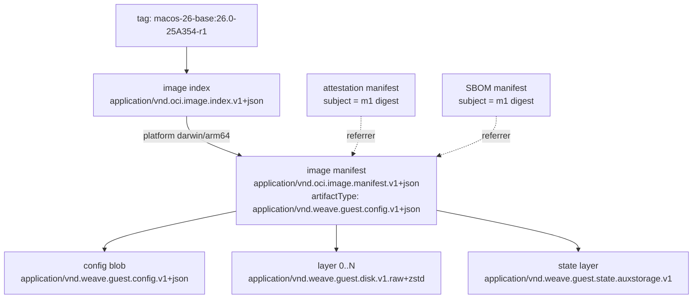

# OCI primer

Research baseline: 2026-10-02. This document explains the Open Container Initiative (OCI)
specifications from the point of view of someone who needs to store multi-GiB virtual machine
disks, their firmware state and ordinary container images in the same registry. It is the
vocabulary the rest of this research set assumes. The weave artifact contract that builds on it
is in [09-artifact-contract-v1.md](09-artifact-contract-v1.md) and
[decisions/0001](decisions/0001-vm-artifact-contract.md). Terms are collected in the
[glossary](glossary.md).

## Spec versions

| Spec | Latest | Released | What it defines | Source |
|---|---|---|---|---|
| image-spec | v1.1.1 | 2025-03-03 (v1.1.0 on 2024-02-15) | manifests, indexes, descriptors, config, layers, annotations, layout | <https://github.com/opencontainers/image-spec/releases> |
| distribution-spec | v1.1.1 | 2025-01-29 (v1.1.0 on 2024-02-15) | the registry HTTP API | <https://github.com/opencontainers/distribution-spec/releases> |
| runtime-spec | v1.3.0 | 2025-11-04 | the unpacked bundle and container lifecycle (runc, crun) | <https://github.com/opencontainers/runtime-spec/releases> |

There is no 1.2 of image-spec or distribution-spec as of the baseline date (checked against
the GitHub tags). The runtime-spec is irrelevant to storing VM images and is not discussed
further.

## Manifest, index, descriptor, config

Everything in a registry is a **blob** addressed by its digest, and four JSON documents tie the
blobs together. The examples below already use the weave media types defined in
[09-artifact-contract-v1.md](09-artifact-contract-v1.md).



**Descriptor.** The pointer type. Every reference from one document to a blob is a descriptor:

```json
{
  "mediaType": "application/vnd.weave.guest.disk.v1.raw+zstd",
  "digest": "sha256:9c8f…",
  "size": 187654321,
  "annotations": {
    "com.deploymenttheory.weave.guest.disk.chunk.index": "0"
  }
}
```

Fields are `mediaType`, `digest`, `size`, and optionally `urls`, `annotations`, `data` (a
base64 copy of a small blob, new in 1.1) and `artifactType`
(<https://github.com/opencontainers/image-spec/blob/v1.1.1/descriptor.md>).

**Image manifest.** One artifact for one platform: a config blob plus an ordered list of
layers (<https://github.com/opencontainers/image-spec/blob/v1.1.1/manifest.md>).

```json
{
  "schemaVersion": 2,
  "mediaType": "application/vnd.oci.image.manifest.v1+json",
  "artifactType": "application/vnd.weave.guest.config.v1+json",
  "config": {
    "mediaType": "application/vnd.weave.guest.config.v1+json",
    "digest": "sha256:1a2b…",
    "size": 1432
  },
  "layers": [
    {
      "mediaType": "application/vnd.weave.guest.disk.v1.raw+zstd",
      "digest": "sha256:9c8f…",
      "size": 187654321,
      "annotations": {
        "com.deploymenttheory.weave.guest.disk.name": "disk0",
        "com.deploymenttheory.weave.guest.disk.chunk.index": "0",
        "com.deploymenttheory.weave.guest.disk.chunk.offset": "0",
        "com.deploymenttheory.weave.guest.disk.chunk.size": "536870912",
        "com.deploymenttheory.weave.guest.disk.chunk.digest": "sha256:aa11…"
      }
    },
    {
      "mediaType": "application/vnd.weave.guest.state.auxstorage.v1",
      "digest": "sha256:77ee…",
      "size": 33554432,
      "annotations": {
        "com.deploymenttheory.weave.guest.state.name": "nvram",
        "com.deploymenttheory.weave.guest.state.semantics": "carry"
      }
    }
  ],
  "annotations": {
    "org.opencontainers.image.created": "2026-10-02T09:00:00Z",
    "org.opencontainers.image.version": "26.0-25A354-r1"
  }
}
```

Three rules in the manifest spec make custom artifacts possible:

- Clients "MUST NOT fail" on an unknown `config.mediaType`; they treat the config as opaque bytes.
- The layer-ordering and filesystem-changeset rules apply **only** when `config.mediaType` is
  `application/vnd.oci.image.config.v1+json`.
- Clients "MUST NOT error on encountering a `mediaType` that is unknown."

**Image index.** A list of manifest descriptors, each with an optional `platform`, so one tag
can serve several platforms (<https://github.com/opencontainers/image-spec/blob/v1.1.1/image-index.md>).
Indexes may nest, and since 1.1 may carry `artifactType`, `subject` and `annotations`.

```json
{
  "schemaVersion": 2,
  "mediaType": "application/vnd.oci.image.index.v1+json",
  "manifests": [
    {
      "mediaType": "application/vnd.oci.image.manifest.v1+json",
      "artifactType": "application/vnd.weave.guest.config.v1+json",
      "digest": "sha256:4d5e…",
      "size": 21874,
      "platform": { "os": "darwin", "architecture": "arm64", "os.version": "26.0.1" }
    }
  ],
  "annotations": {
    "org.opencontainers.image.description": "macOS 26 base image with the weave guest agent"
  }
}
```

**Config.** For container images, `application/vnd.oci.image.config.v1+json` holds `os`,
`architecture`, `rootfs.diff_ids`, `history` and the runtime configuration
(<https://github.com/opencontainers/image-spec/blob/v1.1.1/config.md>). For an artifact, the
config is whatever JSON the artifact's own spec says; weave's is defined in
[09-artifact-contract-v1.md](09-artifact-contract-v1.md).

**Layers.** For container images, layers are tar changesets with media types
`application/vnd.oci.image.layer.v1.tar`, `+gzip` (MUST support) and `+zstd` (SHOULD
support) (<https://github.com/opencontainers/image-spec/blob/v1.1.1/layer.md>). For an
artifact, a "layer" is just a blob listed in `layers[]`; its media type says what it is.

## What image-spec and distribution-spec 1.1 added

Summarised from the OCI announcement
(<https://opencontainers.org/posts/blog/2024-03-13-image-and-distribution-1-1/>) and the spec
text:

- **`artifactType`** on manifests and indexes. It MUST be set when the config is the empty
  descriptor, and it is what registries and tools filter on.
- **`subject`**: a weak reference from one manifest to another. It powers the referrers API.
- **The empty descriptor**: `application/vnd.oci.empty.v1+json`, content `{}`, size 2, digest
  `sha256:44136fa355b3678a1146ad16f7e8649e94fb4fc21fe77e8310c060f61caaff8a`, `data` `e30=`.
  It is the config for artifacts that have no metadata, and the sole layer for artifacts that
  have no content.
- **Descriptor `data`** for embedding small blobs inline.
- **zstd layer media types** for container images.
- **Non-distributable layers deprecated**; new ones SHOULD NOT be produced.
- **Manifest size**: registries SHOULD accept manifests of at least 4 MiB and return 413 above
  their limit.
- In distribution-spec: the **referrers API** and its tag-schema fallback (below), `mount`
  without `from`, `GET` on an upload session to query progress, the `OCI-Chunk-Min-Length`
  header, `/v2/_<ext>` extension paths and `Warning` headers.
- The separate **artifact manifest** (`application/vnd.oci.artifact.manifest.v1+json`) existed
  in image-spec v1.1.0-rc1 and rc2
  (<https://github.com/opencontainers/image-spec/blob/v1.1.0-rc2/artifact.md>) and was removed in
  rc3 in favour of `artifactType` on the ordinary image manifest. Anything that still emits it
  is pre-release behaviour.

### Referrers

When a registry that supports the referrers API stores a manifest carrying `subject`, it
returns an `OCI-Subject` header, and `GET /v2/<name>/referrers/<digest>[?artifactType=…]`
lists every manifest pointing at that digest as an index. If the API returns 404, clients
**MUST** fall back to the **referrers tag schema**: an index stored under the tag
`sha256-<hex of the subject digest>` that the client maintains itself
(<https://github.com/opencontainers/distribution-spec/blob/v1.1.1/spec.md>). GHCR is in the
second category today; see [04-registries-and-github.md](04-registries-and-github.md).

## Artifacts guidance

image-spec ships a decision tree for non-container content
(<https://github.com/opencontainers/image-spec/blob/v1.1.1/artifacts-guidance.md>, with the
details under "Guidelines for Artifact Usage" in
<https://github.com/opencontainers/image-spec/blob/v1.1.1/manifest.md>):

1. Use the ordinary image manifest.
2. If the artifact has its own JSON metadata, set `config.mediaType` to an artifact-specific
   type and put the metadata in the config blob. Set `artifactType` to the same value so filters
   work.
3. If it has no metadata, use the empty descriptor as config and set `artifactType`.
4. Use your own layer media types for content. If there is no content, use a single
   empty-descriptor layer.

The guidance names one pattern as **historical non-conformance**: using
`application/vnd.oci.image.config.v1+json` as the config while the layers are custom types.
Several VM-image projects studied in [02-prior-art.md](02-prior-art.md) do exactly that because
they predate 1.1. The weave contract follows shape 2.

A worked example of shape 2 is the CNCF ModelPack model-spec
(<https://github.com/modelpack/model-spec/blob/main/docs/spec.md>): `artifactType`
`application/vnd.cncf.model.manifest.v1+json`, config
`application/vnd.cncf.model.config.v1+json`, and typed layers such as
`application/vnd.cncf.model.weight.v1.raw` or `….v1.tar+zstd`. The weave media types in
[09-artifact-contract-v1.md](09-artifact-contract-v1.md) are modelled on it.

## Platform object

An index entry's `platform` has these fields
(<https://github.com/opencontainers/image-spec/blob/v1.1.1/image-index.md>):

| Field | Required | Values |
|---|---|---|
| `architecture` | yes | a GOARCH value: `amd64`, `arm64`, … |
| `os` | yes | a GOOS value: `linux`, `windows`, `darwin`, … |
| `os.version` | no | "implementation-defined"; the spec's own example is `10.0.14393.1066` for Windows |
| `os.features` | no | the spec defines only `win32k` for Windows |
| `variant` | no | CPU variant, for example `v8` for arm64 |
| `features` | no | reserved |

When several entries match, clients pick the first. Points that matter for VM images:

- `darwin` and `windows` are valid GOOS values, so the index can hold macOS, Windows and Linux
  entries side by side.
- There is no spec convention for `os.version` outside Windows. The Homebrew bottle index on
  ghcr.io uses `{"os":"darwin","architecture":"arm64","os.version":"macOS 15.7"}` (verified live
  at `ghcr.io/v2/homebrew/core/wget/manifests/1.25.0_2`), which shows registries tolerate
  free-form values. Windows container images from Microsoft use the full build number.
- Hypervisor and disk format are **not** platform fields. Podman's machine-os puts
  non-GOARCH values (`aarch64`, `x86_64`) and a custom `disktype` annotation into platform
  entries (see [02-prior-art.md](02-prior-art.md)); registries accept it, but it is outside the
  spec. The weave contract keeps hypervisor information in annotations and uses GOOS/GOARCH
  strictly ([09-artifact-contract-v1.md](09-artifact-contract-v1.md)).
- Standardising new `os.features` values would mean a proposal to the spec.

## Distribution API

The registry HTTP API is small
(<https://github.com/opencontainers/distribution-spec/blob/v1.1.1/spec.md>):

| Operation | Request |
|---|---|
| Ping | `GET /v2/` |
| Pull blob | `GET` or `HEAD /v2/<name>/blobs/<digest>`; registries SHOULD honour `Range`, which is what makes resumable downloads possible |
| Pull manifest | `GET` or `HEAD /v2/<name>/manifests/<tag-or-digest>` with an `Accept` header listing manifest types |
| Push blob, monolithic | `POST /v2/<name>/blobs/uploads/` then `PUT <location>?digest=…` with the whole body; or a single `POST …?digest=…` |
| Push blob, chunked | `POST`, then repeated `PATCH <location>` with `Content-Range` (in order; out-of-order returns 416), then a closing `PUT ?digest=…`. `GET <location>` returns progress for resuming. The `POST` response may advertise `OCI-Chunk-Min-Length` |
| Cross-repository mount | `POST /v2/<name>/blobs/uploads/?mount=<digest>&from=<other repo>` reuses a blob without re-uploading |
| Push manifest | `PUT /v2/<name>/manifests/<tag-or-digest>` |
| List tags | `GET /v2/<name>/tags/list?n=&last=` |
| Delete | `DELETE` on a manifest or blob |
| Referrers | `GET /v2/<name>/referrers/<digest>[?artifactType=…]` |

Registries may redirect blob `GET`s to a CDN or object store with a 307 or 302; clients must
not forward `Authorization` across hosts. Blob size limits, upload timeouts and chunk sizes are
set by each registry, not by the spec; they are tabulated per registry in
[06-large-artifacts.md](06-large-artifacts.md) and [04-registries-and-github.md](04-registries-and-github.md).

Authentication is outside the spec. In practice every public registry uses the Docker token
flow: an unauthenticated request returns `401` with a `WWW-Authenticate: Bearer realm=…,
service=…, scope=…` header, the client exchanges credentials for a bearer token at the realm,
and retries (<https://docs.docker.com/reference/api/registry/auth/>).

## OCI image layout

The image layout is the on-disk form of a registry
(<https://github.com/opencontainers/image-spec/blob/v1.1.1/image-layout.md>):

```text
oci-layout            {"imageLayoutVersion":"1.0.0"}
index.json            an image index whose descriptors carry
                      org.opencontainers.image.ref.name as the "tag"
blobs/sha256/<hex>    every manifest, config and layer, by digest
```

Because blobs are content-addressed, a layout can be tarred or rsynced across an air gap and
imported into another registry without any digest changing, so signatures and attestations
remain valid. Tooling: `oras --oci-layout` and `oras copy --to-oci-layout`
(<https://github.com/oras-project/oras>), `regctl` ("OCI Layouts in all commands",
<https://github.com/regclient/regclient>), `crane` and the go-containerregistry `layout`
package (<https://github.com/google/go-containerregistry>), and skopeo's `oci:` transport.
The weave cache and export design in [decisions/0008](decisions/0008-device-cache-gc-and-mirrors.md)
uses this layout for sneakernet transfer.

## Annotations

Annotations are string-to-string maps on descriptors, manifests and indexes
(<https://github.com/opencontainers/image-spec/blob/v1.1.1/annotations.md>). Rules:

- Keys use reverse-DNS notation; `org.opencontainers.*` is reserved for the spec.
- Consumers MUST ignore keys they do not understand.
- Pre-defined keys: `org.opencontainers.image.created`, `.authors`, `.url`, `.documentation`,
  `.source`, `.version`, `.revision`, `.vendor`, `.licenses`, `.ref.name`, `.title`,
  `.description`, `.base.digest`, `.base.name`.

`org.opencontainers.image.title` on a layer descriptor is the ORAS convention for the file
name an artifact layer should be restored to. `org.opencontainers.image.source` on a manifest
is what GHCR uses to link a package to a repository
(<https://docs.github.com/en/packages/working-with-a-github-packages-registry/working-with-the-container-registry>).
Custom keys for the weave contract live under `com.deploymenttheory.weave.guest.*`
([09-artifact-contract-v1.md](09-artifact-contract-v1.md)).

## Content addressing and digest pinning

A digest is `<algorithm>:<hex>` over the exact bytes of a blob, and a manifest's digest covers
its config and layer descriptors transitively, so one manifest digest identifies an entire
artifact (a Merkle DAG). Tags are mutable pointers to a digest. Consequences:

- Pin by digest (`repo@sha256:…`) wherever reproducibility or trust matters. Signatures and
  attestations bind to digests, never to tags.
- A tag can be re-pointed at any time unless the registry enforces immutability, which GHCR
  does not ([04-registries-and-github.md](04-registries-and-github.md)). hostweave already
  stores only `repo@sha256:…` references (`deploymenttheory/hostweave@main`
  `pkg/types/image.go`), and the weave channel manifest will record digests
  ([05-supply-chain.md](05-supply-chain.md)).

## Go libraries

| Library | Version | Range fetch | Chunked push | Referrers (API + tag fallback) | OCI layout | Copy | Notes |
|---|---|---|---|---|---|---|---|
| oras-go v2 (`oras.land/oras-go/v2`) | v2.6.2 (2026-07-10) | yes | **no** in v2; merged to main/v3 on 2026-09-25 (PR #1434), v3 not production-ready | yes | yes (`oci.New`) | `oras.Copy`, `oras.ExtendedCopy` (copies referrers) | Built for artifacts: `oras.PackManifest(…, PackManifestVersion1_1, artifactType, …)`, `remote.NewRepository`, `auth.Client`, `credentials.NewStoreFromDocker`, `Repository.Mount`. <https://github.com/oras-project/oras-go>, <https://github.com/oras-project/oras-go/blob/v2/pack.go>, <https://github.com/oras-project/oras-go/pull/1434> |
| google/go-containerregistry | v0.22.1 | yes | no (one `PATCH` per blob) | API only; a 404 historically surfaced as an error (issue #1647) | yes (`layout`) | `crane copy` | Image-centric (`mutate`, `tarball`); awkward for custom artifacts; open issues on multi-GiB blobs. <https://github.com/google/go-containerregistry> |
| regclient | v0.11.6 | yes | yes, with retry and automatic fallback to chunked push; per-host `blobChunk` / `blobMax` | yes | yes, "in all commands" | yes, with mirrors | Smaller community; good operational tooling. <https://github.com/regclient/regclient> |
| containerd `core/remotes/docker` | v2.4.1 | yes | yes | partial | via containerd store | — | Low level; you build manifests yourself. <https://github.com/containerd/containerd> |
| distribution/distribution client | v3.1.2 | — | — | — | — | — | Now under `internal/client`; cannot be imported. <https://github.com/distribution/distribution> |

The shared weave module ([10-shared-go-module.md](10-shared-go-module.md),
[decisions/0004](decisions/0004-shared-go-module.md)) uses oras-go v2 for packing, pushing,
copying, referrers and layout, with its own chunker so that every blob stays well under
1 GiB and a monolithic `PUT` per blob is short and retryable. regclient is the fallback if
chunked uploads become necessary before oras-go v3 stabilises. go-containerregistry stays in
hostweave for ordinary container-image inspection.

## References

- image-spec v1.1.1: <https://github.com/opencontainers/image-spec/tree/v1.1.1>
- distribution-spec v1.1.1: <https://github.com/opencontainers/distribution-spec/tree/v1.1.1>
- OCI 1.1 release post: <https://opencontainers.org/posts/blog/2024-03-13-image-and-distribution-1-1/>
- ORAS project: <https://oras.land>, CLI v1.3.4 <https://github.com/oras-project/oras/releases>
- Docker registry token authentication: <https://docs.docker.com/reference/api/registry/auth/>
- Prior art that uses these mechanisms: [02-prior-art.md](02-prior-art.md)
