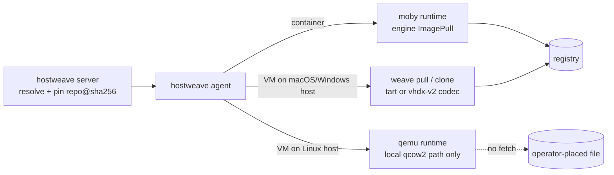

# Current state: how the weave projects handle images today

Research baseline: 2026-10-02. This report records what exists, not what is planned.
It is the as-is input to [08-target-architecture.md](08-target-architecture.md),
[09-artifact-contract-v1.md](09-artifact-contract-v1.md) and
[11-migration.md](11-migration.md). The prior art it compares against is in
[02-prior-art.md](02-prior-art.md).

## 1. Scope and method

Six repositories were read. Every path below was checked by opening the file at the
revision listed; line numbers refer to that revision.

| Repository | Revision read | How |
|---|---|---|
| `weaveplatform/hostweave` | `facca4b` (branch `fix/review-findings`, local checkout) | source and `docs/` |
| `weaveplatform/guestweave-cli-macos` (module `guestweave-macos`) | `3bf49f0` (`main`, local checkout) | source and `internal/docs/` |
| `weaveplatform/guestweave-cli-windows` (module `guestweave-windows`) | `93d230b85f8b` (`main`, via the GitHub contents API) | `internal/oci/oci.go`, `internal/oci/layer.go`, `internal/oci/cache/cache.go`, `internal/winmedia/retail.go`, `internal/vm/layout/layout.go`, `go.mod`, tree listing |
| `deploymenttheory/go-sdk-winmediafoundry` | v0.8.0 (Windows pin), v0.7.0 (macOS pin) | README and package list via GitHub |
| `deploymenttheory/weaveplatform-agent-modules` | `6ff07a7` (local checkout) | `docs/`, `handoff/`, `.github/workflows/module-release.yml` |
| `weaveplatform/weaveplatform-channels` | `3af1c16` (local checkout) | `README.md`, `docs/trust-chain.md` |

Two companion branches referenced by hostweave's image phase were **not** merged at
the time of reading: macOS `94ab635` and Windows `eae767a` on
`feat/hostweave-image-contract`
(`weaveplatform/hostweave@facca4b docs/implementation/image-lifecycle.md:112-124`).
Statements about `weave capabilities` and per-process registry credentials describe
those branches, not `main`.

## 2. hostweave

hostweave is the broker. It never downloads an image itself; it resolves and pins
references on the server, and each agent-side runtime fetches in its own way.

### 2.1 Resolve-and-pin on the server

- `pkg/images/registry.go` builds on `github.com/google/go-containerregistry v0.22.1`
  (`go.mod:26`). `Registry.Resolve` (`pkg/images/registry.go:103`) parses with
  `name.StrictValidation` (`:130`), fetches the descriptor with `remote.Get` (`:136`),
  and records the reference as `repo@sha256:…`. An index must have between 1 and 64
  manifests (`:152-153`); BuildKit attestation entries are skipped (`:157-158`); each
  child is fetched by digest (`:161`). The transport refuses anything but HTTPS
  (`secureRegistryTransport`, `:291-294`).
- VM artifacts go through `inspectVM` (`pkg/images/vm.go:22`). It reads only the
  configuration blob (cap `maxVMConfigBytes = 4 << 20`, `:18`) and classifies layers
  by media type, quoted exactly as in code:

  | Media type (`pkg/images/vm.go`) | Format label |
  |---|---|
  | `application/vnd.guestweave.vm.config.v2+json` (`:36`) | `guestweave-vhdx-v2` |
  | `application/vnd.guestweave.vm.disk.v2.vhdx+zstd` (`:38`) | `guestweave-vhdx-v2` |
  | `application/vnd.cirruslabs.tart.config.v1` (`:40`) | `tart` |
  | `application/vnd.cirruslabs.tart.disk.v2` (`:42`) | `tart` |
  | `application/vnd.cirruslabs.tart.nvram.v1` (`:44`) | `tart` |
  | `application/vnd.trycua.lume.disk.v1` (`:46`) | `lume-chunked` |
  | `application/vnd.trycua.lume.nvram.v1` (`:48`) | `lume-chunked` |
  | `application/vnd.oci.image.config.v1+json` as a *layer* (`:50`) | `lume-sharded` |
  | `application/vnd.oci.image.layer.v1.tar` with `part.number` or title `disk.img` (`:52`) | `lume-sharded` |
  | config `application/vnd.trycua.lume.config.v1+json` (`:83`) | `lume-chunked` |

  Rules enforced: mixed formats are rejected (`:66`); VHDX cannot carry macOS (`:141`);
  macOS needs exactly one NVRAM layer and a `hardwareModel` (`:144`); tart and lume
  artifacts require an arm64 host (`:147`). VM indexes are not accepted.

### 2.2 Domain model

`pkg/types/image.go`:

- `ImagePurpose` is `host | vm | container` (`:11-16`). A collection's purpose cannot change.
- `RegistryConnection` (`:44`) has `Registry`, `Repository`, `Auth`, `CredentialRef`,
  `ProviderConfigID` (`:48-52`). One connection grants access to exactly one repository
  (`:43`). `Auth` is `anonymous | basic | ecr | acr | gar` (`:77-92`).
- `ImagePlatform` (`:110`) is `OS, Arch, Variant, OSVersion, Digest` (`:113-114`).
- `ImageVersion` (`:120`) records `Purpose`, `Source`, `ProviderConfigID`, `Format`,
  `Platforms`, `Status`, `Evidence`, `BuildRunID` (`:123-136`). `Format` is mandatory
  (`:145`); `Status` is one of `metadata_validated | runtime_verified | unavailable |
  unsupported` (`:147-148`). There is no size, layer list, annotation set, artifact
  type, signature or SBOM field.

Persistence is append-only for versions (`pkg/store/images.go:17`), through migration
`0016_images.sql` in each dialect (`internal/sqlstore/{sqlite,postgres,mysql}/migrations/`).
Basic credentials are sealed under `registry/<id>`
(`internal/server/handlers_images.go:176`).

### 2.3 API and dispatch

- REST (`api/openapi.yaml`): `/api/v1/images` (`:2241`), `/api/v1/images/{id}` (`:2277`),
  `/api/v1/registries` (`:2293`), `/api/v1/registries/{id}` (`:2327`),
  `/api/v1/images/{id}/versions` (`:2362`), `/api/v1/image-versions/{id}` (`:2398`),
  `/api/v1/registries/{id}/tags` (`:2414`). Schemas `Image` (`:8148`),
  `RegistryConnection` (`:8197`), `ImagePlatform` (`:8242`), `ImageVersion` (`:8277`).
- Binding at submit time overwrites the workload image with the pinned reference and
  stores a server-owned `ResolvedImage` (`internal/server/image_bindings.go:37-73`;
  supplies at `:82-146`).
- At dispatch the gateway requires the image to start with `<repo>@sha256:`
  (`internal/agentgw/gateway.go:675`) and obtains operation-scoped credentials through
  `ExecutionAuth` (`:681`), carried in `Assign.registry_auth_json`
  (`api/proto/agent/v1/agent.proto:199-205`), outside `job_json`.
- Providers expose optional `ImageInspector` (`pkg/provider/images.go:12`) and
  `RegistryAuthenticator` (`pkg/provider/registry.go:13`); `VerifyBootstrapImage`
  re-checks the resolved host image before every create (`pkg/provider/images.go:44`).

### 2.4 Agent runtimes

All drivers implement `pkg/runtime.Runtime` (`pkg/runtime/runtime.go:102`); `Prepare`
(`:110`) is where images are fetched.

| Runtime | Fetch path | Notes |
|---|---|---|
| `moby` (`agent/runtime/moby/moby.go`) | `ImageInspect` then `ImagePull` through the engine (`:57-66`, `ensureImage` `:319`) | The pull is skipped when the tag is already present locally. Platform chosen from `ResolvedImage.Platforms` (`imagePlatform` `:290`). |
| `guestweave` (`agent/runtime/guestweave/guestweave.go`) | shells out: macOS `weave pull <ref>` then `weave clone <ref> <name> --regenerate-random-mac`; Windows `weave pull <ref> <name>` (`:367-369`) | Credentials go to the child as `GUESTWEAVE_REGISTRY_ENV_ONLY/HOSTNAME/USERNAME/PASSWORD` (`agent/runtime/guestweave/registry.go:49-52,78`) and must match `serveraddress` (`:60`). `weave capabilities` JSON carries `guest_platforms` and `image_formats` (`capabilities.go:23-24`). Local VM names are advertised as `attr.guestweave.images` (`guestweave.go:323`), which nothing reads. |
| `qemu` (`agent/runtime/qemu/qemu.go`) | none. `Options.Images` maps a name to a local qcow2 path (`:63-65`); `base()` accepts a map key or absolute path (`:230`) | Configured only by `HOSTWEAVE_QEMU_IMAGES=name=path,…` (`internal/cli/agentcmd/vms.go:22-24`). Per-attempt overlay via `qemu-img create -b`; NoCloud seed served as a `vvfat` volume labelled `CIDATA` (`:374`). |

The scheduler's VM filter reads only guestweave attributes:
`attr.driver.guestweave.formats` and `.platforms`
(`pkg/scheduler/filter.go:57,62`). A resolved VM image can therefore never be placed on
a QEMU host.

### 2.5 Caching and clean-up

Nothing in hostweave prunes images. The moby driver's only `ImageRemove` use is the
client interface (`agent/runtime/moby/moby.go:67`), exercised for temporary commits; the
guestweave driver never calls `weave prune`; QEMU base images are operator-managed. The
only disk control is an agent health check that fails below 1 GiB free in the work
directory (`agent/health.go:30,166`).

### 2.6 What the documentation already says

- ADR 0029 approves named collections and immutable versions, and states that "OCI
  digests describe artifacts, not universal runtime compatibility"
  (`docs/research/decisions/0029-image-identities-and-builds.md:14-15`).
- ADR 0010 records that "Both CLIs are tart/lume ports" sharing "OCI images with
  copy-on-write (macOS) or differencing-VHDX (Windows) clones"
  (`docs/research/decisions/0010-vm-runtimes-guestweave-and-qemu.md:36-40`). That
  description is accurate as of the revisions read here.
- The CLI research note records "Windows artifacts are a config layer plus 1 GiB zstd
  VHDX chunks. A pulled VM is a differencing child of the cache"
  (`docs/research/guestweave-cli.md:89`).
- The implementation record lists what the image phase still lacks: local template
  registration, explicit QEMU format binding, recipes, builders, publication and
  multi-platform index publication (`docs/implementation/image-lifecycle.md:88-97`).

## 3. guestweave-cli-macos

A Go port of tart (and later lume), running two hypervisor stacks: Virtualization.framework
for macOS and Linux guests, and its own VMM on Hypervisor.framework for Windows 11 ARM64
guests (`internal/hypervisor`).

### 3.1 Image sources

| Guest | Source | Code |
|---|---|---|
| macOS | `weave create <name> --from-ipsw latest\|<url>\|<path>` | `internal/command/commands_create.go:138-149`. `latest` calls `FetchLatestSupportedRestoreImage` (`:228-229`), which is Apple's `VZMacOSRestoreImage.fetchLatestSupported` through `go-bindings-macosplatform`. **This is not GDMF**; no `gdmf.apple.com` client exists in the repository. |
| macOS IPSW cache | `cache/IPSWs/sha256:<hash>.ipsw` | `retrieveIPSW` (`internal/vm/vm.go:318`) reads the S3 header `x-amz-meta-digest-sha256` (`:330`); cache class in `internal/ipsw/ipswcache.go:16,28`. |
| macOS install | `NewVMInstallingFromIPSW` (`internal/vm/vm.go:370`) | creates auxiliary storage `nvram.bin` (`:408`), writes ECID and hardware model into `config.json`, runs the installer. |
| Linux | `weave create --linux` → `VMLinux` (`internal/vm/vm.go:509`) | empty EFI variable store plus empty sparse disk; the user boots an installer ISO or pulls an OCI image. No cloud-image, qcow2, kernel/initrd or cloud-init code exists. |
| Windows ARM64 | `weave create --from-windows` | go-sdk-winmediafoundry `softwaredownload` client `GetByName(ctx, "Arm64", …)` (`internal/winimage/winimage_swdl.go:22-24,62`) downloads the consumer ISO into `cache/iso/swdl` (`:32`), then the ISO is re-mastered with `pkg/iso.BuildWindowsUDF` (`:188`) to inject `autounattend.xml`, no-prompt boot, virtio drivers and the agent (`internal/winmedia/profiles.go:41-47`). Default credentials are `weave`/`weave` (`internal/winimage/unattend/unattend.go:87-88`). The disk is sized in binary GiB (`int64(diskSize) << 30`, `internal/command/commands_create_winguest.go:147`) where the macOS/Linux path uses decimal GB. |

### 3.2 Bundle layout

`internal/vm/layout/layout.go` names the files:

| File | Accessor | Used by |
|---|---|---|
| `config.json` | `:50` | all; also the lock target |
| `disk.img` | `:52` | all (raw sparse, or ASIF on macOS 26+) |
| `nvram.bin` | `:54` | VZ auxiliary storage (macOS) or EFI variables (Linux) |
| `state.vzvmsave` / `state.wsar` | `:59`, `:67` | suspend state (VZ / HV VMM) |
| `manifest.json` | `:110` | the OCI manifest the VM was pulled from |
| `efi_vars.fd` | `:141` | legacy QEMU |
| `NVRAM.dat` | `:156` | Windows guests on the HV VMM |
| `tpm/` | `:170` | Windows vTPM state |
| `lineage.json` | `:174` | clone provenance |
| `machineidentifier.bin` | `internal/vm/config/platformlinux.go:60` | Linux `VZGenericMachineIdentifier` |

Size accounting (`components()`, `:600-618`) counts config, disk and either
`nvram.bin` or `efi_vars.fd`; it never counts `NVRAM.dat`. Clones use `clonefile(2)`
with a full-copy fallback (`internal/fsutil/clone.go:1,22`). Snapshots are capped at 32
(`internal/vm/snapshot/snapshot.go:43`) with a `snapshots/index.json` catalogue (`:78`).
Export produces `.tvm` through `/usr/bin/aa` with LZFSE
(`internal/vm/archive/archive.go:1-2,25,45`).

### 3.3 OCI client and formats

- The registry client is hand-written, ported from tart's Swift:
  `internal/oci/oci_registry.go` (627 lines) with the token flow, resumable blob
  reads and chunked push. `go-containerregistry v0.21.7` appears in `go.mod:15` but is
  used only by the acceptance harness.
- Media types pushed (`internal/oci/oci_manifest.go`): config descriptor
  `application/vnd.oci.image.config.v1+json` (`:19`); layers
  `application/vnd.cirruslabs.tart.config.v1`, `application/vnd.cirruslabs.tart.disk.v2`,
  `application/vnd.cirruslabs.tart.nvram.v1` (`:26-28`); annotations
  `org.cirruslabs.tart.uncompressed-disk-size`, `org.cirruslabs.tart.upload-time`
  (`:33-34`), label `org.cirruslabs.tart.disk.format` (`:38`), layer annotations
  `org.cirruslabs.tart.uncompressed-size`, `org.cirruslabs.tart.uncompressed-content-digest`
  (`:42-43`). The comment at `:22-24` states these are kept as a wire contract so weave
  and tart images are interchangeable. Legacy `application/vnd.cirruslabs.tart.disk.v1`
  is recognised (`internal/oci/codec_tart.go:20`).
- Lume formats read (`internal/oci/lume_manifest.go`): config
  `application/vnd.trycua.lume.config.v1+json`, layers
  `application/vnd.trycua.lume.disk.v1`, `application/vnd.trycua.lume.nvram.v1` (`:27-29`);
  sharded parts use `application/vnd.oci.image.layer.v1.tar` with `part.number` in the
  media-type parameters (`:35`, `format.go:92`); annotations `org.trycua.lume.part.number`,
  `org.trycua.lume.part.offset`, `org.trycua.lume.content.uncompressed-size` (`:42-44`).
- Detection and codecs: `DetectImageFormat` (`internal/oci/format.go:118-130`) dispatches
  to `codec_tart.go`, `codec_lume_chunked.go`, `codec_lume_sharded.go`, `codec_lume_lz4.go`.
- Disk chunking on push: 512 MiB LZ4 layers (`internal/oci/oci_layerizer_diskv2.go:36`);
  pulls punch holes with `F_PUNCHHOLE` (`:51,371-374`).
- Push (`PushToRegistry`, `internal/vm/storage/registry.go:71`) always reads
  `d.NvramURL()` (`:118`), so a VM without `nvram.bin` (every Windows guest) cannot be
  pushed; `NVRAM.dat`, `tpm/` and `machineidentifier.bin` are never pushed. The OCI
  config is a stub with labels (`:132`).
- Cache: `~/.weave/cache/OCIs` (`internal/vm/storage/oci.go:1,50`) keyed by manifest
  digest with tag links; a disk-space guard runs before every download
  (`EnsureDiskSpace`, `internal/vm/storage/diskspace.go:56-60`, auto-prune via
  `GUESTWEAVE_PRUNE_AUTO`).
- Registry profiles live in the settings file (`internal/config/settings.go:54-58`) and
  references resolve as `--registry <profile>` → fully-qualified → bare name against the
  default profile (`internal/registry/resolver.go:6-14,30,66`). Transport interfaces are
  `ImageSource`, `ImageSink`, `TagLister`, `Client` (`internal/registry/registry.go:17-35`).
- Credential providers are tried in the order environment, Docker config, Keychain
  (`defaultCredentialsProviders`, `internal/oci/oci_registry.go:150-156`;
  `GUESTWEAVE_REGISTRY_USERNAME` in `internal/credentials/credentials_environment.go:23`;
  `~/.docker/config.json` in `credentials_dockerconfig.go:81`). The design note
  `internal/docs/registries-and-image-formats.md` lists Keychain first; the code does not.
- Storage root: `GUESTWEAVE_STORAGE_HOME`, then the settings default, then `~/.weave`
  (`internal/config/config.go:28-29,45`), with `cache/` beneath it (`:48`).

### 3.4 Provisioning and agent delivery

The legacy in-guest agent is installed over SSH as a per-user LaunchAgent or a
`systemd --user` unit (`internal/guestweaveagent/client/install.go:4,33`); it refuses
Windows guests, whose agent is baked into the install media (`:45-49`). macOS Setup
Assistant is driven by screen automation (`weave setup --unattended`).

## 4. guestweave-cli-windows

Module `github.com/deploymenttheory/guestweave-windows` (`go.mod:1`), on the Host
Compute Service rather than the Hyper-V VMM. `go-containerregistry v0.22.1` (`go.mod:14`)
and `go-sdk-winmediafoundry v0.8.0` (`go.mod:52`).

### 4.1 Image sources

| Guest | Source | Code |
|---|---|---|
| Windows | `--from-windows <iso\|spec>` | `winmedia.EnsureRetailISO` (`internal/winmedia/retail.go:25-31`) uses the `softwaredownload` client (`:14-15,39`) to fetch the current retail ISO untouched into `<cacheDir>\isos`; Microsoft serves only the current GA release (`:30,51`). Unattend and setup script ride a separate CDFS side volume (`internal/winmedia/sidecar.go`). An ESD-to-ISO path exists (`internal/winmedia/acquire.go`) but create does not call it. |
| Linux, native (default) | `--linux` / `--native` | self-built kernel and debootstrap rootfs VHDX produced in WSL (`internal/nativebuild/nativebuild.go`, `internal/nativebuild/scripts/build-weave-kernel.sh`), described by `internal/guestimage/manifest.go` with sha256 provenance; `cmd/weaveimage/main.go` can pull a kernel from an OCI reference. |
| Linux, unattended | `--from-fedora` / `--from-ubuntu` | `internal/linuxmedia/media.go` resolves the distro mirror, checks SHA-256, and ships a kickstart (`OEMDRV`) or autoinstall (`CIDATA`) side volume. |
| Linux, generic | `--linux --iso X --kickstart\|--autoinstall` | same side-volume mechanism |

### 4.2 Bundle layout

`internal/vm/layout/layout.go`: `config.json` (`:36`), `disk.vhdx` (`:37`), `.lock`
(`:38`), `serial.log` (`:39`), `lineage.json` (`:40`), `oci-source.json` (`:45`),
`unattend.iso` (`:47`), `sidevolume.iso` (`:48`), `guest.vmgs` (`:53`, UEFI variables
plus vTPM), `suspend.vmrs` (`:54`), `snapshots/index.json` (`:66`).

### 4.3 OCI format "v2"

`internal/oci/oci.go` documents the layout at `:6-9`: layer 0 is the config, layers
1..n are "the flattened boot VHDX, split into fixed-size windows, each zstd-compressed".

- Media types: `application/vnd.guestweave.vm.config.v2+json` and
  `application/vnd.guestweave.vm.disk.v2.vhdx+zstd` (`:52-53`). Two **legacy v1**
  strings are still recognised: `application/vnd.weave.vm.config.v1+json` and
  `application/vnd.weave.vm.disk.v1.vhdx+gzip` (`:59-60`). Any future
  `application/vnd.weave.vm.*` naming would collide with these; the contract therefore uses the `application/vnd.weave.guest.*` namespace ([09-artifact-contract-v1.md](09-artifact-contract-v1.md)).
- Annotations under `com.deploymenttheory.guestweave.` (`:65`): per layer
  `disk.chunk-index`, `disk.chunk-count`, `disk.offset`, `disk.uncompressed-size`,
  `disk.uncompressed-digest`, `disk.zero` (`:69-76`); per manifest `disk.size`,
  `disk.format`, `upload-time` (`:79-83`). `disk.format` is `vhdx-file-v2` because
  "Chunk offsets address the VHDX file rather than the guest-visible address space"
  (`:85-88`).
- `ChunkSize = 1 << 30` (1 GiB, `:92`). Chunks are zstd `SpeedDefault` with a single
  encoder goroutine for reproducibility (`internal/oci/layer.go:48-62`); an all-zero
  window is flagged so pulls skip writing it (`:43-45,84-97`).
- The manifest is `types.OCIManifestSchema1` with config `types.OCIConfigJSON`
  (`:284-285`); no `artifactType` is set.
- Cache `<cacheRoot>\OCIs` (`internal/oci/cache/cache.go:122`) holds `index.json`,
  `blobs\sha256\<hex>` and resumable `.part` files (`:12-15`); a VM is a differencing
  child of the cached parent VHDX (`:7,134`); `Prune` respects in-use parents
  (`:191,304`).
- `guest.vmgs` (vTPM and UEFI state) is not part of the artifact; there is no tart or
  lume interoperability.

## 5. go-sdk-winmediafoundry

A deploymenttheory project, **not** a Microsoft product. It is a pure-Go toolkit for
acquiring and building Windows installation media with no wimlib, DISM, oscdimg or
cabextract dependency. Packages: `windowsuup` (Windows Update SOAP client for UUP/ESD/CAB),
`esd` (Media Creation Tool catalogue), `softwaredownload` (the consumer ISO flow), and
`pkg/{wim,cab,udf,iso,isoinspect,builder,unattend,usb,diskspace}`. Inputs are UUP files
and ESDs; outputs are ISO and USB media. **It has no VHDX output.** Both guestweave CLIs
use its `softwaredownload` client; the macOS CLI additionally uses `pkg/iso` for
re-mastering.

## 6. weaveplatform-agent-modules and weaveplatform-manifest

These two repositories hold the only OCI publication and trust mechanisms already in
production use in the platform.

- The release workflow stamps a sidecar manifest with per-artifact `os`, `arch`, `digest`
  and `size`, then runs `oras push ghcr.io/<owner>/weaveplatform-modules/<module>:<version>
  --artifact-type application/vnd.weave.module`
  (`weaveplatform-agent-modules@6ff07a7 .github/workflows/module-release.yml:115-116`),
  and sends a `repository_dispatch` with `event_type=module-published` to
  weaveplatform-manifest (`:126`).
- Trust is a two-tier, minisign-style Ed25519 chain: an offline root key
  (`keys/root.pub`, embedded in core) endorses annual signing keys
  (`keys/signing-<year>.pub`), which sign `channels/stable.json` (rolling) and
  `channels/pinned/<service-version>.json` (immutable)
  (`weaveplatform-manifest@3af1c16 README.md:19-22,30`). Verification lives in core at
  `internal/manifestverify` and needs "no Fulcio, no Rekor, no CA"
  (`docs/trust-chain.md:17,23,26`). The schema is owned by
  `weaveplatform-api/schema/channel-manifest.schema.json` (`README.md:36`).
- The Linux bring-up record fixes a principle: "The image is the unit of trust. The agent
  is baked in at image build time" (`handoff/linux-bring-up.md:24`), and also records
  that "No guest image is built with the agent baked in" yet (`:347`).

## 7. As-is comparison

| Property | hostweave (server inspect) | guestweave-cli-macos | guestweave-cli-windows |
|---|---|---|---|
| Config media type | accepts the four formats in §2.1 | `application/vnd.oci.image.config.v1+json` stub; VM config in a `…tart.config.v1` layer | `application/vnd.oci.image.config.v1+json` stub; VM config in a `…guestweave.vm.config.v2+json` layer |
| Disk media type | as above | `application/vnd.cirruslabs.tart.disk.v2` (reads lume too) | `application/vnd.guestweave.vm.disk.v2.vhdx+zstd` |
| Chunk unit | n/a | 512 MiB | 1 GiB |
| Compression | n/a | LZ4 | zstd (SpeedDefault) |
| Addressing | n/a | guest LBA of a raw disk | byte offsets into the VHDX file |
| Zero handling | n/a | holes punched on pull | zero windows flagged and skipped |
| Resume | n/a | per-chunk uncompressed digest, Range reads | `.part` blobs |
| State blobs | requires one NVRAM layer for macOS | `nvram.bin` only; `NVRAM.dat`, `tpm/`, `machineidentifier.bin` not shipped | none; `guest.vmgs` not shipped |
| Identity shipped | reads `hardwareModel` | ECID, hardware model, MAC in the config layer | per-VM identity in `config.json` |
| `artifactType` | not read | not set | not set |
| Index | rejected for VM purpose | single manifest per tag | single manifest per tag |
| Cache layout | none | `cache/OCIs/<host>/<ns>/<digest>` + tag links; LRU; disk-space guard | `OCIs\index.json` + `blobs\sha256`; differencing parents; in-use pins |
| OCI library | go-containerregistry v0.22.1 | hand-written client (ggcr v0.21.7 in tests only) | go-containerregistry v0.22.1 |
| Auth source | sealed connection credential or ECR/ACR/GAR exchange; HTTPS only | env → Docker config → Keychain | Docker-style keychain chain; `GUESTWEAVE_REGISTRY_*` on the companion branch |

## 8. The three pull paths today

## 9. Gaps

1. **Three unrelated fetch paths.** The engine pulls for moby, the external CLI pulls for
   guestweave, and QEMU has no fetch. No shared pull, verify or cache layer exists on the
   agent (§2.4).
2. **QEMU is outside the model.** No OCI or HTTPS fetch, and the scheduler filter checks
   only guestweave attributes (§2.4), so a resolved VM image cannot land on a Linux host.
3. **Two incompatible artifact formats and no Linux one.** Tart-shaped raw-LBA LZ4 layers
   on macOS; VHDX-file-offset zstd layers on Windows (§3.3, §4.3). Neither CLI can pull
   the other's images; neither sets `artifactType`; neither uses an index.
4. **Format knowledge is duplicated.** Media types are hard-coded in `pkg/images/vm.go`
   and must match the `image_formats` strings each CLI reports. No versioned contract
   defines them.
5. **Firmware and identity state is unmodelled.** `nvram.bin`, `NVRAM.dat`, `guest.vmgs`,
   `tpm/` and `machineidentifier.bin` are handled per hypervisor; the macOS push
   hardcodes `nvram.bin` (§3.3); ECID and MAC ship inside artifacts.
6. **`ImageVersion` is thin.** No size, layers, annotations, artifact type, signature or
   SBOM (§2.2), and no status beyond `metadata_validated` is produced by automation.
7. **Pinning is optional.** A free-form `Workload.Image` still runs, and moby skips the
   pull when the tag is present locally (§2.4).
8. **One connection is one repository.** No mirrors, pull-through or air-gap path in
   hostweave (§2.2); guestweave profiles exist but carry no mirror list (§3.3).
9. **No cache management anywhere in hostweave** (§2.5); the two CLIs each have their own.
10. **Source media is fetched ad hoc.** IPSW (S3 header digest), Windows ISO (none at the
    swdl step), distro ISO (SHA-256), ESD (SHA-1) all use different integrity checks and
    separate caches (§3.1, §4.1).
11. **Provisioning is not separated from the image.** Credentials are baked (`weave`/`weave`),
    macOS has no cloud-init equivalent, and agent delivery is split three ways: SSH, install
    media, and ORAS-published modules (§3.4, §6).
12. **Units and schemas diverge.** Decimal GB on macOS/Linux versus binary GiB for
    Windows-on-macOS (§3.1); `components()` ignores `NVRAM.dat` (§3.2); the two CLIs'
    `config.json` schemas differ.
13. **Builds and publication are designed but unimplemented** in hostweave (§2.6), and
    the one working pipeline (modules) is not yet used for images (§6).

## References

- `weaveplatform/hostweave@facca4b`: `pkg/images/vm.go`, `pkg/images/registry.go`,
  `pkg/types/image.go`, `pkg/scheduler/filter.go`, `agent/runtime/{moby,guestweave,qemu}`,
  `internal/agentgw/gateway.go`, `api/openapi.yaml`, `api/proto/agent/v1/agent.proto`,
  `docs/research/decisions/0010-vm-runtimes-guestweave-and-qemu.md`,
  `docs/research/decisions/0029-image-identities-and-builds.md`,
  `docs/research/guestweave-cli.md`, `docs/implementation/image-lifecycle.md`
- `weaveplatform/guestweave-cli-macos@3bf49f0`: `internal/oci/*`,
  `internal/vm/storage/*`, `internal/vm/layout/layout.go`, `internal/vm/vm.go`,
  `internal/command/commands_create.go`, `internal/command/commands_create_winguest.go`,
  `internal/winimage/*`, `internal/registry/*`, `internal/config/*`,
  `internal/docs/registries-and-image-formats.md`
- `weaveplatform/guestweave-cli-windows@93d230b85f8b`: `internal/oci/oci.go`,
  `internal/oci/layer.go`, `internal/oci/cache/cache.go`, `internal/winmedia/retail.go`,
  `internal/vm/layout/layout.go`, `go.mod`
- `deploymenttheory/go-sdk-winmediafoundry` v0.8.0: <https://github.com/deploymenttheory/go-sdk-winmediafoundry>
- `deploymenttheory/weaveplatform-agent-modules@6ff07a7`:
  `.github/workflows/module-release.yml`, `docs/release-pipeline.md`, `handoff/linux-bring-up.md`
- `weaveplatform/weaveplatform-channels@3af1c16`: `README.md`, `docs/trust-chain.md`
