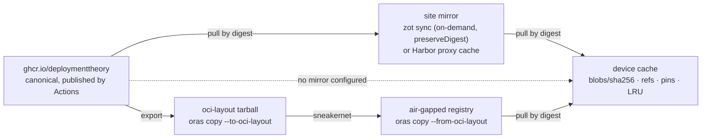

# Registries, GitHub Container Registry and licensing constraints

Research baseline: 2026-10-02. Facts marked **(probed)** come from read-only HTTP
requests sent to the live registry on that date. Everything else cites a primary
source. Items that could not be confirmed are marked *(unverified)*.

This report feeds [decision 0002](decisions/0002-registry-repositories-tags-visibility.md)
(registry, repositories, tags, visibility) and
[decision 0008](decisions/0008-device-cache-gc-and-mirrors.md) (device cache, GC and
mirrors). The artifact shape it assumes is defined in
[09-artifact-contract-v1.md](09-artifact-contract-v1.md); where the pieces fit is in
[08-target-architecture.md](08-target-architecture.md).

## Summary

- GHCR (`ghcr.io`) is the canonical registry in the GitHub and hybrid deployment
  profiles; zot is the reference registry for the private profile, run as the
  `weave-zot` container ([§4.1](#41-private-and-hybrid-hosting),
  [13-deployment-profiles.md](13-deployment-profiles.md)). GHCR stores OCI artifacts with custom
  config and layer media types, and it is free for container storage and bandwidth
  today. It has four gaps the design must work around: no referrers API, no
  immutable tags, a 10 GB per-layer and 10-minute per-upload limit, and
  authentication only by classic personal access token or `GITHUB_TOKEN`.
- Apart from zot in the private profile, every other registry in the comparison table
  below is a *mirror* or a supported target, never a fork of the publication pipeline. Registry profiles with mirror lists, pull-through caches (zot,
  Harbor) and `oci-layout` export cover offices, air gaps and clouds.
- macOS and Windows images may only live in org-private repositories. Linux images
  built from community distributions may be public. The licence clauses are quoted
  in [§6](#6-licensing-constraints); the questions that need counsel are listed as
  open, not decided.

## 1. GHCR capabilities and limits

| Capability | GHCR behaviour | Source |
|---|---|---|
| Formats | Docker v2 schema 2 and OCI manifests, including foreign layers; arbitrary artifacts with custom config and layer media types work in practice: a public macOS VM image publisher pushes a vendor config media type, and Homebrew and Kata push non-image media types (see [02-prior-art.md](02-prior-art.md)) | [GitHub docs: working with the container registry](https://docs.github.com/en/packages/working-with-a-github-packages-registry/working-with-the-container-registry); public macOS VM image manifest **(probed)** |
| Layer size | "10 GB size limit for each layer" | [GitHub docs](https://docs.github.com/en/packages/working-with-a-github-packages-registry/working-with-the-container-registry) |
| Upload time | "10 minute timeout limit for uploads" | same |
| Chunked upload | The help text of the macOS VM tool studied in [02-prior-art.md](02-prior-art.md) claims GHCR only accepts chunks smaller than 4 MB. No GitHub documentation confirms this *(unverified)* | Prior-art source file `Commands/Push.swift` (link in [02-prior-art.md](02-prior-art.md)) |
| Blob download | `GET /v2/<name>/blobs/<digest>` answers `307` to `pkg-containers.githubusercontent.com` (Azure Blob behind Varnish); a `Range` request to that URL returns `206 Partial Content` | **(probed)** |
| Referrers API | `GET /v2/<name>/referrers/<digest>` returns `404 MANIFEST_UNKNOWN` even for an existing manifest. The distribution spec says a registry that supports the API "MUST NOT return a 404", so GHCR does not support it. Clients must use the `sha256-<hex>` fallback tag | **(probed)** against a public macOS VM image repository; [distribution-spec v1.1.1](https://github.com/opencontainers/distribution-spec/blob/v1.1.1/spec.md); [community discussion #163029](https://github.com/orgs/community/discussions/163029) (no staff answer) |
| Immutable tags | Not available. GitHub's "immutable releases" feature covers Git releases and tags, not packages. The GHCR request is unanswered | [GitHub changelog 2025-10-28](https://github.blog/changelog/2025-10-28-immutable-releases-are-now-generally-available/); [community discussion #181783](https://github.com/orgs/community/discussions/181783) |
| Pull rate limits | Not publicly documented. Users of a public macOS VM image tool saw `503 Egress is over the account limit` from the Azure backend on 50–60 GB pulls | Prior-art issues #783 and #944 (links in [02-prior-art.md](02-prior-art.md)) |
| Manifest annotations rendered | `org.opencontainers.image.source` (≤256 chars, links the package to a repository), `description` (≤512), `licenses` (≤256). For multi-arch images, put the description on the index | [GitHub docs](https://docs.github.com/en/packages/working-with-a-github-packages-registry/working-with-the-container-registry) |
| Package names | A `/` inside the package name works: the in-house modules already publish `ghcr.io/deploymenttheory/weaveplatform-modules/<id>` | `deploymenttheory/weaveplatform-agent-modules@main` `.github/workflows/module-release.yml:115` |
| Anonymous pull | Allowed for public packages | [GitHub docs](https://docs.github.com/en/packages/working-with-a-github-packages-registry/working-with-the-container-registry) |
| Pricing | "Container image storage and bandwidth for the Container registry is currently free", with at least one month's notice before any change. Public packages are free. Downloads from Actions with `GITHUB_TOKEN` do not count toward transfer. Plan quotas (Free 500 MB storage / 1 GB transfer, Enterprise Cloud 50 GB / 100 GB) apply to the other Packages registries | [GitHub Packages billing](https://docs.github.com/en/billing/concepts/product-billing/github-packages) |

### 1.1 What the limits mean for VM disks

A 50 GB macOS disk cannot be one layer and could not be uploaded inside ten minutes
on most links. Both constraints are met by splitting disks into independently
compressed chunks of about 512 MiB (see [06-large-artifacts.md](06-large-artifacts.md)).
Each chunk is one blob, uploaded with a single `PUT`, retried on its own, and
skipped with a `HEAD` when the registry already holds it. Because GHCR honours
`Range` on blob downloads **(probed)**, a pull can resume at chunk granularity.

## 2. Authentication

### 2.1 Pushing from GitHub Actions

- A workflow pushing with `GITHUB_TOKEN` needs `permissions: packages: write`.
  The package itself must also grant the repository **Write** under "Manage Actions
  access"; otherwise the push fails with `403 permission_denied: write_package`.
  A public macOS image-template project hit exactly this after migrating to
  `GITHUB_TOKEN` (issue #351; link in [02-prior-art.md](02-prior-art.md)).
- A package linked to a repository inherits that repository's permissions by
  default. Permissions are otherwise granular per package
  ([about permissions for GitHub Packages](https://docs.github.com/en/packages/learn-github-packages/about-permissions-for-github-packages)).
- Attestations need `id-token: write`, `attestations: write` and
  `artifact-metadata: write` in addition
  ([actions/attest](https://github.com/actions/attest)); see
  [05-supply-chain.md](05-supply-chain.md).

### 2.2 Pulling from devices and agents

- "GitHub Packages only supports authentication using a personal access token
  (classic)" with the `read:packages`, `write:packages` and `delete:packages`
  scopes
  ([about permissions for GitHub Packages](https://docs.github.com/en/packages/learn-github-packages/about-permissions-for-github-packages)).
- **GitHub App installation tokens are not accepted by GHCR.** GitHub staff
  confirmed this in August 2025 with no timeline, and it remains unresolved
  ([community discussion #171423](https://github.com/orgs/community/discussions/171423)).
  A fleet of enrolled macOS and Windows devices therefore needs a long-lived
  `read:packages` token on a service account, delivered through the platform's
  secret channel, or a mirror that supports short-lived credentials.
- On devices, credentials should sit in the OS keychain through Docker credential
  helpers (`docker-credential-osxkeychain`, `docker-credential-wincred`), which
  guestweave-macos already honours
  (`deploymenttheory/guestweave-cli-macos@main` `internal/oci/oci_authentication.go`).
- hostweave never uses ambient credentials on the server. It seals basic
  credentials per registry connection and exchanges provider identities for ECR,
  ACR and Artifact Registry tokens at dispatch time
  (`deploymenttheory/hostweave@main` `pkg/images/registry.go:34-80`,
  `pkg/provider/registry.go:18-48`). That model carries over unchanged.

### 2.3 Registry profiles

guestweave-macos already separates *where blobs live* from *how a VM is encoded*,
and names registries with profiles in `$XDG_CONFIG_HOME/weave/config.yaml`
(`deploymenttheory/guestweave-cli-macos@main`
`internal/docs/registries-and-image-formats.md`):

```yaml
registries:
  - name: weave
    host: ghcr.io
    organization: deploymenttheory
    default: true
  - name: corp
    host: registry.internal.example:5000
    organization: vm-images
    insecure: true
```

References resolve in the order `--registry <profile>` → fully-qualified
reference → bare name against the default profile. Credentials resolve per host.

hostweave's `RegistryConnection` is narrower: one connection covers exactly one
repository, and the authentication mode is one of `anonymous`, `basic`, `ecr`,
`acr` or `gar` (`deploymenttheory/hostweave@main` `pkg/types/image.go:44-100`).
It has no concept of a mirror, a pull-through cache or a profile shared with the
agents. [Decision 0008](decisions/0008-device-cache-gc-and-mirrors.md) adds an
ordered mirror list to the shared profile type so that one definition serves the
CLIs, the hostweave server and the agents.

### 2.4 Retention and deletion hazards

`actions/delete-package-versions@v5` can delete untagged versions and keep the
newest *n* ([actions/delete-package-versions](https://github.com/actions/delete-package-versions)).
Two things look "untagged" on GHCR but must not be deleted:

- the per-platform child manifests of an image index, which are only reachable
  through the index;
- the `sha256-<hex>` fallback-tag index that holds attestations and signatures
  (it is tagged, but a child bundle manifest below it is not).

Any automated cleanup must enumerate what the current channel manifests and
indexes reference before deleting. This is my inference from how the fallback
tag is built; it needs a test before it is automated *(unverified)*.

## 3. Registry comparison

| Registry | Referrers API | Max layer / upload | Range on blob GET | Storage backends | Pull-through / replication | Immutable tags | Auth | Notes |
|---|---|---|---|---|---|---|---|---|
| GHCR | **No** (fallback tag) **(probed)** | 10 GB per layer; 10-minute upload timeout ([docs](https://docs.github.com/en/packages/working-with-a-github-packages-registry/working-with-the-container-registry)) | Yes, 206 **(probed)**; 307 to `pkg-containers.githubusercontent.com` | GitHub-managed | None | No | Classic PAT, `GITHUB_TOKEN` | Free "currently" ([billing](https://docs.github.com/en/billing/concepts/product-billing/github-packages)) |
| Docker Hub | Yes **(probed)** | No documented limit; trouble reported above roughly 10–20 GB ([forum](https://forums.docker.com/t/whats-the-largest-supported-image-size-on-docker-hub/7272)) | Yes; 307 to CloudFront **(probed)** | Managed | — | Yes, by regex ([docs](https://docs.docker.com/docker-hub/repos/manage/hub-images/immutable-tags/)) | PAT, OAT | 200 pulls / 6 h on the Personal plan ([usage](https://docs.docker.com/docker-hub/usage/pulls/)) |
| Amazon ECR | Yes ([AWS blog](https://aws.amazon.com/blogs/opensource/diving-into-oci-image-and-distribution-1-1-support-in-amazon-ecr/)); a sigstore-js comment says ECR returns `OCI-Subject` but not the API, so verify in practice ([sigstore-js](https://github.com/sigstore/sigstore-js/blob/main/packages/oci/src/image.ts)) | 52,000 MiB; 200 GB via `docker push` since 2026-08-03, 50 GB via the API ([quotas](https://docs.aws.amazon.com/AmazonECR/latest/userguide/service-quotas.html), [announcement](https://aws.amazon.com/about-aws/whats-new/2026/08/amazon-ecr-image-layers/)); API parts 5–10 MiB, ≤4,200 parts | Yes; ECR Public 307 to CloudFront **(probed)** | S3 | Pull-through cache incl. GHCR ([docs](https://docs.aws.amazon.com/AmazonECR/latest/userguide/pull-through-cache.html)); replication | Yes, with exclusion filters ([2025](https://aws.amazon.com/about-aws/whats-new/2025/07/amazon-ecr-exceptions-tag-immutability/)) | IAM, OIDC | hostweave already exchanges ECR tokens |
| Azure ACR | Yes **(probed on MCR)**; [ORAS docs](https://docs.azure.cn/en-us/container-registry/container-registry-manage-artifact) | 200 GiB per layer; 4 MiB manifest ([SKUs](https://learn.microsoft.com/en-us/azure/container-registry/container-registry-skus)) | Yes; dedicated data endpoints (Premium) | Managed | Artifact cache incl. GHCR ([docs](https://learn.microsoft.com/en-us/azure/container-registry/artifact-cache-overview)); geo-replication (Premium) | Lock / immutable tags | Entra ID, OIDC | hostweave already exchanges ACR tokens |
| Google Artifact Registry | Yes ([docs](https://docs.cloud.google.com/artifact-registry/docs/docker/manage-metadata?authuser=0)) **(probed)** | No size quota published ([quotas](https://docs.cloud.google.com/artifact-registry/quotas)) | Yes; 302 to a same-host path **(probed)** | GCS | Remote repositories | Yes | Workload Identity Federation | hostweave already exchanges GAR tokens |
| Quay.io / Project Quay ≥3.12 | Yes ([Red Hat blog](https://www.redhat.com/en/blog/announcing-open-container-initiativereferrers-api-quayio-step-towards-enhanced-security-and-compliance)) **(probed)** | *(unverified)* | Yes; 302 to `cdn01.quay.io` **(probed)** | S3 and others | Mirroring, proxy | Yes, by regex ([API](https://docs.redhat.com/en/documentation/red_hat_quay/3/html/red_hat_quay_api_reference/immutability_policy)) | Robot accounts | |
| Harbor 2.15 | Yes; "fully supports v1.1.0" since 2.11 ([blog](https://goharbor.io/blog/harbor-2.11)) | Storage-bound | Yes | Filesystem, S3, Azure, GCS, Swift | Proxy cache for Hub, Harbor, ECR, ACR, GCR, Quay, **GHCR**, Artifactory; no push into a proxy project; 7-day default retention ([docs](https://goharbor.io/docs/main/administration/configure-proxy-cache/)); push/pull replication | Yes, rules ([docs](https://goharbor.io/docs/working-with-projects/working-with-images/create-tag-immutability-rules/)) | OIDC, robot accounts | Full UI and RBAC |
| zot 2.1.21 | Yes; syncs referrers recursively ([mirroring](https://zotregistry.dev/v2.1.21/articles/mirroring/)) | Storage-bound | Yes | Filesystem, S3 | `sync` on-demand or periodic, multiple upstreams with failover, regex/semver/glob filters, `onlySigned`, `preserveDigest` | Retention policies | OIDC, htpasswd | Single Go binary; per-office mirror |
| CNCF distribution v3.1.2 (`registry:3`) | **No**; PR open for 3.2 ([#4828](https://github.com/distribution/distribution/pull/4828)) | Storage-bound | Yes | Filesystem, S3 (incl. R2), Azure, GCS | Pull-only proxy, one upstream, TTL ([recipe](https://distribution.github.io/distribution/recipes/mirror/)) | No | Token/htpasswd | Simplest option |
| JFrog Artifactory | Yes, from 7.90.1 ([docs](https://jfrog.com/help/r/jfrog-artifactory-documentation/use-referrers-rest-api-to-discover-oci-references)) | *(unverified)* | Yes | Many | Remote repositories, federation | — | Many | Commercial |
| Sonatype Nexus | Yes ([docs](https://help.sonatype.com/en/oci-repositories.html)) | *(unverified)* | Yes | Blob stores | Proxy | — | Many | Commercial / CE |
| Cloudflare serverless-registry | Not documented; `docker push` limited to 500 MB layers ([README](https://github.com/cloudflare/serverless-registry)) | 500 MB | — | R2 | — | — | — | Not suitable |

The OCI distribution spec says registries SHOULD support `Range` on blob GETs,
defines chunked uploads (`PATCH` with `Content-Range`, resumable via `GET` on the
upload URL) and lets a registry advertise `OCI-Chunk-Min-Length`
([distribution-spec v1.1.1](https://github.com/opencontainers/distribution-spec/blob/v1.1.1/spec.md)).
Upload resumability varies by registry, which is one more reason to keep each
chunk small enough that a failed upload is simply retried whole.

### 3.1 Recommendation

- **Baseline (this project):** GHCR, published from GitHub Actions, with
  attestations pushed to the registry and digests promoted through the channel
  manifest ([05-supply-chain.md](05-supply-chain.md)). Only Linux repositories
  are public.
- **Enterprise mirror:** Harbor when an organisation wants a UI, RBAC, OIDC,
  replication, immutability rules and a GHCR proxy cache in one place; zot when a
  lightweight per-office mirror on S3-compatible storage is enough. ECR or ACR
  are equally good mirrors for organisations already in those clouds, and hostweave
  already knows how to authenticate to them.

## 4. Mirroring, pull-through caches and air gaps



- **zot `sync`** fetches on demand or on a schedule from several upstreams with
  failover and content filters. `preserveDigest: true` with
  `http.compat: ["docker2s2"]` keeps upstream digests so signatures and
  attestations remain valid; `onlySigned` refuses unsigned content; referrers are
  synced recursively ([zot mirroring](https://zotregistry.dev/v2.1.21/articles/mirroring/)).
- **Harbor proxy cache** projects pull from GHCR among others, serve the cache when
  the upstream is down, and cannot be pushed into
  ([Harbor docs](https://goharbor.io/docs/main/administration/configure-proxy-cache/)).
- **distribution proxy mode** mirrors one upstream, pull-only, with a TTL
  ([recipe](https://distribution.github.io/distribution/recipes/mirror/)).
- **Peer-to-peer tools do not help device fleets.** Spegel is a cluster-local
  containerd mirror ([spegel.dev](https://spegel.dev/)); Dragonfly and Kraken
  target Linux nodes ([d7y.io](https://d7y.io/docs/)). macOS and Windows devices
  use their own registry client, so the realistic options are a site-local mirror
  hostname in the registry profile plus the device cache.
- **Air gap.** `oras copy --to-oci-layout`, `regctl` or `skopeo` write an
  [OCI image layout](https://github.com/opencontainers/image-spec/blob/v1.1.1/image-layout.md)
  (`oci-layout`, `index.json`, `blobs/sha256/`) that can be carried across and
  re-imported. Digests do not change, so attestations and channel-manifest entries
  stay valid, and an offline device verifies with the embedded root key and a
  downloaded Sigstore trusted root.

Whether a mirror hostname can be substituted transparently by the registry client,
or must appear in the reference, is settled in
[decision 0008](decisions/0008-device-cache-gc-and-mirrors.md): mirrors are an
ordered list on the profile and the client tries them before the canonical host,
always verifying the same digest.

### 4.1 Private and hybrid hosting

The same artifacts, tools and trust chain run in three deployment profiles
([13-deployment-profiles.md](13-deployment-profiles.md),
[decision 0011](decisions/0011-deployment-profiles-and-reference-registry.md)):

| Profile | Canonical registry | Publisher | Build-time signature | Site registry |
|---|---|---|---|---|
| GitHub | GHCR | GitHub Actions wrapping `weaveoci publish` | GitHub artifact attestation | none |
| Private | zot (`ghcr.io/deploymenttheory/weave-zot`), or Harbor / distribution v3 | `weaveoci publish` from any CI or a workstation | cosign-format bundle signed with a file or KMS key | optional zot mirror |
| Hybrid | GHCR | GitHub Actions | GitHub artifact attestation | zot per site, `sync` on demand with `preserveDigest` |

zot is the reference private registry because it is a single container with the
referrers API, Range and resumable uploads, on-demand GHCR sync that preserves digests,
and tag immutability through access control (`create` without `update`). Harbor and
distribution v3 are supported targets; distribution v3 has no referrers API, so it
exercises the fallback-tag path. The private profile removes the GHCR-specific gaps
above (no referrers API, classic-PAT-only credentials, undocumented egress limits) and
is the natural home for macOS and Windows images. The channel manifest remains
mandatory in every profile ([05-supply-chain.md](05-supply-chain.md)).

## 5. Repository naming and tags on GHCR

Observed layouts **(probed)**, publishers named in [02-prior-art.md](02-prior-art.md):
`macos-<codename>-{vanilla,base}` and `-xcode:<N>`; `macos-sequoia-cua:{latest,15.3}`;
`quay.io/containerdisks/fedora:{44,44-1.7,44-2604290212,latest}`;
`quay.io/fedora/fedora-bootc:{46,46-aarch64}`; `quay.io/podman/machine-os:5.6`.

The weave layout is defined in [09-artifact-contract-v1.md](09-artifact-contract-v1.md)
and fixed by [decision 0002](decisions/0002-registry-repositories-tags-visibility.md):
`ghcr.io/deploymenttheory/weave-images/<family>-<major>[-<variant>]`, immutable
tags `<osver>-<build>-r<rev>` plus moving `stable`, `edge` and `latest`. Because
GHCR cannot enforce tag immutability, the channel manifest records digests and
every consumer pins by digest.

## 6. Licensing constraints

These clauses decide where images may be published. They are quoted so the
constraint is traceable; interpretation beyond the plain text is a question for
counsel and is listed in [12-open-questions.md](12-open-questions.md).

### 6.1 macOS

Source: [Apple macOS Tahoe 26 Software License Agreement](https://www.apple.com/legal/sla/docs/macOSTahoe.pdf).

- §2B(iii) permits running "up to two (2) additional copies or instances … within
  virtual operating system environments on each Apple-branded computer you own or
  control that is already running the Apple Software", for software development,
  testing during software development, macOS Server, or personal non-commercial
  use. The same clause excludes using virtual copies for "service bureau,
  time-sharing, terminal sharing, relay service" purposes.
- §2J: the software may not be run on non-Apple hardware, and "you may not rent,
  lease, lend, sell, redistribute or sublicense the Apple Software" except as
  permitted in §3.
- §2K: the Boot ROM and firmware may not be copied, modified or redistributed. An
  IPSW contains firmware.
- §3 permits leasing only under conditions, including a minimum 24-hour lease with
  sole and exclusive use.

No Apple statement, and no justification from the publishers of public macOS
images on `ghcr.io`, was found during this research.

**Consequence.** No public macOS images. The safest design builds macOS images per
organisation, from Apple's own restore image on that organisation's Apple hardware,
and keeps them in org-private repositories. Whether distributing an image to the
same organisation's other Macs is "redistribution" under §2J, and whether a CI
fleet of two guests per host is "development and testing" or a "service bureau",
are counsel questions.

### 6.2 Windows

Source: [Microsoft Software License Terms, Windows 11 (OEM)](https://microsoft.com/content/dam/microsoft/usetm/documents/windows/11/oem-(pre-installed)/UseTerms_OEM_Windows_11_English.pdf).

- §2a: one instance of the software per licensed device.
- §2b: a "device" may be physical or virtual.
- §2c(ii): the licensee may not "publish, copy (other than the permitted backup
  copy), rent, lease, or lend the software".
- Volume-licensing customers are governed by their agreement instead, and
  reimaging rights allow reimaging licensed devices only with media from the
  Commercial Licensing agreement, matching product, version, edition and language
  ([Microsoft reimaging rights](https://www.microsoft.com/licensing/guidance/Reimaging-rights)).
- Microsoft's own Windows development VMs have been "temporarily unavailable" since
  2024-10-23 ([developer.microsoft.com](https://developer.microsoft.com/downloads/virtual-machines)).
  The Evaluation Center provides 90-day Windows 11 Enterprise ISOs
  ([Evaluation Center](https://www.microsoft.com/en-us/evalcenter/download-windows-11-enterprise)).

**Consequence.** No public Windows images, and no public ISO or ESD media stored
as artifacts. An org-private repository holding images built from that
organisation's volume-licensing media, for that organisation's licensed devices,
is the plausible shape. Whether a pre-installed disk image, rather than
installation media, may be held in a private registry under VL terms is a counsel
question.

### 6.3 Linux

- Ubuntu may be redistributed unmodified, including as VM images; modified
  versions need Canonical's approval to use the trademarks
  ([Canonical IP policy](https://canonical.com/legal/intellectual-property-policy)).
- Modified Fedora must be called "Fedora Remix"
  ([Fedora trademark guidelines](https://doc.fedoraproject.org/ar/legal/trademarks)).
- RHEL may not be redistributed; UBI may only ship as part of a container image or
  certified product ([Red Hat EULAs](https://www.redhat.com/en/about/red-hat-end-user-license-agreements)).

**Consequence.** Public Linux images are fine when built from community
distributions (Fedora, Ubuntu, Debian, AlmaLinux, Rocky) with the trademark rules
respected in repository names and `org.opencontainers.image.licenses`.

### 6.4 Visibility matrix

| Guest OS | Repository visibility | Source media | Build location |
|---|---|---|---|
| Linux (community distro) | Public allowed | Upstream cloud image or bootc image, checksum-verified | GitHub-hosted Linux runners |
| macOS | Org-private only | Apple restore image fetched by the builder itself | Self-hosted Apple-silicon hardware the organisation owns |
| Windows | Org-private only | The organisation's licensed media | GitHub-hosted Linux runners (QEMU/KVM) or self-hosted |

## 7. Open questions carried forward

See [12-open-questions.md](12-open-questions.md) for the full list. From this
report: GHCR referrers API and GitHub App token timelines; undocumented GHCR pull
and egress limits for repeated multi-GB pulls; whether the prior-art "chunks under 4 MB"
claim about GHCR is true; whether ECR and ACR pull-through caches preserve
fallback-tag referrers and custom artifact types; the three licensing questions
above.

## References

- OCI distribution-spec v1.1.1: <https://github.com/opencontainers/distribution-spec/blob/v1.1.1/spec.md>
- OCI image layout: <https://github.com/opencontainers/image-spec/blob/v1.1.1/image-layout.md>
- GitHub container registry: <https://docs.github.com/en/packages/working-with-a-github-packages-registry/working-with-the-container-registry>
- GitHub Packages permissions: <https://docs.github.com/en/packages/learn-github-packages/about-permissions-for-github-packages>
- GitHub Packages billing: <https://docs.github.com/en/billing/concepts/product-billing/github-packages>
- GitHub App tokens and GHCR: <https://github.com/orgs/community/discussions/171423>
- GHCR referrers API request: <https://github.com/orgs/community/discussions/163029>
- GHCR immutable tags request: <https://github.com/orgs/community/discussions/181783>
- zot mirroring: <https://zotregistry.dev/v2.1.21/articles/mirroring/>
- Harbor proxy cache: <https://goharbor.io/docs/main/administration/configure-proxy-cache/>
- distribution mirror recipe: <https://distribution.github.io/distribution/recipes/mirror/>
- Apple macOS Tahoe SLA: <https://www.apple.com/legal/sla/docs/macOSTahoe.pdf>
- Windows 11 OEM licence terms: <https://microsoft.com/content/dam/microsoft/usetm/documents/windows/11/oem-(pre-installed)/UseTerms_OEM_Windows_11_English.pdf>
- Microsoft reimaging rights: <https://www.microsoft.com/licensing/guidance/Reimaging-rights>
- `deploymenttheory/hostweave@main`: `pkg/types/image.go`, `pkg/images/registry.go`, `pkg/provider/registry.go`
- `deploymenttheory/guestweave-cli-macos@main`: `internal/docs/registries-and-image-formats.md`, `internal/oci/oci_authentication.go`
- `deploymenttheory/weaveplatform-agent-modules@main`: `.github/workflows/module-release.yml`
