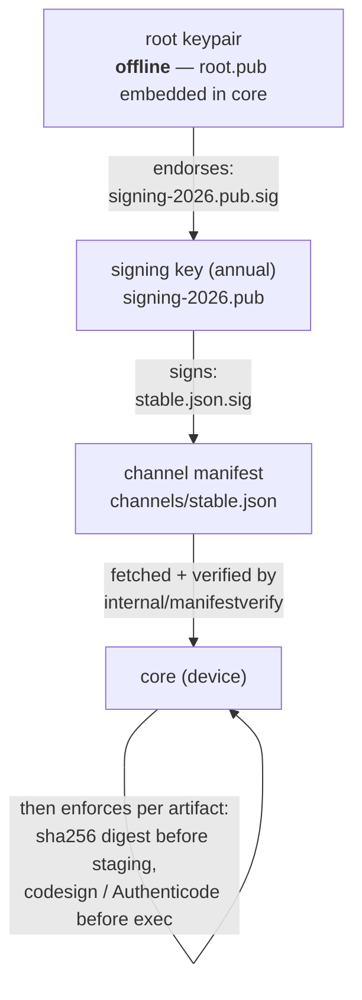
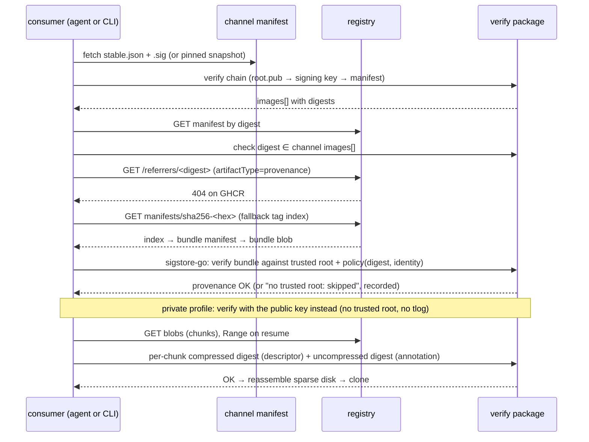

# Supply chain: attestations at build, channel manifest at promotion

Research baseline: 2026-10-02. Every external claim cites a primary source; items
that could not be confirmed are marked *(unverified)*.

This report feeds [decision 0006](decisions/0006-trust-attestations-and-channel-manifest.md).
It assumes the artifact shape in [09-artifact-contract-v1.md](09-artifact-contract-v1.md),
the registry facts in [04-registries-and-github.md](04-registries-and-github.md)
and the component layout in [08-target-architecture.md](08-target-architecture.md).

## Summary

Two mechanisms, each doing one job. The build-time signature is pluggable by
deployment profile ([13-deployment-profiles.md](13-deployment-profiles.md),
[decision 0011](decisions/0011-deployment-profiles-and-reference-registry.md)); the channel
manifest is mandatory in every profile.

| Mechanism | Answers | Produced by | Verified by |
|---|---|---|---|
| **Build-time signature**, GitHub profile: GitHub artifact attestation (Sigstore bundle as an OCI referrer, from `actions/attest`) | "Which workflow, at which commit, built this exact digest from which inputs?" | The publishing workflow, automatically, for every pushed manifest | CI self-check; hostweave server at pin time; `gh attestation verify`; any ecosystem verifier |
| **Build-time signature**, private profile: cosign-format Sigstore bundle signed with a file or KMS key, stored as an OCI referrer | "Did a holder of the organisation's publishing key sign this exact digest?" | `weaveoci publish`, from any CI or a workstation | `weaveoci publish` self-check; hostweave server; `cosign verify --key … --insecure-ignore-tlog` |
| **Channel manifest** (minisign-style Ed25519 chain owned by weaveplatform-manifest) | "Is this digest one the platform has promoted for this channel?" | A human merging the promotion pull request | hostweave server and agents, guestweave CLIs, offline devices, with nothing but the root key embedded in the binary |

The build-time signature gives provenance (keyless attestations) or key-holder
authenticity (key-based bundles) and ecosystem interoperability. The channel manifest
gives an air-gap-capable promotion gate that already exists for agent modules. The
platform's own trust-chain document rules out depending on Sigstore infrastructure
for the gate: "no Fulcio, no Rekor, no CA"
(`weaveplatform/weaveplatform-channels@main` `docs/trust-chain.md`).

## 1. Why both

- **The gate must work offline.** An air-gapped deployment verifies the channel
  manifest with the root public key baked into core
  (`weaveplatform/weaveplatform-channels@main` `README.md`, "Trust model").
  Sigstore verification needs a current trusted root that includes timestamp
  authority material, because Rekor v2 entries require a signed timestamp
  ([cosign CHANGELOG, v3.0.5](https://raw.githubusercontent.com/sigstore/cosign/main/CHANGELOG.md)),
  and GitHub says its Sigstore keys rotate "a few times per year"
  ([verify attestations offline](https://docs.github.com/en/enterprise-cloud@latest/actions/how-tos/secure-your-work/use-artifact-attestations/verify-attestations-offline)).
  That is fine for a build server and awkward for a laptop in a lab.
- **Provenance must be automatic and standard.** The channel manifest records a
  digest, not how it was made. A SLSA provenance attestation records the workflow,
  commit, runner and resolved inputs, and it can be checked by tools the project
  does not own.
- **Promotion is a human decision.** The agent-modules pipeline already makes
  "merge the promotion PR" the act of promotion
  (`deploymenttheory/weaveplatform-agent-modules@main` `docs/release-pipeline.md`).
  Images follow the same path: a build that passed its own verification is
  *published*; a digest listed in the signed channel is *promoted*.
- **Private deployments cannot rely on GitHub.** GitHub attestations need GitHub
  Actions and, for private repositories, GitHub Enterprise Cloud. A private
  organisation publishing to its own zot signs with a key it controls instead; the
  bundle format and referrer shape are the same, so consumers run one verifier with
  two policies (certificate identity or public key).

## 2. GitHub artifact attestations

Facts, as of 2026-10-02:

- `actions/attest` is at v4.2.2. `actions/attest-build-provenance` v4 "is simply a
  wrapper on top of `actions/attest`"
  ([attest-build-provenance README](https://github.com/actions/attest-build-provenance),
  [actions/attest](https://github.com/actions/attest)). The action has three modes:
  build provenance, SBOM, and a custom predicate.
- Permissions: `id-token: write`, `attestations: write` and
  `artifact-metadata: write`, plus `packages: write` when pushing to the registry
  ([use artifact attestations](https://docs.github.com/en/actions/how-tos/secure-your-work/use-artifact-attestations/use-artifact-attestations)).
- Plan requirements: public repositories on every plan; private and internal
  repositories need GitHub Enterprise Cloud. Public repositories sign with the
  Sigstore public-good instance; private repositories use GitHub's private Sigstore
  instance ([artifact attestations concepts](https://docs.github.com/en/enterprise-cloud@latest/actions/concepts/security/artifact-attestations)).
- Storage: every attestation is stored in GitHub's attestations API. With
  `push-to-registry: true` the Sigstore bundle is also pushed as an OCI referrer.
  The push code (`@sigstore/oci`) uploads the bundle as a manifest with an empty
  config and a `subject`, probes the referrers API, and when that fails maintains
  the `sha256-<hex>` fallback-tag index
  ([sigstore-js `image.ts`](https://raw.githubusercontent.com/sigstore/sigstore-js/main/packages/oci/src/image.ts)).
  On GHCR it always takes the fallback path
  ([04-registries-and-github.md §1](04-registries-and-github.md#1-ghcr-capabilities-and-limits)).
- Custom artifacts: the push requires "a single fully-qualified OCI image
  reference with a SHA-256 digest" and no tag in `subject-name`
  ([actions/attest README](https://github.com/actions/attest)). The code only
  `HEAD`s the subject digest and copies its descriptor; it does not inspect whether
  the manifest is a Docker image, so a weave VM artifact manifest should work.
  This is a reading of the code, not a test *(unverified)*.
- SLSA: the specification is at v1.2 ([slsa.dev](https://slsa.dev/spec/)).
  Attestations from a workflow give Build L2; a reusable workflow gives Build L3
  ([GitHub docs](https://docs.github.com/en/enterprise-cloud@latest/actions/concepts/security/artifact-attestations)).
  macOS images must be built on self-hosted Apple-silicon runners
  ([07-build-pipelines.md](07-build-pipelines.md)), so `--deny-self-hosted-runners`
  cannot be used for them, which weakens the L3 claim for macOS. The channel
  manifest closes that gap: a human still has to promote the digest.
- Verification command: `gh attestation verify oci://ghcr.io/ORG/IMG@sha256:… -R ORG/REPO`
  (or `--owner`); `--bundle-from-oci` reads the bundle from the registry instead of
  the API; `--signer-workflow`, `--cert-identity`, `--source-ref` and
  `--deny-self-hosted-runners` tighten identity; `--predicate-type` defaults to
  SLSA provenance v1 ([gh manual](https://cli.github.com/manual/gh_attestation_verify)).
- Offline: `gh attestation download`, then `gh attestation trusted-root > trusted_root.jsonl`,
  then verify with `--bundle` and `--custom-trusted-root`
  ([verify attestations offline](https://docs.github.com/en/enterprise-cloud@latest/actions/how-tos/secure-your-work/use-artifact-attestations/verify-attestations-offline)).

## 3. cosign

cosign key-based signing is the **build-time signature of the private profile**
(project owner's decision, 2026-10-02), and remains the tool for re-signing on a mirror.
The shared module signs natively in Go and produces the same bundle and referrer, so no
cosign binary is needed to publish; `cosign verify` stays an interoperable external
check. Facts, as of 2026-10-02:

- Latest cosign is v3.1.3 (2026-08-06); latest sigstore-go is v1.3.0 (2026-07-30)
  (GitHub releases).
- v3 made the Sigstore bundle format, `--trusted-root` / `--signing-config` and
  OCI 1.1 referrer storage the defaults
  ([Cosign 3.0 announcement](https://blog.sigstore.dev/cosign-3-0-available/)).
  `--bundle` became required in v3.0.2
  ([CHANGELOG](https://raw.githubusercontent.com/sigstore/cosign/main/CHANGELOG.md)).
- Storage is selectable with `--registry-referrers-mode legacy|oci-1-1`
  ([cosign sign](https://raw.githubusercontent.com/sigstore/cosign/main/doc/cosign_sign.md)).
  Legacy storage is the tag `sha256-<hex>.sig`; OCI 1.1 storage falls back to the
  tag `sha256-<hex>` (an index) on registries without the referrers API
  ([summary](https://oneuptime.com/blog/post/2026-08-11-cosign-signature-storage-oci-referrers-separate-repositories/markdown)).
  `COSIGN_REPOSITORY` redirects signatures to another repository; signer and
  verifier must agree.
- Keyless verification requires `--certificate-identity` or
  `--certificate-identity-regexp` plus `--certificate-oidc-issuer` (or `-regexp`);
  `--certificate-github-workflow-repository` and `--certificate-github-workflow-ref`
  exist for GitHub Actions ([cosign verify](https://raw.githubusercontent.com/sigstore/cosign/main/doc/cosign_verify.md)).
  The issuer for Actions is `https://token.actions.githubusercontent.com`.
- Key-based signing supports files, `env://`, `awskms://`, `azurekms://`,
  `gcpkms://`, `hashivault://` and `k8s://`; `--tlog-upload=false` is deprecated
  since v3.0.3 ([cosign sign](https://raw.githubusercontent.com/sigstore/cosign/main/doc/cosign_sign.md)).
- **Key-based signing without a transparency log (v3.1.3).** Preferred: create a
  signing config with no services (`cosign signing-config create --out offline-sc.json`)
  and sign with `cosign sign --key cosign.key --signing-config offline-sc.json
  --trusted-root tr.json <ref@sha256:…>`. Legacy form:
  `--use-signing-config=false --tlog-upload=false`. Because `--use-signing-config`
  defaults to true, `--tlog-upload=false` on its own fails in v3
  ([common.go L433-462](https://github.com/sigstore/cosign/blob/v3.1.3/cmd/cosign/cli/signcommon/common.go),
  [issue 5043](https://github.com/sigstore/cosign/issues/5043)).
- **Key-based verification:** `cosign verify --key cosign.pub --insecure-ignore-tlog
  <ref@digest>`; `--private-infrastructure` is deprecated in its favour
  ([verify options](https://github.com/sigstore/cosign/blob/v3.1.3/cmd/cosign/cli/options/verify.go)).
- **Referrer shape:** empty config, `artifactType:
  application/vnd.dev.sigstore.bundle.v0.3+json`, `subject` = signed manifest, bundle as
  the only layer ([write.go L313-410](https://github.com/sigstore/cosign/blob/v3.1.3/pkg/oci/remote/write.go)).
  On registries without the referrers API the `sha256-<hex>` fallback index tag is
  maintained automatically
  ([ggcr write.go L506-593](https://github.com/google/go-containerregistry/blob/v0.21.7/pkg/v1/remote/write.go)).
- KMS URIs for keys: `awskms://`, `gcpkms://projects/…/cryptoKeys/…/versions/N`,
  `azurekms://`, `hashivault://`, `k8s://ns/name`, `github://`, `gitlab://`
  ([generate-key-pair](https://github.com/sigstore/cosign/blob/v3.1.3/doc/cosign_generate-key-pair.md)).
- `sigstore/cosign-installer` v4.1.2 installs cosign v3.0.6 by default; workflows pin
  `cosign-release: v3.1.3`
  ([action.yml](https://github.com/sigstore/cosign-installer/blob/v4.1.2/action.yml)).
- Sigstore lists GHCR, ECR, GAR, ACR, Docker Hub, Artifactory, distribution,
  GitLab, Harbor, Nexus, Quay and others as tested registries
  ([registry support](https://docs.sigstore.dev/cosign/system_config/registry_support/)).
- Notation (Notary Project, v1.3.2) is the X.509 alternative with no transparency
  log; its default is the tag schema (`--force-referrers-tag=false` opts into the
  API) ([notation `sign.go`](https://raw.githubusercontent.com/notaryproject/notation/main/cmd/notation/sign.go)).
  It suits an enterprise with its own CA, not this project's GitHub baseline.

### 3.1 Referrers discovery by registry

| Registry | Referrers API | Where a bundle lands |
|---|---|---|
| GHCR | No **(probed)** | `sha256-<hex>` fallback-tag index |
| distribution v3.1.2 | No ([PR #4828](https://github.com/distribution/distribution/pull/4828)) | fallback tag |
| Docker Hub, Quay ≥3.12, GAR, ACR, ECR, Harbor ≥2.11, zot, Artifactory ≥7.90.1, Nexus | Yes | native referrers; zot mirrors referrers recursively ([zot](https://zotregistry.dev/v2.1.21/articles/mirroring/)) |

A verifier therefore always tries the referrers API first and the fallback tag
second. Full table in [04-registries-and-github.md §3](04-registries-and-github.md#3-registry-comparison).

## 4. The channel manifest chain

Reproduced from `weaveplatform/weaveplatform-channels@main` `docs/trust-chain.md`:



What exists today:

- Two tiers of detached Ed25519 signatures in a JSON envelope beside the file. An
  offline root key endorses annual signing keys; a signing key signs the channel
  manifest. The root private key never touches CI
  (`weaveplatform-manifest@main` `docs/trust-chain.md`).
- Two channel shapes with one schema and one verifier: `channels/stable.json` is
  rolling and re-signed on every promotion; `channels/pinned/<service-version>.json`
  is an immutable snapshot for self-hosted deployments.
- The schema is owned by `weaveplatform-api/schema/channel-manifest.schema.json`
  (`schema: 1`, `channel`, `generated_at`, `protocol`, `bindings`, `core`,
  `modules[]`; each artifact is `{os, arch, url, digest sha256, size}`;
  `additionalProperties: false` throughout).
- The verifier is `weaveplatform-agent/internal/manifestverify`, deliberately in
  core and not in the SDK: "a CVE is a core patch, not a rebuild of every module".
- The tool is `weavemanifest keygen | endorse | sign | verify | promote | pin`.
- Promotion is a `repository_dispatch` from the publishing workflow, a pull request
  that rewrites and re-signs `stable.json`, and a merge.

What images need, and what phase 2 implemented (2026-10-02):

1. **Where the code lives now.** The repositories named above have moved to the
   `weaveplatform` GitHub organisation: weaveplatform-api, -sdk and -agent were merged
   into `weaveplatform/weaveplatform-agent-core` (format types in its public
   `sdk/manifest` module, verifier still in `internal/manifestverify`), and
   weaveplatform-manifest is now `weaveplatform/weaveplatform-channels`. Several old
   `deploymenttheory/*` remotes no longer resolve, so the local sibling checkouts are
   stale ([12-open-questions.md](12-open-questions.md) Q26).
2. **A byte-compatible re-implementation, not an import.** `pkg/channel` in this
   repository re-implements the roughly 60-line chain check with the same file
   formats: `.pub`, `.key` and `.sig` JSON (`schema`, `key_id`, base64 values), Ed25519
   over `context + 0x00 + exact file bytes`, contexts `weave-endorse-v1` and
   `weave-manifest-v1`, root key id `root`, and manifestverify's order (endorsement,
   manifest signature, then parsing, then expiry and sequence). Importing
   agent-core's `sdk/manifest` would have pulled gRPC and protobuf into every
   consumer for four helper functions.
3. **The `images` section.** Implemented as an optional top-level array; agents that
   predate it decode non-strictly and ignore it, and the signature covers the exact
   bytes, so existing tooling (`weavemanifest sign`/`verify`) is unaffected. Field
   names follow the manifest's existing snake_case style:

   ```json
   "images": [{
     "repository": "weaveplatform/weave-images/ubuntu-24.04",
     "tag": "24.04-20260915-r1",
     "digest": "sha256:…index…",
     "platforms": [{"os": "linux", "arch": "arm64", "digest": "sha256:…"}],
     "signature": {"provider": "cosign-key", "key_id": "<cosign key hint>"},
     "build_date": "2026-10-02T08:00:00Z"
   }]
   ```

   `repository` is the repository path without the registry host, so the same entry
   admits the image whether it is pulled from GHCR, a zot mirror or an air-gapped
   layout. `weaveoci channel new|keygen|endorse|promote|sign|verify` lets an
   organisation run its own channel without the agent-core tooling.
4. **The schema and the promotion path.** agent-core's
   `schema/channel-manifest.schema.json` (`additionalProperties: false` throughout)
   gains `images`, plus the `sequence`, `expires` and module `subscribes` fields CI
   already wrote but the schema rejected, and core's `sdk/manifest` parses and checks
   image entries
   ([weaveplatform-agent-core#56](https://github.com/weaveplatform/weaveplatform-agent-core/pull/56)).
   The channels promote workflow handles a new `image-published` dispatch whose
   payload is the entry `weaveoci publish --promotion-out` writes. It validates the
   entry, re-resolves the tag from the registry and refuses a payload whose index or
   platform digests differ, then adds or replaces the entry by repository and tag as
   `channel.Promote` does
   ([weaveplatform-channels#14](https://github.com/weaveplatform/weaveplatform-channels/pull/14)).
   `pkg/channel` validates everything it writes against a byte-for-byte copy of
   agent-core's schema (`make channel-schema` refreshes it), and uses core's expiry
   rule: the `expires` instant itself is still valid.
5. **Still required.** No real root key exists yet (core's embedded `keys/root.pub`
   is empty, Q29).

## 5. Provenance predicate for VM images

Use the SLSA provenance v1 predicate as produced by `actions/attest` build-provenance
mode, with the VM-specific inputs recorded where the predicate already has room
([SLSA provenance v1](https://slsa.dev/spec/)):

| Field | Content |
|---|---|
| `subject` | The manifest digest of the artifact (and, for an index, the index digest with each child as a further subject) |
| `buildDefinition.externalParameters` | Builder template repository, ref and digest; guest OS build identifier (for example `25A354` or `26200.6584`); variant name; requested disk size |
| `buildDefinition.resolvedDependencies` | Each with a `sha256` digest: the restore image URL and digest (macOS); the ISO or ESD file name, digest and source (Windows); the cloud image or bootc image digest (Linux); the unattend or kickstart file; every provisioning script; the base image digest for derived images; the baked guest-agent binary; the versions of the build tools |
| `runDetails.builder.id` | The workflow identity, which encodes hosted vs self-hosted |

Media digests are not secret, so a public transparency-log entry for a Linux build
is fine. Private Sigstore for the private repositories keeps internal image names
out of the public log.

## 6. SBOMs: what is realistic

- **Trivy** `vm` scanning is experimental and narrow: VMDK streamOptimized only,
  MBR or GPT without LVM, ext2/3/4 and XFS only, plus `ami:` and `ebs:` targets.
  QCOW2, VHD and VHDX are explicitly unsupported, and so are APFS and NTFS
  ([Trivy VM target](https://trivy.dev/docs/dev/target/vm/); Trivy v0.75.0).
- **Syft** has no VM-disk source; the issue is still open
  ([anchore/syft #3245](https://github.com/anchore/syft/issues/3245)). The Linux
  workaround is to mount the disk and run `syft dir:`.
- **macOS and Windows guests** cannot be catalogued from the disk by either tool.
  The workable approach is to collect the inventory inside the guest at build time
  (package receipts and installed applications on macOS, installed packages and
  update list on Windows; tool choice is a project decision, not sourced), convert
  it to SPDX or CycloneDX, and attach it with `actions/attest` in SBOM mode or
  `oras attach`.

An SBOM is therefore a second referrer on the same manifest digest, discovered the
same way as the provenance bundle.

## 7. Who verifies what, and when

| Point | Verifier | Checks | On failure |
|---|---|---|---|
| CI, after push | `weaveoci publish` (wrapped by the workflow in the GitHub profile) | Pull the manifest by digest; verify the build-time bundle (attestation identity or public key) through the referrers API or fallback tag; verify every chunk digest; run the contract validator ([09](09-artifact-contract-v1.md)) | Workflow fails; no dispatch is sent |
| Promotion | Reviewer of the promotion PR plus `weavemanifest verify` in CI | Digest in the PR matches the promotion request; the build-time signature verifies against the expected workflow identity or key ID; `stable.json` re-signs cleanly | PR not merged |
| hostweave server, at pin time | `pkg/images` through the shared `verify` package | Digest is listed in a channel signed under a configured trust anchor (mandatory); build-time signature verifies as the channel entry specifies (recorded as evidence); platform and artifact type match the request | Version recorded as `unsupported` or `unavailable` (`weaveplatform/hostweave@main` `pkg/types/image.go:117-135`) |
| hostweave agent, at pull | Runtime driver through `cache` + `verify` | Manifest digest equals the dispatched digest; every chunk's compressed and uncompressed digests match; channel listing re-checked when the agent has a channel | Attempt fails as a capacity-independent error; no clone |
| guestweave CLI, at pull | `weave pull` with `--verify=channel\|signature\|both\|none` | Same chunk checks always; channel and/or build-time signature (attestation identity or public key) as configured | Pull refused unless `--verify=none` was requested |
| Offline device | Same code with the configured channel anchors and, for attestations, a downloaded `trusted_root.jsonl` | Channel always; key-based bundles always (no network needed); attestations when a trusted root is present | As above |

The chunk-level digest checks are not optional anywhere; they are part of the
artifact contract. Only the trust-policy checks vary by consumer.



## 8. Verification in Go

The shared module's `verify` package ([10-shared-go-module.md](10-shared-go-module.md))
has two halves.

**Sigstore bundle.** sigstore-go is stable and passes the Sigstore conformance
suite; it deliberately leaves out image discovery and KMS
([sigstore-go README](https://github.com/sigstore/sigstore-go),
[verification.md](https://raw.githubusercontent.com/sigstore/sigstore-go/main/docs/verification.md)).
The shape is:

```go
// Trusted root: TUF-refreshed online, or a file shipped to offline devices.
tr, err := root.GetTrustedRoot(tufClient)          // or root.NewTrustedRootFromPath

v, err := verify.NewVerifier(tr,
    verify.WithSignedCertificateTimestamps(1),
    verify.WithTransparencyLog(1),
    verify.WithObserverTimestamps(1))

id, _ := verify.NewShortCertificateIdentity(
    "https://token.actions.githubusercontent.com", "", "",
    `^https://github.com/weaveplatform/weaveplatform-oci/\.github/workflows/publish\.yml@refs/(heads/main|tags/v.*)$`)

res, err := v.Verify(bundle, verify.NewPolicy(
    verify.WithArtifactDigest("sha256", manifestDigestBytes),
    verify.WithCertificateIdentity(id)))
```

**Key-based bundles (private profile).** The same `Verify` call with public-key trusted
material and no transparency log, as cosign itself does it
([cosign verify.go L250-290](https://github.com/sigstore/cosign/blob/v3.1.3/pkg/cosign/verify.go),
[trusted_material.go L117-167](https://github.com/sigstore/sigstore-go/blob/v1.3.0/pkg/root/trusted_material.go)):

```go
sv, err := signature.LoadVerifier(pubKey, crypto.SHA256) // github.com/sigstore/sigstore/pkg/signature
tm := root.NewTrustedPublicKeyMaterial(func(string) (root.TimeConstrainedVerifier, error) {
    return root.NewExpiringKey(sv, time.Time{}, time.Time{}), nil
})
v, err := verify.NewVerifier(tm, verify.WithNoObserverTimestamps())
res, err := v.Verify(bundle, verify.NewPolicy(
    verify.WithArtifactDigest("sha256", manifestDigestBytes),
    verify.WithKey()))
```

`root.NewTrustedPublicKeyMaterialFromMapping` maps key IDs to keys for rotation. The
channel entry for an image names the expected key ID, so a stolen key from another
organisation's anchor cannot satisfy the policy.

Discovery is the caller's job and runs in this order:

1. `GET /v2/<repo>/referrers/<digest>?artifactType=…` (oras-go v2
   `Repository.Referrers` handles the API and the tag fallback).
2. The `sha256-<hex>` fallback-tag index when the API returns 404.
3. The GitHub attestations API (`gh attestation download` equivalent) when the
   registry holds nothing, for example on a mirror that did not copy referrers.

**Channel manifest.** Fetch `stable.json` and its `.sig`, verify the signing key's
endorsement against one of the configured channel trust anchors (weaveplatform's
root by default; a private organisation adds its own `weavemanifest` root,
[13 §Channel trust](13-deployment-profiles.md#channel-trust-in-private-deployments)), verify the manifest signature,
then look the digest up. The key and envelope formats are those documented in
`weaveplatform-manifest@main` `docs/trust-chain.md`; the implementation is the
extracted verifier described in §4.

### 8.1 Pitfalls

- Verify against the **manifest digest that will be pulled**, never a tag; tags
  on GHCR are mutable ([04 §1](04-registries-and-github.md#1-ghcr-capabilities-and-limits)).
- Pin the certificate identity to the workflow path **and ref**, not just the
  organisation; otherwise any workflow in the org can mint an acceptable
  attestation.
- Treat a referrers `404` as "use the fallback tag", not as an error.
  go-containerregistry historically surfaced it as an error
  ([ggcr #1647](https://github.com/google/go-containerregistry/issues/1647)).
- Keep the trusted root fresh. Rekor v2 entries require TSA material in the root
  ([cosign CHANGELOG](https://raw.githubusercontent.com/sigstore/cosign/main/CHANGELOG.md)),
  and GitHub rotates keys several times a year.
- Only the certificate and the verified timestamps are trustworthy. Predicate
  contents are whatever the workflow wrote
  ([gh attestation verify](https://cli.github.com/manual/gh_attestation_verify)).
- Track advisories. GHSA-whqx-f9j3-ch6m was a bundle verification flaw fixed in
  cosign 3.0.4 and 2.6.2 ([cosign CHANGELOG](https://raw.githubusercontent.com/sigstore/cosign/main/CHANGELOG.md)).
- A mirror that was synced without `preserveDigest` or without referrers breaks
  attestation discovery but not channel verification. The channel check is
  therefore the one that is mandatory for hostweave.
- Admission-style policy engines (Kyverno `verifyImages`, sigstore
  policy-controller, Ratify) are Kubernetes-centric; on devices the check is
  embedded in the client.

## 9. Open questions carried forward

Listed in [12-open-questions.md](12-open-questions.md): whether
`gh attestation verify --bundle-from-oci` resolves the fallback tag for a custom
`artifactType` on GHCR; whether private-repository attestations are available on
the project's GitHub plan; how `internal/manifestverify` is extracted; the exact
`images[]` schema in the channel manifest; whether ECR and ACR caches preserve
fallback-tag referrers; the SBOM strategy for APFS and NTFS guests.

## References

- `weaveplatform/weaveplatform-channels@main`: `docs/trust-chain.md`, `README.md`
- `deploymenttheory/weaveplatform-api@main`: `schema/channel-manifest.schema.json`
- `deploymenttheory/weaveplatform-agent-modules@main`: `docs/release-pipeline.md`, `.github/workflows/module-release.yml`
- `weaveplatform/hostweave@main`: `pkg/types/image.go`, `pkg/images/registry.go`
- actions/attest: <https://github.com/actions/attest>
- GitHub artifact attestations: <https://docs.github.com/en/actions/how-tos/secure-your-work/use-artifact-attestations/use-artifact-attestations>
- Offline verification: <https://docs.github.com/en/enterprise-cloud@latest/actions/how-tos/secure-your-work/use-artifact-attestations/verify-attestations-offline>
- gh attestation verify: <https://cli.github.com/manual/gh_attestation_verify>
- sigstore-js OCI push: <https://raw.githubusercontent.com/sigstore/sigstore-js/main/packages/oci/src/image.ts>
- Cosign 3.0: <https://blog.sigstore.dev/cosign-3-0-available/>
- cosign sign / verify docs: <https://raw.githubusercontent.com/sigstore/cosign/main/doc/cosign_sign.md>, <https://raw.githubusercontent.com/sigstore/cosign/main/doc/cosign_verify.md>
- sigstore-go: <https://github.com/sigstore/sigstore-go>, <https://raw.githubusercontent.com/sigstore/sigstore-go/main/docs/verification.md>
- SLSA: <https://slsa.dev/spec/>
- Trivy VM target: <https://trivy.dev/docs/dev/target/vm/>
- Syft VM images issue: <https://github.com/anchore/syft/issues/3245>
- Sigstore registry support: <https://docs.sigstore.dev/cosign/system_config/registry_support/>
