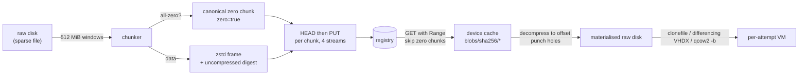

# Large artifacts: chunking, compression, sparseness, resume, dedupe and caching

Research baseline: 2026-10-02. A macOS or Windows guest disk is 30–80 GiB logical and
20–40 GiB after compression; a Linux cloud image is 1–5 GiB. Registries were designed for
layers of a few hundred MiB. This document records what the registries actually allow, what
techniques exist for moving block-level disk images through them efficiently, and what the
weave contract adopts. The contract itself is in
[09-artifact-contract-v1.md](09-artifact-contract-v1.md); the decisions it depends on are
[0001](decisions/0001-vm-artifact-contract.md) (artifact shape) and
[0008](decisions/0008-device-cache-gc-and-mirrors.md) (device cache and mirrors). Prior-art
details are in [02-prior-art.md](02-prior-art.md); this document refers to them only as
evidence.

## Chunking

**Why chunk at all.** GHCR caps a single layer at 10 GB and a single upload at 10 minutes
(<https://docs.github.com/en/packages/working-with-a-github-packages-registry/working-with-the-container-registry>).
A one-layer artifact of a 40 GiB disk cannot be published there, and even where a registry
allows it (ECR now accepts 200 GB layers via `docker push`,
<https://aws.amazon.com/about-aws/whats-new/2026/08/amazon-ecr-image-layers/>) a single blob
means one connection, one failure domain, no parallelism and no partial reuse. Both existing
macOS-VM publishers studied in [02-prior-art.md](02-prior-art.md) therefore split the disk into
independently compressed slices of 512 MiB; the KubeVirt containerDisk, which does not chunk,
is limited to a single gzip layer and is unsuitable above a few GiB
(<https://github.com/kubevirt/containerdisks/blob/main/pkg/build/tar.go>).

**Fixed-size chunks over guest LBA space.** The weave contract cuts the raw disk into
chunks of 512 MiB of guest block addresses, except the last. Every chunk is a separate layer
with annotations for its index, byte offset, uncompressed size and uncompressed digest
([09-artifact-contract-v1.md](09-artifact-contract-v1.md)). Fixed offsets have three
properties that matter:

1. **Parallelism.** Chunks upload and download concurrently (the prior-art default is four
   streams) and each one is a short, retryable monolithic `PUT` or `GET`.
2. **Identity is stable across versions.** A disk is a block device; data does not shift when
   a file changes elsewhere. Chunks whose bytes are unchanged between image versions keep the
   same digest and are skipped on push by a `HEAD` on the blob (see Dedupe below).
3. **Sparse reassembly.** Offsets are known before the bytes arrive, so a consumer can
   pre-truncate the target file and write each chunk straight to its place.

The chunk size is a trade-off between manifest size, per-blob overhead and dedupe
granularity. At roughly 400 bytes per descriptor, a 2 TiB disk in 512 MiB chunks is ~4,000
layers and a ~1.6 MiB manifest, well inside the 4 MiB that registries SHOULD accept
(<https://github.com/opencontainers/image-spec/blob/v1.1.1/manifest.md>). Whether 256 MiB
gives better reuse on real macOS and Windows disks is an open benchmark
([12-open-questions.md](12-open-questions.md)).

**Why not content-defined chunking (CDC).** CDC (rolling hashes such as FastCDC, as used by
casync, desync, restic) would let a chunk boundary move with the data, which helps when files
shift inside a filesystem. The tooling that exists in the OCI world is all aimed at tar or
rootfs content, not raw block devices:

- **zstd:chunked** in containers/storage splits files with a bup-style rolling sum
  (`RollsumBits = 16`, roughly 64 KiB average), detects zero holes of 1 KiB or more and writes a
  table of contents into zstd skippable frames so a client can range-fetch only missing chunks.
  It is "not officially standardized" and only podman and CRI-O read it
  (<https://github.com/containers/storage/blob/main/pkg/chunked/compressor/compressor.go>,
  <https://man.archlinux.org/man/containers-storage-zstd-chunked.1.en>).
- **PuzzleFS** applies FastCDC with chunks shared across layers behind FUSE; the last commit
  was July 2025 (<https://github.com/project-machine/puzzlefs>).
- **Nydus RAFS** uses 1 MiB chunks deduplicated across layers and can export a verity-protected
  block device (<https://github.com/dragonflyoss/nydus/blob/master/docs/nydus-image.md>,
  <https://github.com/dragonflyoss/image-service/blob/master/docs/nydus-design.md>).
- **eStargz** (<https://github.com/containerd/stargz-snapshotter>) and **SOCI**
  (<https://aws.amazon.com/blogs/aws/aws-fargate-enables-faster-container-startup-using-seekable-oci/>,
  <https://github.com/awslabs/soci-snapshotter>) index tar layers for lazy loading. A hypervisor
  reading a raw disk gains nothing from them.

No production tool applies CDC to VM disk layers in OCI. Building one would be new work with
a new on-the-wire format to maintain, and a block device already gives fixed-offset chunks
most of what CDC buys. The contract therefore uses fixed chunks and gets cross-version
sharing from lineage (below). CDC stays a non-goal
([08-target-architecture.md](08-target-architecture.md)).

## Compression

Each chunk is one zstd frame with the content size recorded in the frame header, so every
chunk decompresses independently and a consumer can verify the uncompressed digest as it
streams. Reasons for zstd over the alternatives:

- `+zstd` is a first-class OCI layer suffix and every modern registry stores it as opaque
  bytes (<https://github.com/opencontainers/image-spec/blob/v1.1.1/layer.md>); for a custom
  media type the suffix is informational, but reusing the convention costs nothing.
- Decompression speed is close to LZ4 while the ratio is materially better; the prior-art
  macOS publisher chose LZ4 for speed on Apple silicon, and a 50 GiB disk still compressed to
  ~27 GiB ([02-prior-art.md](02-prior-art.md)). The gzip used by containerDisks is
  single-threaded and slower on both axes.
- A pure-Go zstd implementation exists (`github.com/klauspost/compress/zstd`), so the shared
  module stays CGO-free ([10-shared-go-module.md](10-shared-go-module.md)).

The compression level is a build-time choice and does not change the contract; the right
level for build time versus pull time is an open benchmark
([12-open-questions.md](12-open-questions.md)).

## Sparse and zero handling

A freshly installed guest disk is mostly zeros. The contract handles that at two levels:

- **Whole-zero chunks** are detected at pack time. They are emitted as the single canonical
  zstd encoding of 512 MiB of zeros, so every zero chunk in every image shares one digest, and
  the layer carries `com.deploymenttheory.weave.guest.disk.chunk.zero: "true"`. A consumer that
  has the chunk's offset and size may skip the fetch entirely and leave a hole.
- **Zero runs inside a chunk** are skipped by the reassembler. After decompressing a chunk
  it compares fixed windows against a zero buffer and punches holes instead of writing them
  (`fcntl F_PUNCHHOLE` on APFS, `FSCTL_SET_ZERO_DATA` on NTFS, `fallocate(PUNCH_HOLE)` on
  ext4/XFS). guestweave-macos already does this at 4 MiB granularity when reassembling a disk
  (`deploymenttheory/guestweave-cli-macos@main` `internal/oci/oci_layerizer_diskv2.go:35-48`),
  and the target file is pre-truncated to its logical size so writes land at the right offset.

The result is that a 64 GiB logical disk with ~36 GiB of data occupies ~36 GiB on the host,
and transferring it moves nothing for the empty space.

## Resume

Registries SHOULD honour `Range` on blob `GET`
(<https://github.com/opencontainers/distribution-spec/blob/v1.1.1/spec.md>); GHCR's CDN
returns `206 Partial Content` (verified live on 2026-10-02 against
`pkg-containers.githubusercontent.com`). Combined with per-chunk uncompressed digests, a pull
resumes at two granularities:

1. **Chunk granularity.** Before fetching a chunk, the consumer checks whether the bytes
   already in the target file at that offset hash to the annotated uncompressed digest. If
   they do, the chunk is skipped. An interrupted pull therefore costs at most one chunk of
   repeated work.
2. **Byte granularity.** Within a chunk, the fetch retries with a `Range` header from the
   last byte received.

Pushes are monolithic per chunk in oras-go v2 (chunked `PATCH` upload landed only in the
unreleased v3, <https://github.com/oras-project/oras-go/pull/1434>). Because a chunk is at
most 512 MiB uncompressed, a failed push repeats at most one chunk, which is why the contract
does not depend on chunked uploads. If a registry's `OCI-Chunk-Min-Length` or upload timeout
ever forces chunked uploads, regclient already implements them with automatic fallback
(<https://github.com/regclient/regclient>). The macOS prior art warns, without citing a
source, that GHCR accepts only upload chunks smaller than 4 MB; this is unverified and listed
in [12-open-questions.md](12-open-questions.md).

## Dedupe

Four mechanisms, from cheapest to most involved:

| Mechanism | Where | What it saves |
|---|---|---|
| **HEAD before push** | publisher | A `HEAD /v2/<repo>/blobs/<digest>` per chunk skips uploading anything the registry already holds. Unchanged chunks of a rebuilt image, and every zero chunk, cost one request. |
| **Cross-repository mount** | publisher | `POST …/blobs/uploads/?mount=<digest>&from=<repo>` reuses a blob held in another repository of the same registry without re-uploading, for example when `macos-26-base` derives from `macos-26-vanilla`. |
| **Content-addressed local cache** | consumer | Blobs are stored once by digest ([decisions/0008](decisions/0008-device-cache-gc-and-mirrors.md)). A second image that shares chunks with a cached one fetches only the difference, and reassembly reads shared chunks from local disk. |
| **Lineage at the hypervisor** | consumer | Clones never copy the base disk: APFS `clonefile` copy-on-write on macOS (`deploymenttheory/guestweave-cli-macos@main` `internal/fsutil/clone.go:22`), differencing VHDX children on Windows HCS (about 4 MiB per VM, `deploymenttheory/guestweave-cli-windows@main` `internal/oci/cache/cache.go`), and qcow2 overlays with `qemu-img create -b` for QEMU (`deploymenttheory/hostweave@main` `agent/runtime/qemu/qemu.go:229-293`). |

Lineage is what makes a per-attempt VM cheap; the first three are what make a new image
version cheap to publish and fetch. The prior-art "stacked" overlay format (an immutable base
plus an ASIF overlay published as its own layers, macOS 27 only) is noted in
[02-prior-art.md](02-prior-art.md) as a possible future refinement, not adopted in v1.

## Transfer limits by registry

Observed live on 2026-10-02 where marked; otherwise from vendor documentation.

| Registry | Max layer / blob | Upload constraints | Blob `GET` behaviour | Source |
|---|---|---|---|---|
| GHCR | 10 GB per layer | 10-minute upload timeout; chunk limits undocumented | 307 to `pkg-containers.githubusercontent.com` (Azure Blob behind Varnish); `Range` → 206 (live) | <https://docs.github.com/en/packages/working-with-a-github-packages-registry/working-with-the-container-registry> |
| Docker Hub | no documented limit; users report trouble above 10–20 GB | standard | 307 to `production.cloudfront.docker.com` (live) | <https://forums.docker.com/t/whats-the-largest-supported-image-size-on-docker-hub/7272> |
| AWS ECR | 52,000 MiB via API; 200 GB via `docker push` since 2026-08-03 | direct API parts 5–10 MiB, max 4,200 parts | ECR Public: 307 to CloudFront (live); private: pre-signed S3 *(unverified)* | <https://docs.aws.amazon.com/AmazonECR/latest/userguide/service-quotas.html>, <https://aws.amazon.com/about-aws/whats-new/2026/08/amazon-ecr-image-layers/> |
| Azure ACR | 195 GiB; manifest 4 MiB | standard | dedicated data endpoints and artifact streaming on Premium | <https://learn.microsoft.com/en-us/azure/container-registry/container-registry-skus> |
| Google Artifact Registry | no size quota published | no chunked uploads *(unverified, prior-art claim)* | 302 to a same-host `/artifacts-downloads/…` path (live) | <https://docs.cloud.google.com/artifact-registry/quotas> |
| Quay.io | *(unverified)* | standard | 302 to `cdn01.quay.io` (live) | — |
| CNCF distribution v3.1.2, zot v2.1.21, Harbor v2.15.2 | bound by the storage backend | spec-compliant chunked uploads | distribution and Harbor can redirect to S3 or a CDN through storage middleware *(detail unverified)* | <https://github.com/distribution/distribution>, <https://zotregistry.dev>, <https://goharbor.io> |

The 512 MiB chunk keeps every blob under every limit in this table by more than an order of
magnitude, and under GHCR's 10-minute upload window at any realistic uplink.

## Local cache and garbage collection

Today no weave component manages image storage as a whole: hostweave never prunes anything
(`deploymenttheory/hostweave@main` `agent/runtime/moby/moby.go`, `agent/runtime/qemu`),
guestweave-macos has an LRU prune and a disk-space guard but only for its own cache
(`internal/vm/storage/diskspace.go`), and guestweave-windows pins in-use parents but has no
quota ([03-current-state.md](03-current-state.md)). The shared `cache` package
([10-shared-go-module.md](10-shared-go-module.md), [decisions/0008](decisions/0008-device-cache-gc-and-mirrors.md))
replaces all three with one design:

- **Content-addressed store.** `blobs/sha256/<hex>` for every chunk, config and state blob;
  `refs/` maps `host/repo:tag` and `host/repo@digest` to manifests. The layout is an OCI
  image layout ([01-oci-primer.md](01-oci-primer.md)) so `export-layout` and `import-layout`
  are file copies.
- **Materialised disks.** A reassembled raw disk (and, on Windows, its VHD/VHDX parent) is
  stored per manifest digest next to the blobs and is the clone source for the hypervisor.
- **In-use pins.** A materialised disk that is the parent of a running or stopped VM cannot
  be collected; the VM directory records the parent digest, as guestweave-windows's
  `oci-source.json` does today.
- **LRU eviction with a quota.** Unpinned entries are evicted least-recently-used first when
  the cache exceeds its quota or the volume runs short. The default quota and the auto-prune
  opt-out follow the existing guestweave behaviour.
- **Disk-space guard before the first byte.** The pull computes the uncompressed size from the
  manifest annotations and refuses, or evicts and retries, before downloading. On macOS the
  check must use Foundation's volume-capacity API so purgeable space counts; that
  implementation stays in guestweave-macos behind an interface.
- **Prewarm.** A host can be asked to pull a digest ahead of demand so a pool's first job does
  not pay the download; hostweave's capacity readiness work is the natural caller
  (`deploymenttheory/hostweave@main` `docs/research/decisions/0027-scheduled-capacity-readiness.md`).

## Worked example

A macOS 26 base image with a 50 GiB logical disk of which ~26 GiB is data (the numbers match
the public prior-art image measured in [02-prior-art.md](02-prior-art.md): 94 disk layers,
27.3 GB compressed):

| Quantity | Value |
|---|---|
| Logical disk | 50 GiB → 100 chunks of 512 MiB |
| Zero chunks | ~45, all sharing one digest; fetched zero times |
| Data chunks | ~55, each ~250–500 MiB after zstd |
| Compressed transfer, first pull | ~26–27 GiB |
| Manifest | ~100 descriptors + 2 state layers ≈ 45 KiB |
| Rebuild after a point release | typically 10–30 % of data chunks change; the rest are skipped by `HEAD` on push and by the cache on pull *(estimate, to be measured)* |
| Host disk after pull | ~26 GiB sparse file + the chunks in the cache (or the file alone once the blobs are evicted) |
| Per-attempt clone | seconds, a few MiB of metadata, via copy-on-write |

## References

- OCI distribution-spec v1.1.1 (Range, chunked upload, mount): <https://github.com/opencontainers/distribution-spec/blob/v1.1.1/spec.md>
- OCI image-spec v1.1.1 (layer media types, manifest size): <https://github.com/opencontainers/image-spec/tree/v1.1.1>
- GHCR limits: <https://docs.github.com/en/packages/working-with-a-github-packages-registry/working-with-the-container-registry>
- oras-go chunked push (v3 only): <https://github.com/oras-project/oras-go/pull/1434>
- regclient chunked and resumable push: <https://github.com/regclient/regclient>
- containers/storage zstd:chunked: <https://github.com/containers/storage/blob/main/pkg/chunked/compressor/compressor.go>
- Nydus: <https://github.com/dragonflyoss/nydus/blob/master/docs/nydus-image.md>
- SOCI: <https://github.com/awslabs/soci-snapshotter>
- Prior-art chunking, sparse writes and resume (macOS VM publishers): [02-prior-art.md](02-prior-art.md)
- Current weave sparse reassembly: `deploymenttheory/guestweave-cli-macos@main` `internal/oci/oci_layerizer_diskv2.go`
- Current weave clone mechanisms: `deploymenttheory/guestweave-cli-macos@main` `internal/fsutil/clone.go`; `deploymenttheory/guestweave-cli-windows@main` `internal/oci/cache/cache.go`; `deploymenttheory/hostweave@main` `agent/runtime/qemu/qemu.go`
