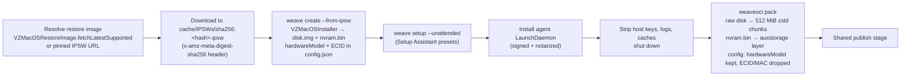
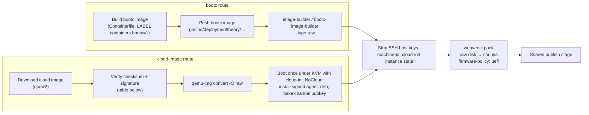
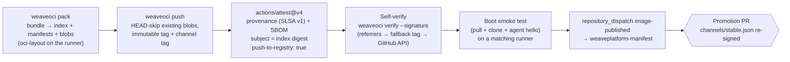
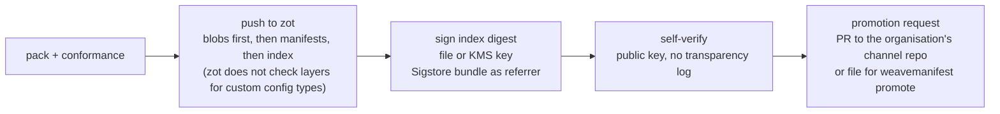

# Build pipelines

How macOS, Windows and Linux VM images get built and published on GitHub, what the hosted runners
can and cannot do, and the one publish stage every pipeline shares. Research baseline 2026-10-02.
The decisions this report feeds are [0007 (publication pipeline)](decisions/0007-publication-pipeline.md)
and [0006 (trust)](decisions/0006-trust-attestations-and-channel-manifest.md); the artifact being
produced is defined in [09-artifact-contract-v1.md](09-artifact-contract-v1.md). Licensing limits on
what may be published are in [04-registries-and-github.md](04-registries-and-github.md).

Two naming facts up front:

- **go-sdk-winmediafoundry is a deploymenttheory project, not a Microsoft product.** There is no
  Microsoft "Windows Media Foundry"; the nearest third-party tool with a similar name,
  [foundry-osd/foundry](https://github.com/foundry-osd/foundry), builds WinPE media and is unrelated.
  The SDK's README disclaims any Microsoft affiliation
  ([go-sdk-winmediafoundry](https://github.com/deploymenttheory/go-sdk-winmediafoundry)).
- guestweave-macos resolves "latest" macOS through Apple's `VZMacOSRestoreImage.fetchLatestSupported`,
  not GDMF (`guestweave-cli-macos@main internal/command/commands_create.go:228-230`).

## Runner constraints

| Runner | Nested virtualisation | Consequence | Source |
|---|---|---|---|
| GitHub-hosted macOS (`macos-15`, `macos-26`/`macos-latest`; M1 3 vCPU/7 GB/14 GB SSD, `-xlarge` M2 5 vCPU/14 GB) | No. "Nested-virtualization is not supported due to the limitation of Apple's Virtualization Framework." Apple DTS: nested virtualisation is never supported for macOS guests; `isNestedVirtualizationSupported` exists only on `VZGenericPlatformConfiguration` (Linux guests, M3+, macOS 15+) | macOS images need **self-hosted Apple-silicon bare metal** | [hosted runners](https://docs.github.com/en/actions/reference/runners/github-hosted-runners), [larger runners](https://docs.github.com/en/actions/reference/runners/larger-runners), [runner-images](https://github.com/actions/runner-images), [Apple forums 827663](https://developer.apple.com/forums/thread/827663) |
| GitHub-hosted Windows (`windows-2022`, `windows-2025`) | No; the runner VMs are already nested | Windows images cannot be built with Hyper-V on hosted runners | [runner-images #183](https://github.com/actions/runner-images/issues/183) |
| GitHub-hosted Ubuntu (`ubuntu-24.04`, `ubuntu-24.04-arm`, larger runners) | Yes, KVM, including on 2-vCPU runners | Windows and Linux images build under QEMU/KVM here; the 14 GB disk on standard runners bounds disk size, so larger or self-hosted runners are realistic for 50 GB disks | [GitHub changelog 2024-04-02](https://github.blog/changelog/2024-04-02-github-actions-hardware-accelerated-android-virtualization-now-available/) |
| Third-party runner providers | Some offer nested virtualisation on Windows | Option, not a dependency | [RunsOn](https://runs-on.com/docs/runners/capabilities/nested-virtualization/) |
| Self-hosted | Whatever the hardware allows | Required for macOS; optional for Windows and Linux; cannot be combined with `gh attestation verify --deny-self-hosted-runners` | [05-supply-chain.md](05-supply-chain.md) |

How others do it: cirruslabs/macos-image-templates runs on `[self-hosted, macOS, ARM64]` with
`max-parallel: 1` and a `tart-image-builds` concurrency group, rebuilt monthly on the first Saturday
([vanilla.yml](https://github.com/cirruslabs/macos-image-templates/blob/main/.github/workflows/vanilla.yml),
[release.yml](https://github.com/cirruslabs/macos-image-templates/blob/main/.github/workflows/release.yml)).
GitHub's own runner images are built with Packer `azure-arm` for Windows and Ubuntu (output is an
Azure managed image, not a disk file) and Veertu Anka for macOS
([source.windows.pkr.hcl](https://github.com/actions/runner-images/blob/main/images/windows/templates/source.windows.pkr.hcl),
[create-image doc](https://github.com/actions/runner-images/blob/main/docs/create-image-and-azure-resources.md),
[macOS-26.arm64.anka.pkr.hcl](https://github.com/actions/runner-images/blob/main/images/macos/templates/macOS-26.arm64.anka.pkr.hcl)).

## macOS pipeline

Runs on a self-hosted Apple-silicon runner that has the guestweave CLI built, code-signed and
entitled (`com.apple.security.virtualization`; see `guestweave-cli-macos@main CLAUDE.md`). Apple's
licence permits two macOS guests per Mac, so the job sets `max-parallel: 1` and a per-runner
concurrency group.

Facts that shape it:

- Source media: the IPSW URL and its SHA-256 are recorded in provenance; the existing cache names
  files by digest (`guestweave-cli-macos@main internal/vm/vm.go:318-350`,
  `internal/ipsw/ipswcache.go`). cirruslabs pins exact Apple CDN URLs such as
  `UniversalMac_27.0_26A428_Restore.ipsw` in its templates
  ([vanilla-golden-gate.pkr.hcl](https://github.com/cirruslabs/macos-image-templates/blob/main/templates/vanilla-golden-gate.pkr.hcl)).
- Install produces `disk.img` (raw sparse, or ASIF on macOS 26+), `nvram.bin` (VZ auxiliary
  storage) and a `config.json` holding the base64 `hardwareModel` and `ecid`
  (`internal/vm/vm.go:370-460`, `internal/vm/config/platformdarwin.go:69-70`). The contract carries
  the hardware model and the auxiliary storage and never the ECID
  ([decision 0009](decisions/0009-guest-state-carry-vs-regenerate.md)).
- Unattended Setup Assistant is OCR over VNC with per-version presets
  (`internal/unattended/unattended-presets/*.yml`); macOS has no cloud-init, and the
  agent-modules handoff names `weave setup` as the provisioning seam
  (`weaveplatform-agent-modules@main handoff/macos-follow-on.md`).
- The in-guest agent must be a signed, notarized LaunchDaemon with a pinned Team ID; the legacy
  per-user LaunchAgent install over SSH is the wrong session (same handoff).
- ASIF disks are converted to raw before chunking; whether to keep an ASIF path is an open question
  ([12-open-questions.md](12-open-questions.md)).

## Windows pipeline

Windows media is acquired with go-sdk-winmediafoundry, installed unattended under QEMU/KVM on a
GitHub-hosted Ubuntu runner (or a self-hosted Linux or Windows host), and packed as a raw disk. No
VHDX is published; the Windows consumer converts raw to VHD/VHDX on pull
([08-target-architecture.md](08-target-architecture.md)).

```mermaid
flowchart LR
    media["Acquire media<br/>go-sdk-winmediafoundry softwaredownload (retail ISO)<br/>or esd + builder.BuildISO"] --> verify["Verify<br/>ESD SHA-1 from products.cab;<br/>record ISO digest"]
    verify --> side["Side volume<br/>autounattend.xml + weave-setup.ps1<br/>+ virtio drivers + agent installer"]
    side --> qemu["qemu-system-x86_64 -enable-kvm<br/>OVMF, raw disk, virtio-blk/net"]
    qemu --> unattend["Unattended install<br/>agent scheduled task registered"]
    unattend --> sysprep["Generalise (sysprep /oobe /generalize)<br/>shut down"]
    sysprep --> pack["weaveoci pack<br/>raw disk → chunks<br/>firmware-policy: uefi, secureBoot, tpm required"]
    pack --> publish["Shared publish stage"]
```

Facts that shape it:

- go-sdk-winmediafoundry v0.8.0 provides `windowsuup` (Windows Update SOAP client; UUP/ESD/CAB),
  `esd` (Media Creation Tool `products.cab` catalog with SHA-1), `softwaredownload` (consumer ISO
  flow) and `pkg/{wim,cab,udf,iso,isoinspect,builder,unattend,usb}`. Outputs are ISO and USB only;
  there is no VHDX output ([repo](https://github.com/deploymenttheory/go-sdk-winmediafoundry)).
- guestweave-windows today fetches the x64 retail ISO untouched and rides `autounattend.xml` and
  `weave-setup.ps1` on a separate CDFS side volume labelled `WVUNATTEND`
  (`guestweave-cli-windows@main internal/winmedia/retail.go`, `internal/winmedia/sidecar.go`);
  guestweave-macos remasters the ARM64 ISO with `pkg/iso.BuildWindowsUDF`
  (`guestweave-cli-macos@main internal/command/commands_create_winguest.go:60-215`). Either approach
  works in CI; the side-volume approach keeps the vendor ISO digest stable for provenance.
- HCS guests need a vTPM and Secure Boot and create `guest.vmgs` on first elevated run
  (`hostweave@main docs/research/decisions/0010-vm-runtimes-guestweave-and-qemu.md`). The pipeline
  installs under QEMU with OVMF and swtpm so that the installed OS expects UEFI and TPM 2.0, and the
  artifact's firmware policy says so; the vmgs is never shipped
  ([decision 0009](decisions/0009-guest-state-carry-vs-regenerate.md)).
- Builders: Packer `hyperv-iso` v1.1.5 ([plugin](https://github.com/hashicorp/packer-plugin-hyperv))
  only on a Hyper-V host; Packer `qemu` v1.1.7 ([plugin](https://github.com/hashicorp/packer-plugin-qemu))
  or a direct `qemu-system` invocation on KVM. Microsoft's downloadable developer VMs have been
  unavailable since 2024-10-23 ([developer.microsoft.com](https://developer.microsoft.com/downloads/virtual-machines)),
  so there is no vendor VHDX to start from.
- Only private publication is permitted for Windows images; evaluation ISOs are 90-day Enterprise
  builds ([Evaluation Center](https://www.microsoft.com/en-us/evalcenter/download-windows-11-enterprise));
  VL reimaging rights apply to VL media only ([04-registries-and-github.md](04-registries-and-github.md)).

## Linux pipeline

Two inputs, one output. Where a bootc image exists, it is the source of truth and the raw disk is
derived from it; otherwise an upstream cloud image is verified, converted to raw and provisioned.

Facts that shape it:

- bootc v1.16.13 images carry `LABEL containers.bootc=1` and the kernel under
  `/usr/lib/modules/$kver/vmlinuz`; `bootc container lint` validates them
  ([bootc-compatible images](https://github.com/bootc-dev/bootc/blob/main/docs/src/bootc-compatible-images.7.md)).
  bootc-image-builder (osbuild/image-builder v85.0.0) emits `raw` among `ami`, `qcow2`, `vmdk`,
  `vhd`, `gce`, `iso` and more ([README](https://github.com/osbuild/image-builder/blob/main/bootc-image-builder/README.md)).
  Running machines later update with `bootc upgrade` from the same registry tag
  ([bootc upgrades](https://github.com/bootc-dev/bootc/blob/main/docs/src/bootc-upgrades.7.md)).
- The agent is baked at image build time; the Linux agent is a signed `.deb` from a GPG-signed apt
  repository, installed by cloud-init NoCloud with a fresh `instance-id`
  (`weaveplatform-agent-modules@main handoff/linux-bring-up.md`). KVM is available on hosted
  Ubuntu runners for that one provisioning boot.
- Alternatives considered for the cloud route: osbuild image-builder CLI (`--with-sbom`,
  `--with-manifest`; [osbuild/image-builder](https://github.com/osbuild/image-builder)),
  mkosi v27.1 ([systemd/mkosi](https://github.com/systemd/mkosi)), Packer qemu, diskimage-builder
  ([docs](https://docs.openstack.org/diskimage-builder/latest/)). None is required; `qemu-img`
  plus cloud-init covers the baseline.

Upstream cloud images and how to verify them (listings checked 2026-10-02):

| Distro | Image | Integrity | Source |
|---|---|---|---|
| Ubuntu 24.04 | `noble-server-cloudimg-{amd64,arm64}.img` (qcow2, UEFI/GPT) | `SHA256SUMS` + `SHA256SUMS.gpg` | [cloud-images.ubuntu.com](https://cloud-images.ubuntu.com/noble/current/) |
| Fedora Cloud | qcow2 / raw | clearsigned `*-CHECKSUM`; `gpgv --keyring fedora.gpg` then `sha256sum -c` | [Fedora verify](https://alt.fedoraproject.org/verify) |
| Debian 13 | `debian-13-{generic,genericcloud}-{amd64,arm64}.qcow2` | `SHA512SUMS` only in the listing; no detached signature seen | [cloud.debian.org](https://cloud.debian.org/images/cloud/trixie/latest/) |
| AlmaLinux 10 | `AlmaLinux-10-GenericCloud-10.2-*.x86_64.qcow2` | `CHECKSUM` + `CHECKSUM.asc` | [repo.almalinux.org](https://repo.almalinux.org/almalinux/10/cloud/x86_64/images/) |
| Rocky 10 | `Rocky-10-GenericCloud-{Base,LVM}-10.2-*.qcow2` | `CHECKSUM`/`.asc` plus per-image `.CHECKSUM`/`.asc` | [dl.rockylinux.org](https://dl.rockylinux.org/pub/rocky/10/images/x86_64/) |

Redistribution: unmodified Ubuntu may be redistributed, modified images need Canonical trademark
approval ([IP policy](https://canonical.com/legal/intellectual-property-policy)); modified Fedora must
be called a "Fedora Remix" ([trademark guidelines](https://doc.fedoraproject.org/ar/legal/trademarks));
RHEL may not be redistributed ([EULAs](https://www.redhat.com/en/about/red-hat-end-user-license-agreements)).
Public weave Linux images therefore use community distros and carry the required naming.

## Shared publish stage

Every pipeline ends in the same publish stage, modelled on
`weaveplatform-agent-modules@main .github/workflows/module-release.yml:85-128`. The stage is
implemented by `weaveoci publish` ([10-shared-go-module.md](10-shared-go-module.md)), so it runs
on any CI system or a workstation; the GitHub workflow `publish.yml` is a thin wrapper that adds
the GitHub-only steps (artifact attestation and the cross-repository dispatch). The diagram
shows the GitHub profile; the private profile is described below.

Steps and the facts behind them:

1. **Pack.** `weaveoci pack` writes an OCI layout on the runner (chunks, state blobs, config, per-OS
   manifests, index) exactly as [09-artifact-contract-v1.md](09-artifact-contract-v1.md) specifies.
   Blobs are ≤ 512 MiB so each upload stays well inside GHCR's 10 GB layer and 10-minute upload
   limits ([GitHub docs](https://docs.github.com/en/packages/working-with-a-github-packages-registry/working-with-the-container-registry)).
2. **Push.** `weaveoci push` sends `HEAD` per blob and skips those present (dedupe across builds),
   then pushes manifests and the index under the immutable tag `<osver>-<build>-r<rev>` and the
   channel tag (`edge`; `stable` and `latest` move only at promotion). Authentication is
   `GITHUB_TOKEN` with `packages: write`; the package's "Manage Actions access" must grant the
   repository Write, which is the failure cirruslabs hit (`403 permission_denied: write_package`,
   [macos-image-templates #361](https://github.com/cirruslabs/macos-image-templates/issues/361), following the token migration in #351).
3. **Attest.** `actions/attest@v4.2.2` (the `attest-build-provenance` action is now a wrapper over it)
   with `subject-name: ghcr.io/deploymenttheory/weave-images/<repo>` (no tag), `subject-digest` set
   to the index digest, and `push-to-registry: true`. GHCR has no referrers API, so the bundle lands
   under the `sha256-<digest>` fallback tag ([05-supply-chain.md](05-supply-chain.md),
   [actions/attest](https://github.com/actions/attest)). Permissions: `id-token: write`,
   `attestations: write`, `artifact-metadata: write`. Private repositories need GitHub Enterprise
   Cloud and use GitHub's private Sigstore instance. A custom predicate records the SLSA v1
   `resolvedDependencies` (IPSW/ISO/ESD/cloud-image/bootc digests, unattend and script digests,
   agent version, tool versions).
4. **Self-verify.** The same verifier devices use (`weaveoci verify`) runs against what was just
   pushed, so a broken fallback tag fails the job rather than the fleet.
5. **Boot smoke test.** A pull, clone and in-guest agent hello on a runner of the matching
   platform. This mirrors the containerdisks rule that an image that does not boot is not
   promoted ([02-prior-art.md](02-prior-art.md)). For macOS this is the same self-hosted runner;
   for Windows and Linux it is a KVM runner using QEMU.
6. **Dispatch.** `repository_dispatch` with `event_type=image-published` and
   `{repository, tag, digest, platforms}` to weaveplatform-manifest, which opens a promotion PR
   that adds the digest to `channels/stable.json` and re-signs it; merging promotes
   ([trust chain](https://github.com/deploymenttheory/weaveplatform-manifest/blob/main/docs/trust-chain.md)).
   The modules pipeline uses a `RELEASE_PLEASE_PAT` for this cross-repository call because
   `GITHUB_TOKEN` cannot dispatch to another repository
   (`weaveplatform-agent-modules@main docs/release-pipeline.md`).

### Publishing in the private profile

In the private profile ([13-deployment-profiles.md](13-deployment-profiles.md),
[decision 0011](decisions/0011-deployment-profiles-and-reference-registry.md)) the same
`weaveoci publish` command runs from Gitea or Forgejo Actions, GitLab CI, Jenkins, a
self-hosted runner or a workstation, against the organisation's zot (`weave-zot`), Harbor or
distribution v3:

Differences from the GitHub profile:

- **Signature.** `weaveoci publish --sign-key <file|env://|awskms://…>` produces the
  cosign-compatible bundle natively; no cosign binary or Sigstore service is needed. The key
  stays in the CI system's secret store or a KMS.
- **Credentials.** A zot user with `create` (not `update`) on `weave-images/**` pushes; a
  separate promotion identity holds `update` for channel tags.
- **Immutability is enforced by the registry**, not only by `weaveoci publish` refusing an
  existing build tag, because the publisher has no `update` permission.
- **Promotion** goes to the organisation's own channel repository on any Git host, signed
  under its own `weavemanifest` root, or to deploymenttheory's channel when the organisation
  only mirrors.
- **Boot smoke test** runs on whatever hardware the organisation provides; the macOS and
  Windows constraints in [Runner constraints](#runner-constraints) still apply.

## Container images for weaveplatform-oci itself

Separate from VM images, this repository publishes two container images to GHCR on every
release ([decision 0012](decisions/0012-container-images.md)):

| Image | Builder | Base | Platforms |
|---|---|---|---|
| `ghcr.io/deploymenttheory/weaveoci` | ko v0.19.1 (no Dockerfile; SPDX SBOM by default) | `gcr.io/distroless/static-debian12:nonroot` | linux/amd64, linux/arm64 |
| `ghcr.io/deploymenttheory/weave-zot` | `docker/build-push-action` v7.4.0 with buildx (copy-only Dockerfile, no QEMU) | `ghcr.io/project-zot/zot:v2.1.21` pinned by digest | linux/amd64, linux/arm64 |

Both are signed keyless with cosign v3.1.3 (`id-token: write`) and receive provenance and SBOM
attestations from `actions/attest` with `push-to-registry: true`. The `weave-zot` job also runs
`docker run --rm <image> verify /etc/zot/config.json` for each shipped config and starts the
image under testcontainers to check `/readyz` before pushing. Sources:
[ko v0.19.1](https://github.com/ko-build/ko/releases/tag/v0.19.1),
[build-push-action v7.4.0](https://github.com/docker/build-push-action/blob/v7.4.0/action.yml),
[zot releases](https://github.com/project-zot/zot/releases/tag/v2.1.21).

## Tool versions (2026-10-02)

| Tool | Version | Role | Source |
|---|---|---|---|
| ORAS CLI / `oras-project/setup-oras` | 1.3.4 / v2.0.2 | ad-hoc pushes, layout copies | [oras releases](https://github.com/oras-project/oras/releases) |
| oras-go | v2.6.2 | library behind `weaveoci` | [oras-go](https://github.com/oras-project/oras-go) |
| `actions/attest` | v4.2.2 | provenance, SBOM, custom predicates | [actions/attest](https://github.com/actions/attest) |
| cosign / `sigstore/cosign-installer` | 3.1.3 / v4.1.2 (installer defaults to 3.0.6, so pin `cosign-release: v3.1.3`) | keyless signing of this repository's container images; external verification of key-based bundles | [cosign v3 announcement](https://blog.sigstore.dev/cosign-3-0-available/), [installer action.yml](https://github.com/sigstore/cosign-installer/blob/v4.1.2/action.yml) |
| ko | v0.19.1 | `weaveoci` container image | [ko](https://github.com/ko-build/ko/releases/tag/v0.19.1) |
| zot | v2.1.21 | base of `weave-zot`; reference private registry and site mirror | [zot](https://github.com/project-zot/zot/releases/tag/v2.1.21) |
| testcontainers-go | v0.44.0 | zot and `registry:3.1.2` in acceptance tests | [registry module](https://github.com/testcontainers/testcontainers-go/tree/v0.44.0/modules/registry) |
| sigstore-go | v1.3.0 | verification inside `weaveoci` and consumers | [sigstore-go](https://github.com/sigstore/sigstore-go) |
| bootc | v1.16.13 | Linux source images | [bootc.dev](https://bootc.dev/bootc/) |
| osbuild/image-builder (bootc-image-builder) | v85.0.0 | raw disk from a bootc image | [osbuild/image-builder](https://github.com/osbuild/image-builder) |
| go-sdk-winmediafoundry | v0.8.0 (guestweave-macos pins v0.7.0) | Windows media acquisition | [repo](https://github.com/deploymenttheory/go-sdk-winmediafoundry) |
| Packer qemu / hyperv plugins | v1.1.7 / v1.1.5 | optional Windows builders | [qemu](https://github.com/hashicorp/packer-plugin-qemu), [hyperv](https://github.com/hashicorp/packer-plugin-hyperv) |
| `actions/delete-package-versions` | v5 | retention | [repo](https://github.com/actions/delete-package-versions) |
| `docker/build-push-action` | v7.4.0 | `weave-zot` image; container images for the moby runtime in separate repositories | [repo](https://github.com/docker/build-push-action) |

## Secrets and permissions

| Need | Mechanism | Note |
|---|---|---|
| Push to GHCR from the pipeline | `GITHUB_TOKEN`, `permissions: packages: write`; package "Manage Actions access" set to Write for the publishing repository | Downloads with `GITHUB_TOKEN` inside Actions do not count toward transfer ([billing](https://docs.github.com/en/billing/concepts/product-billing/github-packages)) |
| Attestations | `id-token: write`, `attestations: write`, `artifact-metadata: write` | Private repos: GHEC ([attestations docs](https://docs.github.com/en/actions/how-tos/secure-your-work/use-artifact-attestations/use-artifact-attestations)) |
| Dispatch to weaveplatform-manifest | PAT with `repo` scope on that repository (`RELEASE_PLEASE_PAT` precedent) | `GITHUB_TOKEN` cannot cross repositories |
| Channel signing key | Lives only in weaveplatform-manifest CI; the images pipeline never signs the channel | [trust chain](https://github.com/deploymenttheory/weaveplatform-manifest/blob/main/docs/trust-chain.md) |
| Fleet pulls of private images | A service account's classic PAT with `read:packages`; GitHub App installation tokens are not accepted by GHCR | [permissions](https://docs.github.com/en/packages/learn-github-packages/about-permissions-for-github-packages), [discussion #171423](https://github.com/orgs/community/discussions/171423) |
| Apple signing identity (agent LaunchDaemon) | Developer ID + notarization on the self-hosted macOS runner | `weaveplatform-agent-modules@main handoff/macos-follow-on.md` |
| Windows media | No secret; retail ISO from Microsoft's public download flow | VL media, if used, is an org secret and stays private |

## Rebuild cadence

- **macOS:** on every Apple release that changes the restore image, and otherwise monthly (the
  cirruslabs cadence is the first Saturday of the month). Each rebuild gets a new immutable tag and a
  promotion PR; `stable` moves only on merge.
- **Windows:** monthly after Patch Tuesday, and when a new feature update's ESD appears in the
  Media Creation Tool catalog; the ESD/ISO digest in provenance identifies the media.
- **Linux (bootc route):** on every push of the bootc image; the derived raw disk is cheap to
  rebuild and running VMs do not need it.
- **Linux (cloud route):** when the upstream checksum file changes, which is how containerdisks
  decides ([`pipeline.sh`](https://github.com/kubevirt/containerdisks/blob/main/pipeline.sh)).
- **Retention:** keep every promoted digest; prune `edge` builds older than N with
  `actions/delete-package-versions@v5`, after confirming that the deletion does not remove
  untagged index children or fallback-tag attestation indexes
  ([04-registries-and-github.md](04-registries-and-github.md)).

## Open points carried to [12-open-questions.md](12-open-questions.md)

- Chunk size and zstd level benchmark on real 50 GB disks (build time versus pull time).
- Whether `gh attestation verify --bundle-from-oci` resolves the GHCR fallback tag for a custom
  `artifactType` (untested).
- ASIF versus raw as the pack input on macOS 26+.
- Whether Windows builds stay on hosted Ubuntu runners (disk size) or move to self-hosted.
