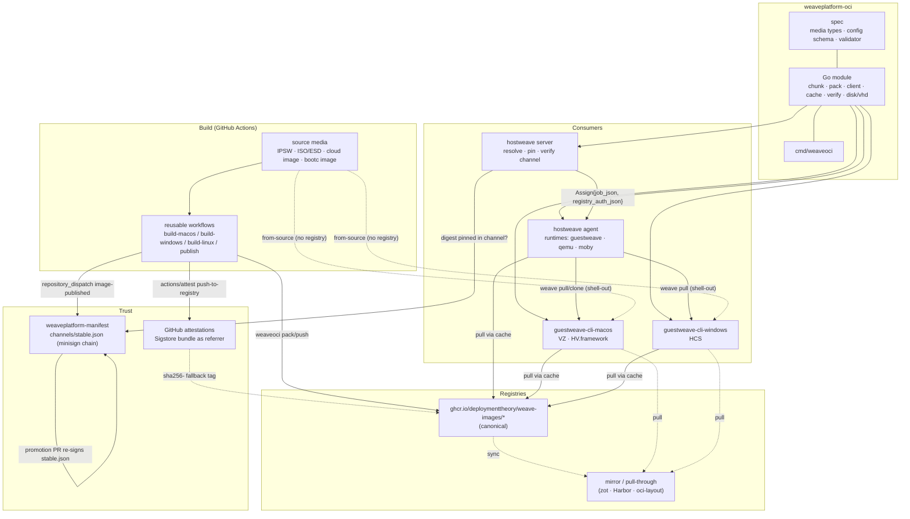
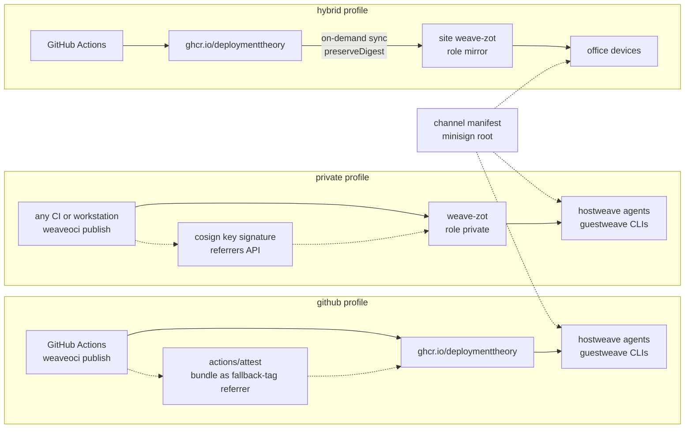
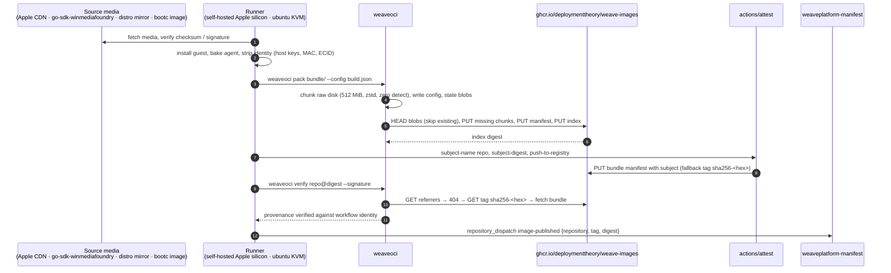
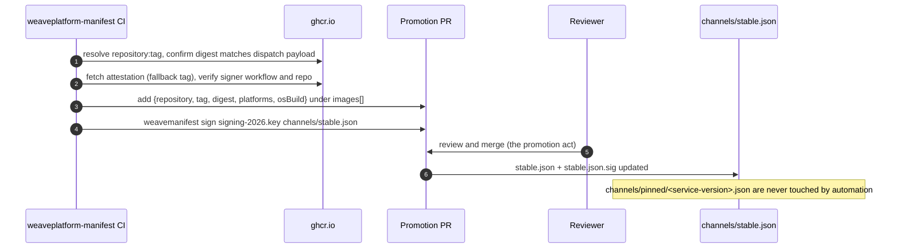
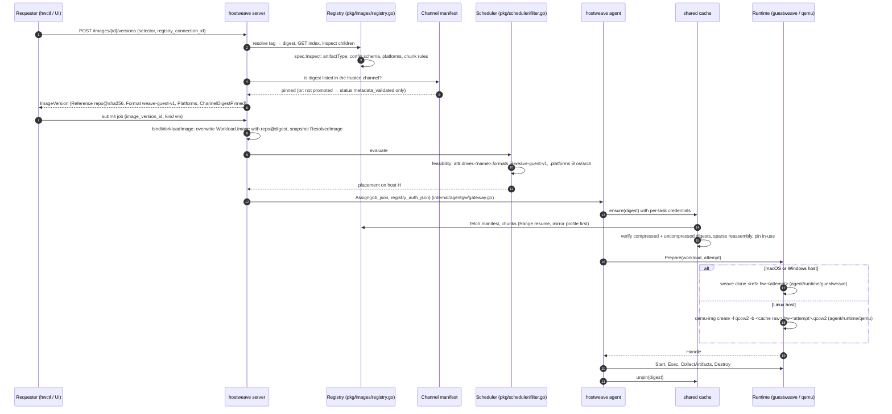
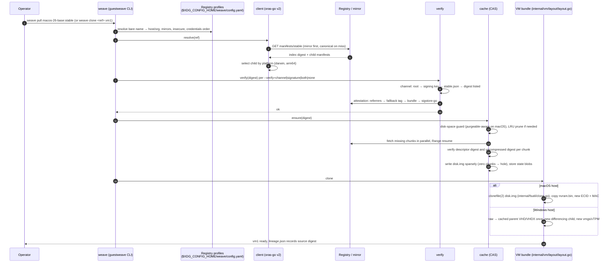
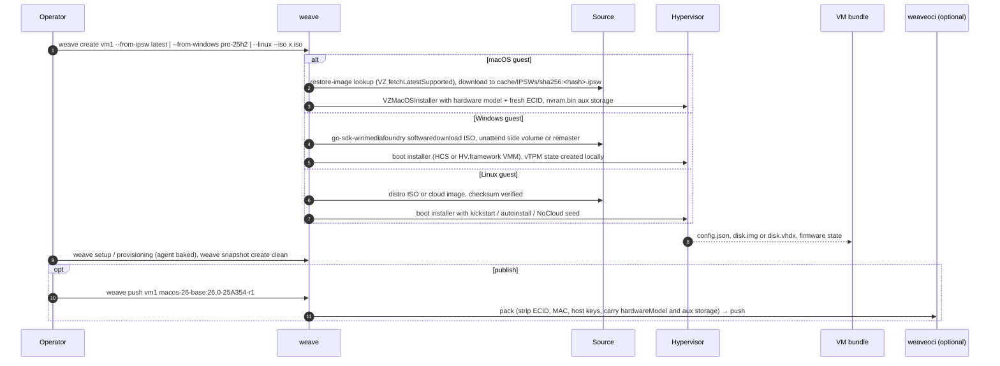

# Target architecture

Research baseline: 2026-10-02. This document describes the system the weave projects move
towards once the decisions in [decisions/](decisions/README.md) are accepted. It draws on the
reports [01](01-oci-primer.md)–[07](07-build-pipelines.md), the artifact contract in
[09](09-artifact-contract-v1.md) and the shared module in [10](10-shared-go-module.md). Sequencing
is in [11-migration.md](11-migration.md); unresolved points are in
[12-open-questions.md](12-open-questions.md).

The four fixed decisions that shape everything below: one weave-native VM artifact contract with no
Tart dependency ([0001](decisions/0001-vm-artifact-contract.md)); trust from build-time attestations
plus promotion-time channel manifests ([0006](decisions/0006-trust-attestations-and-channel-manifest.md));
`weaveplatform-oci` as spec, shared Go module and publication workflows
([0004](decisions/0004-shared-go-module.md)); GHCR canonical with any OCI registry as mirror
([0002](decisions/0002-registry-repositories-tags-visibility.md)).

Three later decisions extend them. The same codebase serves three deployment profiles: **github**,
**private** and **hybrid** ([0011](decisions/0011-deployment-profiles-and-reference-registry.md),
[13-deployment-profiles.md](13-deployment-profiles.md)). zot is the reference private registry, and
the private profile signs with cosign key-based signing plus the channel manifest.
`weaveplatform-oci` publishes its own `weaveoci` and `weave-zot` container images to GHCR
([0012](decisions/0012-container-images.md)). Every implementation phase passes a 95% merged
coverage gate and its own godog acceptance suite ([0013](decisions/0013-quality-gates.md)).

## Components

| Component | Repository | Role in the target |
|---|---|---|
| Artifact spec | `weaveplatform-oci` (`pkg/spec`, [09](09-artifact-contract-v1.md)) | The only VM artifact encoding any weave project publishes or consumes: `application/vnd.weave.guest.config.v1+json` config and artifactType, `application/vnd.weave.guest.disk.v1.raw+zstd` chunks, typed state blobs, one index per OS build |
| Shared Go module | `weaveplatform-oci` ([10](10-shared-go-module.md)) | `chunk`, `pack`, `client` (oras-go v2), `cache`, `verify`, `disk/vhd`, `cmd/weaveoci`, plus `profile`, `sign` and `publish`. Replaces the three OCI clients that exist today |
| Publication workflows | `weaveplatform-oci/.github/workflows/` ([07](07-build-pipelines.md)) | Reusable `build-macos.yml`, `build-windows.yml`, `build-linux.yml`, `publish.yml`. Mirror the shape of `weaveplatform-agent-modules/.github/workflows/module-release.yml` |
| `weaveoci` container image | `ghcr.io/deploymenttheory/weaveoci` ([0012](decisions/0012-container-images.md)) | Static, nonroot multi-arch image of the CLI. Runs `weaveoci publish` on any CI system, not only GitHub Actions, and supplies the `healthcheck` probe binary inside `weave-zot` |
| `weave-zot` container image | `ghcr.io/deploymenttheory/weave-zot`, built `FROM ghcr.io/project-zot/zot:v2.1.21@sha256:…` with weave config roles ([13](13-deployment-profiles.md)) | Reference private registry and site mirror. Config roles `private` (canonical store, htpasswd or OpenID, create-without-update tag immutability, cosign trust extension) and `mirror` (on-demand `sync` from GHCR with `preserveDigest`). Docker Compose file in `deploy/zot/` |
| Canonical registry | `ghcr.io/deploymenttheory/weave-images/<family>-<major>[-<variant>]` ([04](04-registries-and-github.md)) | Linux repositories public; macOS and Windows repositories org-private. Tags are immutable `<osver>-<build>-r<rev>` plus moving `stable`, `edge`, `latest` |
| Mirrors | operator-run zot or Harbor; `oci-layout` directories for air gap | Registry profiles name a mirror list; digests are preserved so attestations and channel pins stay valid |
| Build-time trust | Profile-dependent signing provider ([05](05-supply-chain.md), [0011](decisions/0011-deployment-profiles-and-reference-registry.md)): GitHub artifact attestations (`actions/attest`) in the github profile, cosign v3 key-based signing (file or KMS key, no transparency log) in the private profile | A Sigstore bundle pushed as an OCI 1.1 referrer with artifactType `application/vnd.dev.sigstore.bundle.v0.3+json`; zot serves it through the referrers API, GHCR and distribution v3 through the `sha256-<hex>` fallback tag |
| Promotion-time trust | `weaveplatform-manifest` channel manifest, minisign root → signing key → `channels/stable.json` | The channel lists promoted image digests. hostweave and guestweave trust the channel; an air-gapped host verifies with the root key already embedded in core |
| hostweave server | `hostweave` (`pkg/images`, `internal/server`, `internal/agentgw`) | OCI-only. Resolves a selector to a digest with `pkg/images/registry.go`, inspects it with `spec.Inspect`, records a channel pin, binds the version to jobs and supplies, and sends per-task registry credentials in `Assign.registry_auth_json` (`internal/agentgw/gateway.go`) |
| hostweave agent | `hostweave` (`agent/runtime/{guestweave,qemu,moby}`, `pkg/scheduler/filter.go`) | Fingerprints `attr.driver.<name>.formats` and `.platforms`; pulls VM images through the shared `cache`; QEMU becomes an OCI consumer; guestweave remains a shell-out |
| guestweave-cli-macos | `guestweave-macos` | From-source (IPSW, Windows ARM64 ISO, Linux ISO) and OCI through the shared module. Tart and Lume codecs removed ([0010](decisions/0010-remove-tart-and-lume-compatibility.md)) |
| guestweave-cli-windows | `guestweave-windows` | From-source (retail ISO plus unattend side volume, Linux native or ISO) and OCI through the shared module. VHDX-v2 format removed; raw chunks are converted to a cached parent VHD/VHDX and cloned as differencing children |

## Deployment profiles

The artifact contract, the CLI and the consumers are identical in every profile. A profile only
changes where images are pushed, who signs them and how devices reach the registry.

| Profile | Canonical registry | Publishes from | Build-time signature | Promotion | Devices pull from |
|---|---|---|---|---|---|
| github | `ghcr.io/deploymenttheory` | GitHub Actions reusable workflows wrapping `weaveoci publish` | GitHub artifact attestation (keyless, GitHub OIDC) | `weaveplatform-manifest` channel | GHCR, with a service PAT |
| private | `weave-zot` in the `private` role | Any CI or a workstation running `weaveoci publish` (binary or container) | cosign key-based signature (file or KMS key) | the organisation's own channel manifest | `weave-zot`, with htpasswd, OpenID or API-key credentials |
| hybrid | `ghcr.io/deploymenttheory` | GitHub Actions | GitHub artifact attestation | `weaveplatform-manifest` channel | a site `weave-zot` in the `mirror` role, syncing on demand with digests preserved |

The channel manifest is mandatory in all three profiles. In the private profile an organisation
can run its own `weavemanifest` root and signing key; how that trust anchor reaches devices is
an open question ([12](12-open-questions.md)).

## Data flows

Five flows cover the system. Each is drawn as a sequence below.

| Flow | Trigger | Produces |
|---|---|---|
| Publish | `weaveoci publish`, run by a GitHub workflow in `weaveplatform-oci` (scheduled rebuild, source-media change, or manual) or, in the private profile, by any CI system or operator | A pushed index plus manifests, a Sigstore bundle referrer, a `repository_dispatch` to `weaveplatform-manifest` |
| Promote | The `image-published` dispatch | A promotion PR that adds the image digest to `channels/stable.json` and re-signs it; merge is the promotion act |
| hostweave dispatch | A requester submits a job that selects an image version | A pinned `ResolvedImage` on the workload, a placement on a host whose driver reports the format, a pull through the agent cache, a clone, a run |
| guestweave pull and clone | `weave pull <ref>` or `weave clone <ref> <name>` | A verified, cached image and a copy-on-write (macOS) or differencing (Windows) VM |
| guestweave from-source | `weave create --from-ipsw`, `--from-windows`, `--linux --iso` | A local VM bundle with no registry involved; optionally `weave push` afterwards |

### Publish

The diagram shows the github profile. Every stage after the guest build is performed by
`weaveoci publish`, so the same sequence runs on any CI system. In the private profile the
registry is `weave-zot`, the attestation step is replaced by `weaveoci sign` with a cosign key,
the referrer is found through the referrers API instead of the fallback tag, and the dispatch is
replaced by a promotion request to the organisation's own channel repository.

### Promote

### hostweave dispatch

hostweave never accepts a free-form image string for VM jobs in the target: `Workload.Image` is
always `repo@sha256:…` set by the server. Container jobs keep the moby runtime's engine pull
([0009 in hostweave](https://github.com/deploymenttheory/hostweave/blob/main/docs/research/decisions/0009-container-runtime-moby.md))
and are outside the VM contract.

### guestweave pull and clone

### guestweave from-source

No step in the from-source flow contacts a registry. This is the mode guestweave must keep working
with no network beyond the vendor media endpoints
([0003](decisions/0003-consumer-modes.md)).

## Runtime consumption

The artifact carries raw guest-LBA chunks. Each hypervisor backend turns the reassembled raw disk
into what it can boot. Conversion happens once per cached digest, never per clone.

| Host / hypervisor | Cached form | Per-VM instantiation | Firmware and identity state |
|---|---|---|---|
| macOS, Virtualization.framework (macOS and Linux guests) | raw `disk.img` (sparse); ASIF conversion optional on macOS 26+ | APFS `clonefile(2)` copy (`internal/fsutil/clone.go`) | carry `hardwareModel` and auxiliary storage (`nvram.bin`); regenerate ECID, `machineidentifier.bin`, MAC |
| macOS, HV.framework VMM (Windows 11 ARM64 guests) | raw `disk.img` | APFS clone | carry `NVRAM.dat` if present (optional); regenerate `tpm/` |
| Linux, QEMU/KVM (hostweave agent) | raw base file in the agent cache | `qemu-img create -f qcow2 -b <base>` overlay per attempt | regenerate OVMF VARS from firmware policy; cloud-init NoCloud seed per attempt as today |
| Windows, HCS (guestweave-cli-windows) | raw chunks → parent `disk.vhdx` written by `disk/vhd` (fixed VHD footer or dynamic VHDX, see [12](12-open-questions.md)) | differencing child VHDX (about 4 MB) | regenerate `guest.vmgs` (UEFI vars plus vTPM) from firmware policy; first run elevated as hostweave ADR 0010 records |

Windows QEMU and Linux VZ follow the same rules as their hypervisor row. A format that a host
cannot consume is never pulled: the scheduler filter and `weave capabilities` both report
`image_formats: ["weave-guest-v1"]` and the guest platforms the host can boot.

## Trust placement

| Where | What is verified | Mechanism | Failure behaviour |
|---|---|---|---|
| CI, after push (github profile) | The pushed digest has a valid provenance bundle from this workflow | `weaveoci verify --signature` (sigstore-go, trusted root from TUF) | Workflow fails; no dispatch sent |
| CI or operator, after push (private profile) | The pushed digest has a cosign bundle signed by the organisation's key | `weaveoci verify --key cosign.pub` (sigstore-go public-key trusted material, no transparency log, no observer timestamps) | `weaveoci publish` exits non-zero; no promotion request |
| weave-zot trust extension | Uploaded cosign public keys against stored signatures | zot `extensions.trust` (v2.1.21 verifies cosign v3 bundles) | Informational only; zot does not block pushes or pulls, so consumers still verify |
| Promotion PR | Digest matches the dispatch; attestation signer is the expected workflow | CI check on the PR plus human review | PR not merged; image stays unpromoted |
| hostweave server, at resolve time | Digest is listed in the configured channel; artifact conforms to the contract | `verify.Channel` (root key, signing key, `stable.json`) plus `spec.Inspect` | Version recorded as `metadata_validated` but not pinnable for jobs when policy requires a channel pin |
| hostweave agent, at pull time | Blob digests match descriptors; uncompressed chunk digests match annotations | `cache` | Attempt fails as a capacity-class error and is retried elsewhere |
| guestweave CLI, at pull time | As configured: `--verify=channel` (default when a channel is configured), `signature`, `both`, or `none` | `verify` | Pull refused with the reason; `--verify=none` prints a warning |
| Air-gapped host | Channel manifest against the embedded root key; attestation bundles against a downloaded `trusted_root.jsonl` | `verify` with local inputs; images imported from `oci-layout` | Same as online |

Attestation verification is optional for private mirrors that cannot reach Sigstore; channel
verification is mandatory for hostweave ([0006](decisions/0006-trust-attestations-and-channel-manifest.md)).

## Shared-module boundary

| In the shared module (`weaveplatform-oci`) | In each consumer |
|---|---|
| Media types, config schema and validator (`spec`) | Translating the config into the consumer's own VM config (`vmconfig.VMConfig` on macOS, `internal/vm/config` on Windows, `types.ImageVersion` in hostweave) |
| Chunking, zero detection, zstd, sparse reassembly (`chunk`) | Hole punching implementation per filesystem is behind an interface; the macOS purgeable-space disk guard stays in guestweave-macos |
| Manifest and index packing with `oras.PackManifest` (`pack`) | Which bundle files are state blobs and their carry/regenerate semantics come from the spec, but the consumer decides what to regenerate at clone |
| Registry profiles, credential chain, resolve, fetch with Range resume, push with HEAD skip, referrers discovery (`client`) | Keychain and Windows Credential Manager hooks; hostweave's provider-backed token exchange (ECR, ACR, GAR) feeds credentials in |
| Content-addressed cache, pins, LRU, quota, `oci-layout` import and export (`cache`) | Cache location and quota policy; hostweave's agent health check reads free space from it |
| Sigstore bundle and channel-manifest verification (`verify`) | Policy: which channel, which workflow identity, whether `none` is allowed |
| Raw to VHD/VHDX conversion (`disk/vhd`) | Hypervisor-specific attach, differencing children, overlays |
| Profile loading, signing providers and the publish pipeline (`profile`, `sign`, `publish`) | Which profile a host uses, where keys and credentials live |
| `cmd/weaveoci` for pipelines and operators | `weave` and `hwctl` keep their own verbs and call the module |

The module has no hypervisor code, no SSH, no exec, and no knowledge of hostweave's job model.

## Migration summary

Sequencing is in [11-migration.md](11-migration.md). In short: document first (this set), then the
spec and chunker with fixtures, then the client, cache and verifier, then the Linux pipeline end to
end because it carries no licensing risk, with the `weave-zot` image and the container release
workflow alongside it so both the github and private publish paths are tested, then guestweave-macos, guestweave-windows and hostweave
adopt the module, then the macOS and Windows pipelines, then a mirror and air-gap drill. Images
already published in the Tart or VHDX-v2 encodings are re-published once with `weaveoci republish`.

## Non-goals

- **Splitting provisioning from the image.** Per-instance configuration (credentials, agent channel
  keys, cloud-init or unattend seeds) stays a consumer concern. The contract reserves a seed media
  type but v1 does not use it.
- **Content-defined chunking.** Fixed 512 MiB guest-LBA chunks with digest-level dedupe and
  lineage-based sharing (APFS clones, qcow2 overlays, differencing VHDX) are the v1 answer. CDC is
  revisited only if rebuild frequency makes bandwidth the dominant cost
  ([06](06-large-artifacts.md)).
- **Writing a registry.** The private profile runs upstream zot with weave configuration, packaged
  as `weave-zot`. weaveplatform-oci contains no registry server code. Harbor and distribution v3
  are supported targets, not packaged.
- **Container images.** The moby runtime keeps pulling ordinary images through the engine. The
  contract covers VM images only.
- **Wire compatibility with Tart or Lume.** Removed deliberately
  ([0010](decisions/0010-remove-tart-and-lume-compatibility.md)).
