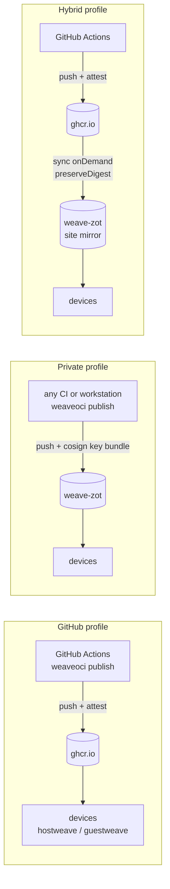
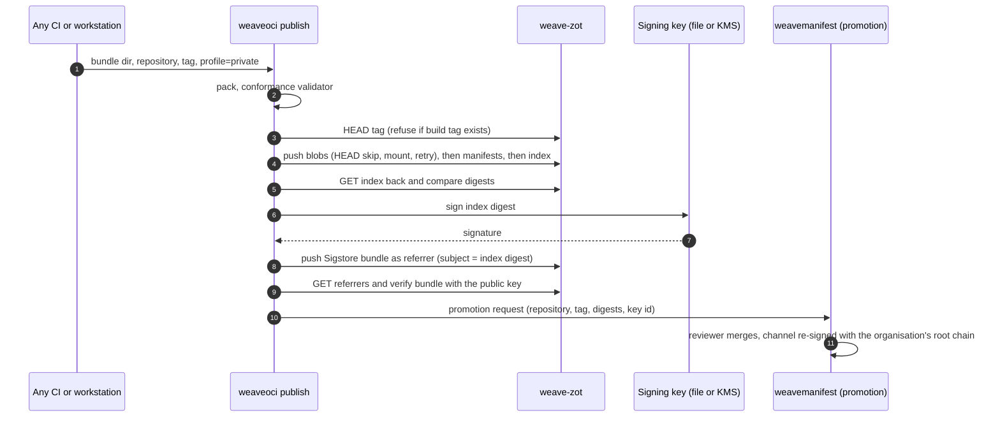

# Deployment profiles: GitHub, private and hybrid

Research baseline: 2026-10-02. This report extends the original scope. The first research
set assumed GHCR and GitHub Actions throughout. The project owner then asked for the same
platform to run fully privately, for example a registry hosted as a container in Docker, and
fixed three decisions on 2026-10-02:

1. **zot is the reference private registry.** Harbor and CNCF distribution v3 are supported
   targets, not reference deployments.
2. **The private profile signs with cosign key-based signing** (file or KMS key) **plus the
   minisign channel manifest.**
3. **weaveplatform-oci publishes its own container images to GHCR:**
   `ghcr.io/weaveplatform/weaveoci` (the CLI) and `ghcr.io/weaveplatform/weave-zot`
   (zot preconfigured for weave artifacts).

The contracts these facts feed are in
[decision 0011](decisions/0011-deployment-profiles-and-reference-registry.md) (profiles and the
reference registry), [decision 0012](decisions/0012-container-images.md) (images published by
this repository) and [decision 0013](decisions/0013-quality-gates.md) (coverage and acceptance
gates). Registry facts are in [04-registries-and-github.md](04-registries-and-github.md); the
trust mechanisms are in [05-supply-chain.md](05-supply-chain.md).

## Summary

- The artifact contract ([09](09-artifact-contract-v1.md)) does not depend on the registry.
  Any OCI 1.1 registry stores it. A deployment profile only changes where images are
  published, how the build-time signature is made and how consumers authenticate.
- **One code path.** Every publication stage lives in `weaveoci publish`; the GitHub
  workflows become thin wrappers. Any CI system, or a workstation, can publish to a private
  registry.
- **The channel manifest is mandatory in every profile.** Only the build-time signature
  changes: GitHub artifact attestations in the GitHub profile, cosign key-based bundles in
  the private profile.
- **zot fits the private role best.** It is a single container, implements the referrers
  API, Range and resumable uploads, has no blob size limit, can mirror GHCR on demand while
  preserving digests, and can enforce tag immutability through access control.
- zot has sharp edges for multi-GiB artifacts: a 60 s default HTTP timeout, a garbage
  collector that can remove blobs from a slow push, deletion of untagged manifests, and no
  layer-existence check for custom config media types. The `weave-zot` image ships a config
  that handles all four.

## Three profiles

| | GitHub | Private | Hybrid |
|---|---|---|---|
| Canonical registry | `ghcr.io/weaveplatform` | an organisation's zot (`weave-zot`), Harbor or distribution v3 | GHCR |
| Site registry | none | none, or a second zot as a site mirror | zot per site, `sync` on demand from GHCR |
| Publisher | GitHub Actions wrappers around `weaveoci publish` | `weaveoci publish` from any CI or a workstation | GitHub Actions |
| Build-time signature | GitHub artifact attestation (Sigstore, keyless) | cosign-format bundle signed with a file or KMS key | GitHub artifact attestation |
| Promotion trust | minisign channel manifest, weaveplatform root | minisign channel manifest, organisation's own root or weaveplatform root | minisign channel manifest |
| Referrers | fallback tag `sha256-<hex>` (no API) | native referrers API on zot and Harbor; fallback tag on distribution v3 | fallback tag upstream; zot syncs referrers |
| Consumer credentials | classic PAT (`read:packages`) or `GITHUB_TOKEN` | htpasswd, OpenID Connect or API keys on zot; robot accounts on Harbor | site zot credentials; zot holds the GHCR PAT |
| Best for | open-source Linux images, the weaveplatform release stream | air-gapped and sovereign sites; macOS and Windows images that must stay inside an organisation | offices with many devices pulling the same images |



All three profiles use the same consumer configuration shape: a registry profile with an
ordered mirror list ([decision 0008](decisions/0008-device-cache-gc-and-mirrors.md)) and a list
of channel trust anchors (below). A device can move between profiles by changing
configuration, not code.

## Why zot

| | zot | Harbor | distribution v3 |
|---|---|---|---|
| Release at baseline | v2.1.21, 2026-09-06 ([release](https://github.com/project-zot/zot/releases/tag/v2.1.21)) | 2.15.2 | 3.1.2, 2026-09-24 |
| Footprint | one container | many containers (core, jobservice, database, cache, portal) | one container |
| Referrers API | yes, with `artifactType` filter | yes (2.11+) | no |
| Range GET | yes, multi-range up to 16 specs | yes | yes |
| Chunked and resumable upload | yes; `GET` on the upload URL returns progress | yes | yes |
| Blob size limit | none found; manifests capped at 4 MiB | storage-bound | storage-bound |
| Pull-through from GHCR | `sync` on demand, `preserveDigest` | proxy-cache project | proxy mode, one upstream, pull-only |
| Tag immutability | grant `create` without `update` | immutability rules | none |
| Signature verification | `trust` extension, informational | via Cosign/Notation policies | none |
| Role in weave | reference private registry and site mirror | supported target | supported target; exercises the fallback-tag path |

Facts behind the zot column, from the v2.1.21 source and docs:

- **Images.** `ghcr.io/project-zot/zot` includes every extension (sync, search, scrub,
  metrics, lint, ui, mgmt, imagetrust, events). `ghcr.io/project-zot/zot-minimal` has none.
  weave needs `sync` and `trust`, so `weave-zot` derives from the full image. Platforms are
  linux/amd64, linux/arm64, freebsd/amd64 and freebsd/arm64 (index fetched from GHCR on
  2026-10-02; [publish workflow](https://github.com/project-zot/zot/blob/v2.1.21/.github/workflows/publish.yaml)).
- **Layout of the image.** Built with stacker on `gcr.io/distroless/base-nossl-debian13`.
  The entrypoint is an architecture-specific binary (`/usr/local/bin/zot-linux-amd64` or
  `zot-linux-arm64`) with `CMD ["serve","/etc/zot/config.json"]`. The image config sets
  `User: "0"`, no volumes and no exposed ports. Defaults: port 5000, config
  `/etc/zot/config.json`, storage `/var/lib/registry`
  ([stacker.yaml](https://github.com/project-zot/zot/blob/v2.1.21/build/stacker.yaml)).
- **No shell or HTTP client.** Distroless means no `sh`, `curl` or `wget`. The CLI offers
  `serve`, `verify <config>` (config validation only), `scrub`, `verify-feature`, `schema`
  and `retention`; there is no health-check subcommand
  ([root.go](https://github.com/project-zot/zot/blob/v2.1.21/pkg/cli/server/root.go)).
- **Health endpoints.** `/livez`, `/readyz` and `/startupz` are registered before the
  authentication middleware and need no credentials
  ([routes.go L67-72](https://github.com/project-zot/zot/blob/v2.1.21/pkg/api/routes.go)).
- **Custom artifacts.** Manifests are validated against OCI 1.1 (`distSpecVersion`
  1.1.1), so a custom `artifactType` and config media type are accepted. zot checks that
  config and layer blobs exist only when the config media type is the OCI image config or
  the empty JSON type. For `application/vnd.weave.guest.config.v1+json` it does **not**
  check, so the weave client must push every blob before the manifest and verify the push
  by reading the manifest back
  ([common.go L104-133](https://github.com/project-zot/zot/blob/v2.1.21/pkg/storage/common/common.go)).
- **Limits.** No blob size limit was found; manifests are capped at 4 MiB and trust-key
  uploads at 8 MiB ([consts.go L25-29](https://github.com/project-zot/zot/blob/v2.1.21/pkg/api/constants/consts.go)).
- **Immutability.** zot has no dedicated flag. Granting `["read","create"]` without
  `update` stops anyone from moving an existing tag; CEL conditions such as
  `req.referenceType == "digest"` refine policies further
  ([immutable tags](https://zotregistry.dev/v2.1.21/articles/immutable-tags/),
  [authz.go](https://github.com/project-zot/zot/blob/v2.1.21/pkg/api/authz.go)). Channel tags
  (`stable`, `edge`, `latest`) are moved by promotion, so only the promotion identity holds
  `update`.

## Reference deployment: the weave-zot image

`ghcr.io/weaveplatform/weave-zot` is upstream zot plus a weave configuration and a
health-check binary. It is built by this repository ([decision 0012](decisions/0012-container-images.md)).

```dockerfile
# deploy/zot/Dockerfile
ARG ZOT_IMAGE=ghcr.io/project-zot/zot:v2.1.21@sha256:<index digest pinned at build>
FROM ${ZOT_IMAGE}
COPY config/private.json /etc/zot/config.json
COPY --chmod=0555 weaveoci /usr/local/bin/weaveoci
HEALTHCHECK --interval=15s --timeout=5s --start-period=30s --retries=3 \
  CMD ["/usr/local/bin/weaveoci", "healthcheck", "http://127.0.0.1:5000/readyz"]
```

- **The upstream digest is pinned.** Renovate or Dependabot bumps it in a pull request.
  zot's images carry no cosign signatures or referrers (observed with `oras discover`), so
  the digest pin is the only integrity control on the base.
- **Health check.** The image has no shell or `curl`, so a static `weaveoci` binary
  (CGO off) provides `weaveoci healthcheck <url>`, which exits 0 on HTTP 200. `/readyz` is
  used for readiness and `/livez` for liveness.
- **Platforms.** linux/amd64 and linux/arm64. The Dockerfile only copies files, so buildx
  needs no emulation.
- **Config validation.** CI runs `docker run --rm <image> verify /etc/zot/config.json`. A
  `RUN` step cannot do this because there is no shell and the binary path depends on the
  architecture.
- **User.** Upstream runs as root. `weave-zot` keeps root by default so volume permissions
  behave as upstream documents; a `-nonroot` variant setting `USER 65532` with a writable
  `/var/lib/registry` volume is offered as an option. Which should be the default is an open
  question.
- **Two configs ship in the image**: `/etc/zot/config.json` (the `private` role) and
  `/etc/zot/mirror.json` (the `mirror` role). Operators select one with
  `command: ["serve", "/etc/zot/mirror.json"]` or mount their own.

## Config roles

Both roles must set the following for multi-GiB weave artifacts:

| Setting | Value | Why |
|---|---|---|
| `http.readTimeout`, `http.writeTimeout` | `"0s"` | Default is 60 s since v2.1.17; a 512 MiB blob on a slow uplink exceeds it ([issue 4079](https://github.com/project-zot/zot/issues/4079), [issue 4140](https://github.com/project-zot/zot/issues/4140)) |
| `storage.gcDelay` | `"24h"` | GC deletes unreferenced blobs older than `gcDelay` (default 1 h); a 30–60 GiB push can take longer, so early chunks could vanish before the manifest arrives ([gc.go](https://github.com/project-zot/zot/blob/v2.1.21/pkg/storage/gc/gc.go)) *(risk inferred from code)* |
| Tagged pushes | always | retention deletes untagged manifests by default ([retention](https://zotregistry.dev/v2.1.21/articles/retention/)) |
| `extensions.search.cve` | omitted | with CVE scanning on, zot downloads the Trivy database from ghcr.io, which an air-gapped site cannot reach |
| `http.auth` | `htpasswd`, `openid` or `apikey` enabled | the cosign public-key upload endpoint `/v2/_zot/ext/cosign` is admin-only only when one of htpasswd, LDAP, OpenID or apikey is on; bearer-only or mTLS-only leaves it open ([http_server.go L90-120](https://github.com/project-zot/zot/blob/v2.1.21/pkg/common/http_server.go)) |
| `storage.dedupe` with mounts | client uses `POST ?mount=` | since v2.1.21, HEAD and Range GET no longer hydrate blobs held by another repository unless `hydrateBlobOnRead` is set ([PR 4363](https://github.com/project-zot/zot/pull/4363)) |

Two behaviours are informational only and must not be mistaken for enforcement:

- **`extensions.trust`** verifies cosign and Notation signatures and records the result in
  search metadata; it does not block pushes or pulls. zot v2.1.21 or later is needed to
  verify cosign v3 bundle signatures ([PR 4307](https://github.com/project-zot/zot/pull/4307)).
  weave consumers verify for themselves ([05](05-supply-chain.md)).
- **`sync.onlySigned`** only checks that a signature referrer or legacy `.sig` tag exists;
  it does not verify it ([referrers.go](https://github.com/project-zot/zot/blob/v2.1.21/pkg/extensions/sync/referrers.go)).

### Role `private`: the canonical store

```json
{
  "distSpecVersion": "1.1.1",
  "storage": {
    "rootDirectory": "/var/lib/registry",
    "dedupe": true,
    "gc": true,
    "gcDelay": "24h",
    "gcInterval": "6h",
    "retention": {
      "dryRun": false,
      "delay": "24h",
      "policies": [
        {
          "repositories": ["weave-images/**"],
          "deleteReferrers": false,
          "deleteUntagged": true,
          "keepTags": [
            { "patterns": ["^[0-9][0-9A-Za-z.]*-[0-9A-Za-z.]+-r[0-9]+$"] },
            { "patterns": ["^(stable|edge|latest)$"] }
          ]
        },
        { "repositories": ["**"], "keepTags": [ { "patterns": [".*"] } ] }
      ]
    }
  },
  "http": {
    "address": "0.0.0.0",
    "port": "5000",
    "realm": "weave",
    "readTimeout": "0s",
    "writeTimeout": "0s",
    "tls": { "cert": "/etc/zot/tls/tls.crt", "key": "/etc/zot/tls/tls.key" },
    "auth": { "htpasswd": { "path": "/etc/zot/htpasswd" }, "failDelay": 1 },
    "accessControl": {
      "repositories": {
        "weave-images/**": {
          "policies": [
            { "users": ["publisher"], "actions": ["read", "create"] },
            { "users": ["promoter"], "actions": ["read", "update"] }
          ],
          "defaultPolicy": ["read"]
        }
      },
      "adminPolicy": { "users": ["admin"], "actions": ["read", "create", "update", "delete"] }
    }
  },
  "log": { "level": "info" },
  "extensions": {
    "search": { "enable": true },
    "trust": { "enable": true, "cosign": true, "notation": false },
    "scrub": { "enable": true, "interval": "24h" },
    "metrics": { "enable": true, "prometheus": { "path": "/metrics" } }
  }
}
```

The retention policy keeps every build tag (`<osver>-<build>-r<rev>`, see
[09](09-artifact-contract-v1.md)) and the channel tags, keeps referrers, and ends with a
catch-all policy: once any `keepTags` policy matches a repository, tags matching nothing are
deleted, so the final `"**"` policy protects everything else
([config-retention.json](https://github.com/project-zot/zot/blob/v2.1.21/examples/config-retention.json)).
`publisher` can create tags but not move them; `promoter` can move channel tags. Anonymous
reads are off by default; a Linux-only public deployment can add `anonymousPolicy: ["read"]`.

### Role `mirror`: a site cache of GHCR

```json
{
  "distSpecVersion": "1.1.1",
  "storage": {
    "rootDirectory": "/var/lib/registry",
    "dedupe": true,
    "gc": true,
    "gcDelay": "24h",
    "gcInterval": "6h"
  },
  "http": {
    "address": "0.0.0.0",
    "port": "5000",
    "realm": "weave-mirror",
    "readTimeout": "0s",
    "writeTimeout": "0s",
    "compat": ["docker2s2"],
    "tls": { "cert": "/etc/zot/tls/tls.crt", "key": "/etc/zot/tls/tls.key" },
    "auth": { "htpasswd": { "path": "/etc/zot/htpasswd" }, "failDelay": 1 },
    "accessControl": {
      "repositories": { "**": { "defaultPolicy": ["read"] } },
      "adminPolicy": { "users": ["admin"], "actions": ["read", "create", "update", "delete"] }
    }
  },
  "log": { "level": "info" },
  "extensions": {
    "sync": {
      "enable": true,
      "credentialsFile": "/etc/zot/sync-credentials.json",
      "registries": [
        {
          "urls": ["https://ghcr.io"],
          "onDemand": true,
          "tlsVerify": true,
          "preserveDigest": true,
          "maxRetries": 3,
          "retryDelay": "30s",
          "syncTimeout": "6h",
          "content": [ { "prefix": "weaveplatform/weave-images/**" } ]
        }
      ]
    },
    "search": { "enable": true },
    "metrics": { "enable": true, "prometheus": { "path": "/metrics" } }
  }
}
```

- `preserveDigest: true` is required so the channel manifest's digests stay valid, and zot
  refuses to start with it unless `http.compat` contains `"docker2s2"`
  ([root.go L1845](https://github.com/project-zot/zot/blob/v2.1.21/pkg/cli/server/root.go),
  [mirroring](https://zotregistry.dev/v2.1.21/articles/mirroring/)).
- `sync-credentials.json` has the form `{"ghcr.io":{"username":"…","password":"…"}}`; the
  password is the service account's classic PAT with `read:packages`
  ([sync config](https://github.com/project-zot/zot/blob/v2.1.21/pkg/extensions/config/sync/config.go)).
  The PAT then lives on one server instead of every device.
- `syncTimeout` is raised from the 3 h default to 6 h for the largest images.
- Known issue: stale on-demand sync staging can hang
  ([issue 4357](https://github.com/project-zot/zot/issues/4357), open).

## Docker Compose reference

`deploy/zot/compose.yaml` is the reference private deployment. It runs one canonical store
and, optionally, a mirror.

```yaml
name: weave-registry

services:
  zot:
    image: ghcr.io/weaveplatform/weave-zot:1
    restart: unless-stopped
    ports:
      - "5000:5000"
    volumes:
      - zot-data:/var/lib/registry
      - ./tls:/etc/zot/tls:ro
      - ./htpasswd:/etc/zot/htpasswd:ro
    healthcheck:
      test: ["CMD", "/usr/local/bin/weaveoci", "healthcheck", "http://127.0.0.1:5000/readyz"]
      interval: 15s
      timeout: 5s
      start_period: 30s
      retries: 3

  zot-mirror:
    profiles: ["mirror"]
    image: ghcr.io/weaveplatform/weave-zot:1
    command: ["serve", "/etc/zot/mirror.json"]
    restart: unless-stopped
    ports:
      - "5001:5000"
    volumes:
      - mirror-data:/var/lib/registry
      - ./tls:/etc/zot/tls:ro
      - ./htpasswd:/etc/zot/htpasswd:ro
      - ./sync-credentials.json:/etc/zot/sync-credentials.json:ro
    healthcheck:
      test: ["CMD", "/usr/local/bin/weaveoci", "healthcheck", "http://127.0.0.1:5000/readyz"]
      interval: 15s
      timeout: 5s
      start_period: 30s
      retries: 3

volumes:
  zot-data:
  mirror-data:
```

`docker compose up -d` starts the canonical store; `docker compose --profile mirror up -d`
adds the site mirror. zot v2.1.21 ships no compose file of its own; its docs show only
`docker run -p 5000:5000 -v $(pwd)/registry:/var/lib/registry`
([getting started](https://zotregistry.dev/v2.1.21/admin-guide/admin-getting-started/)).
`deploy/zot/README.md` documents generating the htpasswd file, providing TLS material and
uploading the cosign public key.

## Publishing without GitHub

Every publication stage is a `weaveoci publish` step, so the private profile needs no
GitHub service. The GitHub workflows in [07](07-build-pipelines.md) call the same command
and add only the GitHub-specific attestation step.



The promotion request is pluggable: a `repository_dispatch` in the GitHub profile, and in
the private profile either a pull request against the organisation's own channel repository
(any Git host) or a file written for `weavemanifest promote` to consume. Promotion is still a
human merge in every profile.

## cosign key-based signing

Facts for cosign v3.1.3 (2026-08-06):

- **Keys.** `cosign generate-key-pair` creates a file key pair; `--kms` supports
  `awskms://`, `gcpkms://projects/…/cryptoKeys/…` (signing needs `/versions/N`),
  `azurekms://`, `hashivault://`, `k8s://ns/name`, `github://` and `gitlab://`; `--key`
  also accepts `env://`
  ([generate-key-pair](https://github.com/sigstore/cosign/blob/v3.1.3/doc/cosign_generate-key-pair.md),
  [sign](https://github.com/sigstore/cosign/blob/v3.1.3/doc/cosign_sign.md)).
- **Offline signing, preferred form.** Create a signing config with no Rekor, Fulcio or
  timestamp services with `cosign signing-config create --out offline-sc.json`, then
  `cosign sign --key cosign.key --signing-config offline-sc.json --trusted-root tr.json <ref@sha256:…>`.
  Without `--trusted-root`, cosign attempts a TUF fetch and warns if it fails
  ([common.go L447-462](https://github.com/sigstore/cosign/blob/v3.1.3/cmd/cosign/cli/signcommon/common.go)).
- **Offline signing, legacy flags.** `cosign sign --key k --use-signing-config=false --tlog-upload=false <ref@digest>`
  works on v3.1.3 ([issue 5043](https://github.com/sigstore/cosign/issues/5043)).
- **Gotcha.** `--tlog-upload` is deprecated, and `--use-signing-config` defaults to true.
  `--tlog-upload=false` on its own therefore fails with "--tlog-upload=false is not
  supported with --signing-config or --use-signing-config", even though older doc examples
  show exactly that command
  ([common.go L433-446](https://github.com/sigstore/cosign/blob/v3.1.3/cmd/cosign/cli/signcommon/common.go),
  [sign options](https://github.com/sigstore/cosign/blob/v3.1.3/cmd/cosign/cli/options/sign.go)).
- **Verify.** `cosign verify --key cosign.pub --insecure-ignore-tlog <ref@digest>`.
  `--private-infrastructure` is deprecated in favour of `--insecure-ignore-tlog`
  ([verify options](https://github.com/sigstore/cosign/blob/v3.1.3/cmd/cosign/cli/options/verify.go)).
- **Storage.** cosign writes an OCI 1.1 referrer: empty config, `artifactType:
  application/vnd.dev.sigstore.bundle.v0.3+json`, `subject` set to the signed manifest and
  the bundle as the single layer
  ([write.go L313-410](https://github.com/sigstore/cosign/blob/v3.1.3/pkg/oci/remote/write.go)).
  zot and Harbor serve it through the referrers API. On GHCR and distribution v3, which
  lack the API, go-containerregistry maintains the `sha256-<hex>` fallback index tag
  automatically
  ([ggcr write.go L506-593](https://github.com/google/go-containerregistry/blob/v0.21.7/pkg/v1/remote/write.go)).
- **Non-image artifacts.** cosign only HEADs the subject; nothing in the signing path
  assumes a container image. Signing a custom `artifactType` is expected to work but is
  untested *(unverified)*.

**weave signs natively.** The shared module's `sign` package produces the same Sigstore
bundle (v0.3) with the same referrer shape, using a key loaded from a file, environment
variable or KMS URI through the sigstore signature libraries. `weaveoci publish` therefore
needs no cosign binary, and `cosign verify --key … --insecure-ignore-tlog` remains a valid
external check of anything weave signed. Verification in Go follows the cosign
implementation ([verify.go L250-290](https://github.com/sigstore/cosign/blob/v3.1.3/pkg/cosign/verify.go),
[trusted_material.go L117-167](https://github.com/sigstore/sigstore-go/blob/v1.3.0/pkg/root/trusted_material.go)):

```go
sv, err := signature.LoadVerifier(pubKey, crypto.SHA256) // github.com/sigstore/sigstore/pkg/signature
tm := root.NewTrustedPublicKeyMaterial(func(string) (root.TimeConstrainedVerifier, error) {
    return root.NewExpiringKey(sv, time.Time{}, time.Time{}), nil
})
v, err := verify.NewVerifier(tm, verify.WithNoObserverTimestamps()) // the only option for key + no tlog
var b bundle.Bundle
err = b.UnmarshalJSON(bundleLayer)
_, err = v.Verify(&b, verify.NewPolicy(
    verify.WithArtifactDigest("sha256", indexDigest),
    verify.WithKey(),
))
```

`root.NewTrustedPublicKeyMaterialFromMapping` maps key IDs to keys, which supports key
rotation through the bundle's key hint
([signed_entity.go](https://github.com/sigstore/sigstore-go/blob/v1.3.0/pkg/verify/signed_entity.go)).

## Channel trust in private deployments

Consumers accept a configured list of **channel trust anchors**: minisign root public keys,
each with a name. The default list contains only weaveplatform's root, which core
already embeds. A private organisation that builds its own images runs its own
`weavemanifest keygen` root, endorses its own signing key, promotes into its own channel
repository and adds its root to the anchor list on its devices. An image is dispatchable
when its digest appears in a channel signed under any configured anchor, and the channel
entry names which build-time signature to expect (attestation identity or cosign key ID).
The verifier is the same in every profile ([05](05-supply-chain.md),
[decision 0006](decisions/0006-trust-attestations-and-channel-manifest.md)).

## Credentials per profile

| Profile | Push | Pull |
|---|---|---|
| GitHub | `GITHUB_TOKEN` with `packages: write`; package "Manage Actions access" grants Write | classic PAT with `read:packages` from a service account, or `GITHUB_TOKEN` inside Actions; GitHub App tokens are not accepted ([04](04-registries-and-github.md)) |
| Private (zot) | htpasswd or API-key user with `create` on `weave-images/**`; promotion user with `update` | htpasswd users, OpenID Connect (`github`, `google`, `gitlab` or generic `oidc` providers) or API keys ([config-openid.json](https://github.com/project-zot/zot/blob/v2.1.21/examples/config-openid.json)) |
| Private (Harbor) | robot account with push on the project | robot account with pull; OIDC users |
| Hybrid | as GitHub | site zot credentials; the mirror holds the GHCR PAT |

Devices store registry credentials through the Docker credential-helper protocol
(`osxkeychain`, `wincred`); the shared module reads them through its auth chain
([10](10-shared-go-module.md)).

## Container images published by weaveplatform-oci

| Image | Built with | Base | Platforms | Tags |
|---|---|---|---|---|
| `ghcr.io/weaveplatform/weaveoci` | ko v0.19.1 ([ko](https://github.com/ko-build/ko/releases/tag/v0.19.1)) | `gcr.io/distroless/static-debian12:nonroot` | linux/amd64, linux/arm64 | `vX.Y.Z`, `vX.Y`, `vX`, `latest` |
| `ghcr.io/weaveplatform/weave-zot` | docker/build-push-action v7.4.0 ([action](https://github.com/docker/build-push-action/blob/v7.4.0/action.yml)) | `ghcr.io/project-zot/zot:v2.1.21@sha256:…` | linux/amd64, linux/arm64 | `<weave version>`, `<weave version>-zot2.1.21`, `latest`; `-nonroot` variants |

- `weaveoci` is CGO-free, so ko builds it without a Dockerfile and generates an SPDX SBOM
  by default ([ko SBOMs](https://github.com/ko-build/ko/blob/v0.19.1/docs/features/sboms.md)).
  The `nonroot` distroless base runs as UID 65532.
- `weave-zot` copies files only, so buildx builds both architectures without QEMU.
- Both images are signed keyless with cosign in GitHub Actions (`id-token: write`) and
  receive SLSA provenance and SBOM attestations through `actions/attest` v4.2.2 with
  `push-to-registry: true`. A private organisation can additionally sign them with its own
  key after mirroring.
- `cosign-installer` v4.1.2 installs cosign v3.0.6 by default, so workflows pin
  `cosign-release: v3.1.3`
  ([action.yml](https://github.com/sigstore/cosign-installer/blob/v4.1.2/action.yml)).

## Testing implications

The profiles become the test matrix for every phase's acceptance suite
([decision 0013](decisions/0013-quality-gates.md)):

| Registry under test | How it starts | What it proves |
|---|---|---|
| In-process registry (oras-go memory store or go-containerregistry `pkg/registry`) | in the test binary | fast unit coverage of client, cache and verify |
| zot v2.1.21 | testcontainers-go v0.44.0 generic container: `testcontainers.Run(ctx, "ghcr.io/project-zot/zot:v2.1.21", WithExposedPorts("5000/tcp"), WithFiles(…config…), WithWaitStrategy(wait.ForHTTP("/readyz").WithPort("5000/tcp")))` | referrers API path, chunked upload, Range resume, custom config media types, retention behaviour |
| distribution `registry:3.1.2` | testcontainers-go `modules/registry` (`registry.Run(ctx, "registry:3.1.2")`) | fallback-tag path |
| `weave-zot` image built from the working tree | testcontainers-go | the shipped configs, health check and access-control policy |
| GHCR | opt-in nightly smoke with a scratch package | real GHCR behaviour; never required for a merge |

testcontainers-go has no zot module; its `registry` module defaults to `registry:2.8.3`
with a `wait.ForHTTP("/")` wait
([registry module](https://github.com/testcontainers/testcontainers-go/tree/v0.44.0/modules/registry)).

## Licensing note

The private profile is the natural home for macOS and Windows images, which the licence
findings in [04](04-registries-and-github.md) already restrict to organisation-private
distribution. The counsel questions (internal macOS distribution, Windows images in a
private registry) are unchanged by hosting choice and remain open in
[12](12-open-questions.md).

## Open questions

- Should `weave-zot` run as root (upstream behaviour) or as UID 65532 by default?
- zot on-demand sync staging can hang ([issue 4357](https://github.com/project-zot/zot/issues/4357));
  the mirror drill must exercise a 30 GiB image.
- S3 and R2 multipart problems behind zot ([issue 2142](https://github.com/project-zot/zot/issues/2142))
  must be checked before recommending object storage for the private role.
- Does GHCR accept the cosign key-based bundle referrer for a custom `artifactType` through
  the fallback tag, exactly as for an attestation? (a spike, shared with the attestation
  question in [12](12-open-questions.md)).
- How does an organisation's own channel root coexist with weaveplatform's in one
  channel document, and who may promote into which channel?

## References

- zot v2.1.21: <https://github.com/project-zot/zot/releases/tag/v2.1.21>; docs <https://zotregistry.dev/v2.1.21/>; mirroring <https://zotregistry.dev/v2.1.21/articles/mirroring/>; retention <https://zotregistry.dev/v2.1.21/articles/retention/>; immutable tags <https://zotregistry.dev/v2.1.21/articles/immutable-tags/>; verifying signatures <https://zotregistry.dev/v2.1.21/articles/verifying-signatures/>; storage <https://zotregistry.dev/v2.1.21/articles/storage/>
- zot source: <https://github.com/project-zot/zot/blob/v2.1.21/pkg/api/routes.go>, <https://github.com/project-zot/zot/blob/v2.1.21/pkg/storage/common/common.go>, <https://github.com/project-zot/zot/blob/v2.1.21/pkg/cli/server/root.go>, <https://github.com/project-zot/zot/blob/v2.1.21/build/stacker.yaml>, <https://github.com/project-zot/zot/blob/v2.1.21/examples/config-retention.json>
- cosign v3.1.3: <https://github.com/sigstore/cosign/blob/v3.1.3/CHANGELOG.md>, <https://github.com/sigstore/cosign/blob/v3.1.3/doc/cosign_sign.md>, <https://github.com/sigstore/cosign/issues/5043>, <https://github.com/sigstore/cosign/issues/4831>
- sigstore-go v1.3.0: <https://github.com/sigstore/sigstore-go/blob/v1.3.0/pkg/root/trusted_material.go>, <https://github.com/sigstore/sigstore-go/blob/v1.3.0/pkg/verify/signed_entity.go>
- ko v0.19.1: <https://github.com/ko-build/ko/releases/tag/v0.19.1>; build-push-action v7.4.0: <https://github.com/docker/build-push-action/blob/v7.4.0/action.yml>; cosign-installer v4.1.2: <https://github.com/sigstore/cosign-installer/blob/v4.1.2/action.yml>; actions/attest: <https://github.com/actions/attest>
- testcontainers-go v0.44.0: <https://github.com/testcontainers/testcontainers-go/tree/v0.44.0/modules/registry>
- distribution v3.1.2: <https://github.com/distribution/distribution/tree/v3.1.2>
