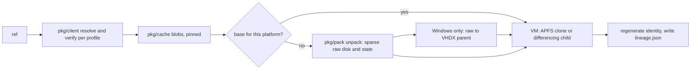

# 14. guestweave adoption: standalone or with weaveplatform-oci

Phases 4 (guestweave-cli-macos) and 5 (guestweave-cli-windows) of
[11-migration.md](11-migration.md). This document is the design both CLIs build
against. It refines [0003](decisions/0003-consumer-modes.md),
[0008](decisions/0008-device-cache-gc-and-mirrors.md),
[0009](decisions/0009-guest-state-carry-vs-regenerate.md) and
[0010](decisions/0010-remove-tart-and-lume-compatibility.md) with what the code surveys of
2026-10-02 found. The surveys were of `weaveplatform/guestweave-cli-macos@158042b`
and `weaveplatform/guestweave-cli-windows@4fad716`.

## 1. Requirements

- **Standalone.** guestweave runs with no registry, profile, credentials,
  channel manifest or weaveplatform-oci services. It builds VMs from source
  (IPSW, retail Windows media, Linux ISO, native Linux on Windows), clones
  local VMs and snapshots, and imports and exports archives.
- **With weaveplatform-oci.** guestweave pulls, clones from, pushes and lists
  weave guest artifacts through the shared module, verifies them per profile,
  and is a hostweave driver.
- **Both CLIs.** The macOS and Windows CLIs expose the same verbs and
  semantics; only the hypervisor-specific materialisation differs.
- **No compatibility burden.** guestweave predates the shared module. The
  Tart and Lume formats, the macOS hand-ported registry client, the Windows
  VHDX-v2 format, both existing image caches and their on-disk layouts are
  removed, not migrated. Existing caches are discarded; existing local VMs are
  untouched.

## 2. The seam

Each CLI gets one internal package, `internal/imagesource`, and VM lifecycle
code (`create`, `run`, `clone` of a local VM, snapshots, `delete`, `prune` of
VMs) never imports registry code.

```go
// Source puts a guest into a fresh VM directory.
type Source interface {
    Materialize(ctx context.Context, vm *layout.VMDirectory, o Options) (Result, error)
}

type Result struct {
    Config     []byte      // the guest's config.json, before identity is regenerated
    Provenance *Provenance // ref, digest, platform; nil for local sources
}

// Images is the image cache seen from lifecycle code: list, prune and pins.
type Images interface {
    List(ctx context.Context) ([]Image, error)
    Prune(ctx context.Context, p PrunePolicy) (PruneReport, error)
    Pin(ctx context.Context, digest, vm string) error
    Unpin(ctx context.Context, vm string) error
}
```

| Implementation | Package | Build |
|---|---|---|
| Local clone (VM or snapshot) | `internal/imagesource/local` | always |
| Archive import (`.tvm` on macOS, `.wvm` on Windows) | `internal/imagesource/archive` | always |
| OCI: `pull`, `clone <ref>`, `push`, `images`, `login`, `logout`, `fqn`, `export-layout`, `import-layout` | `internal/imagesource/oci` | default; excluded with `-tags standalone` |

A `-tags standalone` build links no weaveplatform-oci code and no registry
credentials code. Its registry verbs are absent, and `clone <ref>` explains
that this build has no registry support. The default build contains both.
Without a profile, the registry verbs say what to configure instead of
failing obscurely.

**Name resolution.** Today `oci.RemoteName` decides whether a name is a
local VM or a registry reference (macOS `vmstorage.Open`, `run --disk`,
`fqn`; Windows `isRemoteRef`). That becomes one function in
`internal/imagesource`: a local VM of that name wins; otherwise a name with a
`/` is a reference, parsed by `pkg/client`; otherwise it is an unknown VM. The
rules are unchanged, so existing VM names resolve as they do now.

## 3. Cache

Both CLIs use `pkg/cache` (content-addressed blobs, a reference index, pins,
least-recently-used GC, a quota and a free-space guard).

- **Location.** `<cacheDir>/images` (macOS `$WEAVE_HOME/cache/images`,
  Windows `%LOCALAPPDATA%\weave\cache\images`). The old `OCIs/` trees are
  deleted by the first `prune` after upgrade.
- **Bases.** A pulled artifact is unpacked once per platform into a base:
  `<cacheDir>/bases/<index-digest>/<platform>/`. macOS keeps the sparse raw
  disk (`disk.img`); Windows keeps a dynamic VHDX parent (`disk.vhdx`). A VM
  is an APFS clone of the base (macOS) or a differencing child of it
  (Windows).
- **Pins are the in-use authority.** Materialising a VM pins the index digest
  with the VM's name as owner; deleting the VM unpins it. Prune never evicts
  a pinned digest or its base. On Windows the VHDX parent walk stays as a
  second check, so a VM whose pin was lost still protects its parent.
- **Prune.** `weave prune` keeps its flags. `--entries caches` covers the
  image cache, bases and the media cache (IPSWs, ISOs); `--entries vms`
  covers local VMs. `--space-budget` is the cache quota, `--older-than`
  evicts by last access, and auto-reclaim before a pull uses the free-space
  guard. The macOS guard keeps its purgeable-space measure
  (`NSURLVolumeAvailableCapacityForImportantUsageKey`).
- **Standalone.** The media cache and local VMs are pruned as today; there is
  no image cache to clean.

## 4. Pull and clone



- **Identity.** Every VM materialised from an artifact gets a fresh MAC
  address. A macOS guest gets a fresh machine identifier (ECID). A Windows
  guest gets a fresh VM ID and a new `guest.vmgs`; for an image with
  `firmware.tpm: required` the vTPM is created empty, as it is at install time.
  This is decision 0009, made the default instead of opt-in.
- **Lineage.** `lineage.json` records the reference and index digest for
  every OCI-sourced VM, including `pull` (macOS and Windows), which writes none
  today.
- **Platforms.** The CLI selects the child for its host: `darwin/arm64` and
  `linux/arm64` and `windows/arm64` on Apple silicon; `windows/amd64` and
  `linux/amd64` on Windows x64.

## 5. Push

Push turns a stopped VM into a weave bundle and runs `pkg/publish`.

| Guest | Disk | State carried | Regenerated by consumers |
|---|---|---|---|
| macOS (VZ) | `disk.img` raw; an ASIF disk is converted to raw at push (Q11) | `nvram.bin` as auxiliary storage; `hardwareModel` in the config | ECID, MAC |
| Linux (VZ, QEMU, HCS) | raw | none | `machineidentifier.bin`, UEFI variables, MAC |
| Windows ARM64 on macOS (native VMM) | raw | `NVRAM.dat` as UEFI variables (optional carry) | `tpm/`, MAC |
| Windows on HCS | VHDX flattened to raw (section 6) | firmware policy (Secure Boot template, TPM, generation) | `guest.vmgs`, VM ID, MAC |
| Native Linux on HCS | — | — | refused: the config embeds a host-absolute kernel and rootfs directory |

Push refuses before uploading anything when the VM is running, when a state
file the table requires is missing, or for native Linux. Labels become
manifest annotations. `--profile` selects the registry and signing provider;
a profile with a cosign key signs, and `--promotion-out` writes the channel
entry.

## 6. Windows disk conversion

Q14 is resolved: **fixed VHD as the intermediate, VHDX at rest.**

A fixed VHD is the raw disk followed by a 512-byte footer. The conversion code
in the shared module is therefore a pure-Go footer writer and reader
(`pkg/disk/vhd`), and Windows' own virtdisk API does the expensive part:

- **Pull:** raw chunks are assembled into `base.vhd` with the footer
  appended, then `CreateVirtualDisk` with that file as `SourcePath` (source
  type VHD) writes a dynamic `disk.vhdx` parent, and `base.vhd` is removed.
  VMs are differencing children of `disk.vhdx`, as today.
- **Push:** the VM's leaf is flattened by `CreateVirtualDisk` into a fixed
  `push.vhd`; the raw disk is that file without its footer, which `pkg/chunk`
  reads by length.

`pkg/chunk` gains Windows sparse support (`FSCTL_SET_SPARSE` and
`FSCTL_SET_ZERO_DATA`), so zero chunks cost no space on NTFS either. The HCS
worker is granted access to the cache base explicitly, because a parent
outside the VM tree is otherwise reachable only through the child.

## 7. hostweave contract

Both CLIs add:

- **`weave capabilities`**, printing the document hostweave's guestweave
  driver reads (`hostweave/agent/runtime/guestweave/capabilities.go`):
  `version`, `host_os`, `host_arch`, `cli_version`, `exec_argv`,
  `exec_stdin`, `registry_auth`, `guest_platforms[]`, `verify_modes[]` and
  `image_formats: ["weave-guest-v1"]`. A standalone build reports an empty
  `image_formats` and no registry auth, so hostweave never schedules VM jobs
  that need images on it.
- **`GUESTWEAVE_REGISTRY_ENV_ONLY`.** When set, credentials come only from
  `GUESTWEAVE_REGISTRY_*`; the Docker config, Keychain and Credential Manager
  are not consulted. hostweave sets it for every assignment.

## 8. Credentials

`pkg/client` takes a credential function. Each CLI passes its chain:
environment (`GUESTWEAVE_REGISTRY_USERNAME`, `_PASSWORD`, scoped by
`_HOSTNAME`), then the Docker config, then the platform store (Keychain on
macOS, Credential Manager on Windows). That is the order the code uses today,
and the documentation is corrected to match. Credentials are withheld over
plain HTTP unless explicitly allowed.

## 9. Tests and gates

Each CLI adopts the template's quality gate in the same PR that adopts the
module. Neither has a coverage gate today.

- **Unit.** `internal/imagesource` and the OCI implementation run against
  weaveplatform-oci's `internal/testregistry` equivalent (a chi registry), on
  the CLI's own OS runner.
- **Acceptance.** The suites replace the Tart (`ghcr.io/cirruslabs/ubuntu`)
  and VHDX-v2 images with `weave-zot` and published weave images: pull,
  clone, push, prune with a pinned base, standalone build.
- **Coverage.** At least 95% total and 90% per package on the packages the
  migration touches, rising to the whole module as the rest gains tests.

## 10. Order of work

1. **weaveplatform-oci.** `pkg/disk/vhd`, Windows sparse support in
   `pkg/chunk`, a credential hook and a pin owner listing in `pkg/cache`.
2. **guestweave-cli-macos (phase 4).** The seam, the OCI implementation,
   push for macOS, Linux and Windows ARM64 guests, `capabilities`, prune on
   `pkg/cache`, deletion of `internal/oci` and the Tart-shaped storage, the
   gate.
3. **guestweave-cli-windows (phase 5).** The same seam and verbs on HCS, VHD
   conversion, `guest.vmgs` regeneration, `capabilities` and
   `GUESTWEAVE_REGISTRY_ENV_ONLY`, deletion of `internal/oci` and the ggcr
   dependency (moving `guestimage.PullKernel` to `pkg/client`), the gate.

## References

- [0003](decisions/0003-consumer-modes.md), [0008](decisions/0008-device-cache-gc-and-mirrors.md),
  [0009](decisions/0009-guest-state-carry-vs-regenerate.md), [0010](decisions/0010-remove-tart-and-lume-compatibility.md)
- [09-artifact-contract-v1.md](09-artifact-contract-v1.md), [10-shared-go-module.md](10-shared-go-module.md),
  [11-migration.md](11-migration.md), [12-open-questions.md](12-open-questions.md)
- VHD format specification (footer layout): <https://learn.microsoft.com/en-us/windows/win32/vstor/about-vhd>
- virtdisk `CreateVirtualDisk`: <https://learn.microsoft.com/en-us/windows/win32/api/virtdisk/nf-virtdisk-createvirtualdisk>
- `FSCTL_SET_ZERO_DATA`: <https://learn.microsoft.com/en-us/windows/win32/api/winioctl/ni-winioctl-fsctl_set_zero_data>
