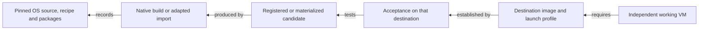
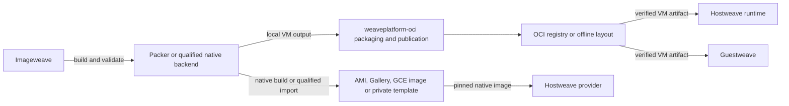

# Destination-first VM image research

Research date: **2026-10-07**. Status: **research and options for design review**.
This report does not adopt a new architecture or supersede an accepted ADR.

## 1. The problem to solve

Weave needs to deliver maintained, identifiable and verifiable VM images that
**Guestweave, AWS, Azure, Google Cloud and selected private-cloud platforms can
actually deploy**. The images include vendor operating-system bases and derived
images containing pinned Weave agent packages. Consumers must be able to select
an appropriate version, create independent machines, establish their intended
trust relationship, and recover to an earlier usable version.

The unresolved problem is how to achieve that across destinations with different
image resources, hardware, boot requirements, provisioning systems and lifecycle
controls, while reusing established builders and services. It is not sufficient
to produce a disk, upload an OCI artifact, or change a release pointer.

The original [research index](README.md) starts with “one OCI-centred model”.
That is a previously selected solution, not a destination requirement. This
report reopens that assumption for comparison. OCI might remain useful for
Guestweave distribution, intermediates and evidence without being the mandatory
storage or construction path for every cloud image.

Success means an operator can answer, for a particular destination:

1. Which exact OS, edition, architecture, firmware and machine class is supported?
2. Which exact deployable image resource should be used, in this account and region?
3. What produced it, which inputs and parent did it use, and what tests passed?
4. How do two deployments acquire independent identities and usable management?
5. What happens when a parent changes, an image is withdrawn, or rollback is needed?
6. Which existing product owns each operation, and what work genuinely remains for Weave?

These questions concern **images only**. Agent packages are pinned image inputs.
Module registries, module categories, agent update channels and a new signing-key
hierarchy are outside this report.

## 2. Evidence, scope and limits

**Documented** means a primary vendor or project source describes the behavior.
**Observed code** means the cited repository snapshot implements the stated path.
**Inference** means a conclusion drawn from that evidence. **Unverified** means
the exact combination or operational behavior has not been established.
None of these labels means a live Weave deployment passed acceptance.

External sources were consulted on the research date. Links ending in `latest`
or `main` are moving documentation, not dependency pins. Plugin versions below
record the documentation versions observed; they have not been installed or
qualified by this research. Source links accompany claims and are collected in
section 16. Repository evidence is pinned in sections 11 and 15.

The local snapshots are `weaveplatform-oci@47381c92`,
`guestweave-cli-macos@1ae4c296` and `guestweave-cli-windows@48fe4242`. They are
not asserted to be the latest remote branches. Existing uncommitted admission
and consumer changes are excluded from the implementation baseline.

Private cloud is deliberately a **comparison set**, not five implementation
commitments: OpenStack/KVM, VMware vSphere, Proxmox VE, Hyper-V and KubeVirt.
The actual customer platforms, versions, storage backends and entitlement
constraints remain to be selected.

No cloud account was used, no image was built or imported, and no VM was booted
for this report. Existing deferred Windows and cloud acceptance is recorded in
[incident #38](https://github.com/weaveplatform/weaveplatform-oci/issues/38) and
[incident #39](https://github.com/weaveplatform/weaveplatform-oci/issues/39);
their current remote status was not rechecked. Historical coverage figures in
[report 16](16-validated-image-delivery.md) are not new measurements.

### Findings that materially change the design discussion

| Finding | Consequence for the next design |
|---|---|
| Providers consume native image resources, not this project's custom OCI manifests. | A registered, tested AMI, Compute Engine image or Gallery version is an output in its own right. |
| Packer already implements cloud builds, local hypervisor builds and some import paths. | Compare adopting those integrations before extending custom orchestration. |
| An OS release existing does not establish support on every destination. | Select explicit destination profiles; do not expand the catalog into an unrestricted cross-product. |
| Importers can change the guest. | Preserve transformation lineage and validate the imported result; do not claim identical disk bytes. |
| HCP Packer, native catalogs and OCI registries solve different lifecycle problems. | Evaluate their responsibilities separately; Packer adoption does not require HCP adoption. |
| Current export code explicitly returns pending acceptance. | Conversion is implemented, but cloud registration and destination readiness remain gaps. |

These are research conclusions supported by the destination, tool and code
comparisons below, not claims that replacement work has already been done.

## 3. Work backwards from the deployed machine

For every destination, define the required deployed behavior first, then its
image resource, then the supported construction or import path.

The proposed **requirements checklist**, not a new schema, is:

| Dimension | Information required |
|---|---|
| Workload | Base, agent or desktop; headless versus interactive operation |
| Guest | OS release and build, edition, language, architecture and package inventory |
| Runtime | Hypervisor/provider, CPU features, firmware, Secure Boot/TPM needs and supported machine class |
| Initialization | Cloud-init, Sysprep, provider guest environment or macOS onboarding; credentials and identity generation |
| Deployment | Image identifier, account/project, region, storage, encryption access and launch permissions |
| Management | A transport the actual consumer can reach and authenticate, including reboot recovery |
| Release | Pinned parent and inputs, build identity, destination acceptance and selection policy |
| Operations | Update detection, promotion, rollback, withdrawal, retention, cleanup and audit |

A cloud image can be a **direct workload guest** or an image of a host that runs
nested Guestweave VMs. Those are separate products with different acceptance
criteria. A host-controlled HvSocket/virtio transport cannot simply be assumed
available to a cloud tenant. This distinction is already recognized in
[ADR 0015](decisions/0015-target-image-delivery.md).

### Distinguish the identities

An input checksum identifies source bytes; a recipe commit identifies instructions;
an OCI digest identifies an artifact; a provider image ID identifies a registered
resource; a VM ID identifies one deployment. None substitutes for the others.

**Design inference:** one logical release can bind several destination outputs
and their evidence without claiming that all disks are byte-identical. An import,
native rebuild, regional copy or change of target preparation needs a traceable
relationship to its source and an explicit acceptance policy. A moving alias
must resolve to a recorded concrete identity before deployment or testing.

## 4. OS and architecture: do not infer a universal support matrix

The repository requests macOS 26/27 on ARM64, Windows 11 26H2 Professional
en-US on AMD64/ARM64, and Ubuntu 20.04/26.04 on AMD64/ARM64. That is an input
catalog, not evidence of cloud support. See [C1](#repository-evidence).

The following matrix describes the **reviewed route**, not every possible way
to run an OS. “Unverified” is not a claim of vendor-wide impossibility.

| Requested workload | Guestweave | AWS | Azure | GCP | Private cloud |
|---|---|---|---|---|---|
| macOS 26/27 ARM64 | Native Apple-host path exists; exact accepted builds remain to be demonstrated. | EC2 Mac AMI release notes list 26.7 and 27.0. Use the Mac-specific path; no local IPSW-disk import equivalence is established. | No supported ordinary Azure VM path established by this research. | No supported Compute Engine path established by this research. | Needs an explicitly selected Apple-host virtualization platform; generic KVM/Hyper-V support is not established. |
| Windows 11 26H2 AMD64 | Windows native path and macOS Windows backend require separate acceptance. | Windows 11 x64 import documented; exact build and entitlement unverified. | Exact release, edition, tenancy and image-source eligibility remain unverified. | Reviewed Migrate to VMs image-import table lists Windows Server, not this client release. Another qualified route would need evidence. | Exact hypervisor, virtual hardware and driver profile must be qualified. |
| Windows 11 26H2 ARM64 | Requires a matching host/backend and actual native acceptance. | ARM64 VM Import excluded. | Requested client OS/ARM combination unverified. | Requested client OS/ARM combination unverified. | Unverified; x64 Windows acceptance cannot qualify ARM64. |
| Ubuntu 20.04/26.04 AMD64 | Existing Linux QEMU checks provide a starting point; they do not qualify cloud guests. | Both releases appear in VM Import's OS table, with kernel constraints. | Qualify an exact source and target machine generation; format compatibility alone is insufficient. | 26.04 appears in the current image-import table. 20.04 requires checking the older-OS/support path separately. | Likely candidate for each selected platform, subject to its actual guest support and initialization. |
| Ubuntu 20.04/26.04 ARM64 | ARM host/backend acceptance is separate from emulated CI. | VM Import route excluded; investigate native ARM64 AMI construction. | Qualify provider base, image architecture and VM SKU together. | 26.04 image import explicitly lists Arm support; that does not qualify every machine class or 20.04. | Depends on host architecture and platform support; not implied by QCOW2 support. |

Sources: [AWS import prerequisites][aws-import], [EC2 Mac releases][aws-mac-releases],
[GCP import OS matrix][gcp-os], [Azure preparation][azure-prep], and repository
evidence C1/C6–C8. The private-cloud and unverified entries identify work still
needed; they do not declare support.

Windows 11 26H2 appears on Microsoft's download page, and Apple documents macOS
27. Release availability therefore need not be guessed. However, neither page
establishes cloud eligibility or access to a particular Enterprise installer.
[Microsoft media][windows-media], [Apple upgrade documentation][apple-release].

GCP separately documents BYOL and sole-tenant requirements. Entitlement and
activation are additional inputs, not consequences of a successful conversion.
This report makes no licensing determination for the user's accounts.
[GCP BYOL][gcp-byol].

## 5. Destination contracts

### 5.1 Google Cloud

**Deployable result:** a Compute Engine image selected by an exact resource
identity, with appropriate project access, architecture, guest features and
license configuration. An image family is a selection mechanism; it is not a
disk-file format.

Google's current import guidance recommends Migrate to Virtual Machines for
supported disks and operating systems; that workflow adapts guest configuration.
A pre-prepared raw-disk archive and provider-native image construction are
distinct alternatives. The current `gcp` exporter choosing `tar.gz` is therefore
one path, not the full GCP contract. [GCP import][gcp-import].

Packer's `googlecompute` builder starts from an existing image and produces a
Compute Engine image. Its import post-processor accepts a compressed raw disk
and registers an image via Google Cloud. These are alternatives worth testing
before implementing those operations in Go. The post-processor documentation
does not establish equivalence with Migrate to VMs' guest adaptation service.
[GCP builder][packer-gcp], [GCP import post-processor][packer-gcp-import].

Image families select eligible versions; deprecating a bad newest image can
restore selection of an earlier image. Deprecated images can still be addressed
explicitly, whereas obsolete images reject new use. Trusted-image-project policy
also has scope exceptions, including images in the caller's project and Cloud
Storage inputs. **Inference:** family selection and organization policy do not
by themselves establish Weave acceptance or universally enforce withdrawal.
[Families][gcp-families], [deprecation][gcp-deprecate], [image policy][gcp-policy].

**Qualification needed:** exact OS route; guest environment and storage/network
drivers; first-boot credentials; reachable agent operations; family rollback;
launch permissions; and deletion/re-creation of named resources. Record the
provider's resource identity as well as the name so name reuse cannot silently
stand in for the previously accepted image.

### 5.2 Amazon Web Services

**Deployable result:** a regional AMI and its backing resources, launch
permissions and compatible instance requirements. Copies have destination
identities; an S3 object or local raw disk is not an AMI. AWS distinguishes
deprecation from disabling and deregistration, and those operations do not
terminate already running instances. [AMI lifecycle][aws-lifecycle].

For imported x64 guests, VM Import supports specified RAW, VHD/VHDX, VMDK and
OVA representations, but its OS, boot and architecture restrictions still apply.
Its explicit ARM64 exclusion prevents treating the current AWS raw exporter as
a universal delivery adapter. [Import prerequisites][aws-import].

For native builds, Packer `amazon-ebs` starts from an AMI and creates another AMI.
The documentation explicitly leaves subsequent AMI lifecycle management to the
operator. EC2 Image Builder is a further option with build, test and distribution
workflows, plus lifecycle policies. **Inference:** compare these existing paths
against custom AWS orchestration before writing it.
[Amazon builder][packer-aws], [Image Builder workflows][aws-workflows],
[lifecycle policies][aws-retention], [distribution][aws-distribution].

EC2 Mac must be considered separately: Apple hardware on Dedicated Hosts,
AWS-provided macOS AMIs and provider initialization. AWS documents 26/27 AMIs;
that establishes a credible native starting point, not that a locally restored
Virtualization.framework disk can become one unchanged. Host allocation and
re-use constraints belong in the experiment's cost and cleanup plan.
[EC2 Mac][aws-mac], [release notes][aws-mac-releases].

Allowed AMIs supplies provider/name/age/deprecation controls and an audit mode,
but excludes images owned by the same account. **Inference:** it can complement
acceptance policy, not replace verification of our own published images.
[Allowed AMIs][aws-allowed].

**Qualification needed:** native ARM Linux; requested Windows edition/build;
EC2 Mac recipe and machine family; boot drivers and initialization; account and
region copies; encrypted-image sharing; failure cleanup; and actual deployment
using a pinned AMI.

### 5.3 Microsoft Azure

**Deployable result:** normally a Compute Gallery image version, image definition
and regional replicas, or another explicitly selected Azure image resource.
Definitions carry compatibility information; versions carry releases. Azure
supports both generalized and specialized image approaches. For independent
reusable Weave machines, generalization is a candidate requirement that must be
tested, not inferred from a version number. [Compute Gallery][azure-gallery].

The documented Windows OS-image upload route uses a fixed VHD with the correct
generation and preparation. Converting its container cannot change VM generation.
This does **not** mean Azure has no VHDX support: its disk upload guide permits
specific VHDX uploads to Premium SSD v2 and Ultra Disk, which the disk-type table
identifies as unsuitable for OS disks. The distinction is OS-image delivery
versus those data-disk paths. [OS preparation][azure-prep],
[upload restrictions][azure-upload], [disk types][azure-disk-types].

A provider-native Packer `azure-arm` build can produce a Gallery version directly;
the name refers to Azure Resource Manager, not a promise of ARM64 guest support.
Azure VM Image Builder is another construction/validation/distribution option.
Its validator configuration exposes whether failed validation stops distribution;
the policy must be set intentionally. [Azure Packer builder][packer-azure],
[Image Builder template][azure-builder], [validators][azure-validator].

Gallery versions provide regional replication and sharing. `excludeFromLatest`
affects discovery, and end-of-life metadata does not automatically prohibit
deployment. **Inference:** publishing a version, changing latest selection,
withdrawing access and deleting a version are separate actions.
[Compute Gallery][azure-gallery].

**Qualification needed:** exact source offer or imported media and entitlement;
generation, Secure Boot/TPM requirements and image features; agent/deprovisioning
behavior; client Windows versus Windows Server; ARM64 SKU compatibility;
replication readiness; and independent post-Sysprep deployments. Do not silently
substitute Windows Server to make a test pass for a Windows 11 requirement.

### 5.4 Guestweave

**Deployable result:** a VM materialized for the selected local runtime, with
fresh writable storage and appropriate machine state. It needs both a usable
image source and the correct runtime configuration.

The inspected Windows checkout uses VHDX through native virtual-disk APIs and
still contains the legacy `guestweave` config-v2/VHDX-zstd OCI encoding. The
inspected macOS implementation materializes raw disks and platform state. Thus,
“Guestweave needs VHDX everywhere” and “Guestweave never needs VHDX” are both
incorrect descriptions of these snapshots. [C7–C8](#repository-evidence).

VHDX can remain an internal Windows working representation while delivery uses
another representation. Conversely, a Windows-oriented artifact is not directly
usable by the macOS backend merely because both guests run Windows. This is a
consumer-boundary choice, distinct from the Azure OS upload requirement.

Native source acquisition must remain available independently of an image
registry. Building inside `weaveplatform-oci` must not require driving a
Guestweave CLI. Packer would be a construction backend owned by this project;
Guestweave would remain a consumer. These are scope requirements from the user,
not claims that current consumers have completed migration.

**Qualification needed:** pull exact artifact; verify content and evidence;
materialize twice; regenerate appropriate machine/firmware/agent identity;
reboot; exercise operations; inspect sealing; preserve parent cache immutability;
and prove native-source operation still works.

### 5.5 Private cloud: compare actual platforms

| Platform | Native result and construction option | Existing mechanism to reuse | What still needs qualification |
|---|---|---|---|
| OpenStack/KVM | Glance image plus Nova launch profile; Packer OpenStack build or adapted disk import. | Glance format metadata, access controls and optional image-signature verification. | Enabled Glance formats, Nova driver, firmware properties, cloud-init/config drive, network/storage drivers and certificate policy. Glance storage acceptance does not prove hypervisor support. |
| VMware vSphere | VM template or Content Library item; Packer vSphere ISO/clone build or OVF import. | vSphere template and library deployment APIs. | Virtual hardware version, firmware, VMware Tools, customization and storage policy. A standalone VMDK is not an OVF package or tested template. |
| Proxmox VE | VM template with imported disk or native installation; Packer Proxmox build. | Template/clone operations, cloud-init drive and storage facilities. | Actual storage backend, linked versus full clone, guest drivers; Windows Cloudbase-Init/configdrive2 configuration. |
| Hyper-V | VM export/template plus compatible disks and configuration. | Hyper-V import/copy and Packer Hyper-V ISO/VM configuration builders. | Generation, configuration version, Secure Boot/TPM and guest generalization. A fresh Hyper-V VM ID does not prove a fresh guest identity. |
| KubeVirt | PVC/DataVolume or compatible containerDisk plus VM specification. | CDI population and KubeVirt storage/VM lifecycle. | StorageClass/access mode, firmware, credentials, clone behavior and image packaging. A custom Weave OCI artifact is not automatically a containerDisk. |

Sources: [Glance formats][openstack-formats], [Glance signatures][openstack-signatures],
[vSphere deployment API][vsphere-library], [Proxmox cloud-init source][proxmox-cloudinit],
[Hyper-V import][hyperv-import], [KubeVirt storage][kubevirt-storage], and the
plugin references in section 7.

For OpenStack, upload-time signature validation and compute-side enforcement
must be configured and verified separately. For the other platforms, this review
does not establish a uniform signed-image admission mechanism. Do not generalize
Glance's facilities across all private clouds.

For disconnected sites, qualified source media, plugins, guest packages and
trust material must all be obtainable locally. Mirroring an OCI disk alone does
not make a recipe independent of Internet package repositories or SaaS metadata.
This is a requirement to test, not an assertion that every Packer plugin supports
an air-gapped workflow.

## 6. What existing projects already solve

### GitHub Actions runner-images, GHCR and releases

GitHub's runner-images build guide describes HCL2 Packer templates creating
temporary Azure VMs, provisioning them over SSH/WinRM, capturing images and
cleaning up. The useful precedent is provider-specific construction with shared
automation, not a single cloud-neutral disk. Its Windows Server images do not
establish support for our Windows client release. [Runner image builds][github-builds].

GHCR supplies registry storage, access control and digest-addressable pulls.
GitHub artifact attestations bind provenance to artifacts. Immutable GitHub
releases protect release assets and associated tags under that feature; they do
not establish GHCR tag immutability. **Inference:** these mechanisms can cover
distribution and evidence, but none alone certifies VM bootability, manages AMI
copies or decides which Gallery version is acceptable.
[GHCR][ghcr], [attestations][github-attest], [immutable releases][github-immutable].

### Tart

Tart demonstrates an effective macOS workflow: pull/clone an OCI-distributed VM
and run a local clone. Its Packer plugin offers a construction integration.
That integration introduces the Tart runtime and artifact conventions; it is
not a direct Go binding to Apple's virtualization APIs and does not implement
all our cloud targets. [Tart workflow][tart], [Tart plugin][packer-tart].

**Inference:** adopt the separation of reusable image and per-VM writable state.
Evaluate the plugin only if accepting its runtime/dependency is allowed; do not
claim adopting Packer mandates adopting Tart. Historical
[ADR 0010](decisions/0010-remove-tart-and-lume-compatibility.md) must be explicitly
revisited before changing that dependency decision.

### Kubernetes SIGs Image Builder

This project combines Packer and Ansible to produce Kubernetes machine images
for multiple infrastructure providers. It is evidence for shared provisioning
logic with provider-specific outputs. Its Kubernetes assumptions and supported
OS set are not a ready-made Weave product; copying the whole project would bring
unneeded policy and workload content. [SIG Image Builder][sig-image-builder].

### HCP Packer and provider-native lifecycle services

HCP Packer stores **artifact metadata, not artifact bytes**. It supplies artifact
versions, channel references and ancestry visibility. It is a separate hosted
product from the Packer executable, and adopting the executable does not require
using that service. [HCP overview][hcp].

| Mechanism | Useful existing behavior | Boundary to retain in the design |
|---|---|---|
| HCP Packer channels | Select a version by named channel. | Channel updates do not trigger downstream builds or notify consumers automatically. |
| HCP ancestry | Tracks parents and identifies outdated ancestry. | “Parent changed” and “parent revoked” are different conditions; exact-current-parent admission remains a policy choice. |
| HCP revocation | Supports revocation and descendant handling in its metadata workflow. | Consumer enforcement must be integrated; do not infer that cloud resources are deleted or running VMs stopped. |
| EC2 Image Builder | Build/test/distribution stages and configurable image lifecycle rules. | Our tests, target coverage and policy must be supplied; an omitted test stage proves nothing. |
| Azure Image Builder/Gallery | Native construction/validation plus version distribution and replication. | Gallery latest/EOL metadata is not universal denial of explicit launches. |
| GCP families/deprecation | Native image selection and staged retirement. | Explicit references and differing lifecycle states need deliberate policy. |

Sources: [HCP channels][hcp-channels], [ancestry][hcp-ancestry],
[revocation][hcp-revoke], [AWS workflows][aws-workflows],
[AWS lifecycle][aws-retention], [Azure validators][azure-validator],
[Gallery][azure-gallery], [GCP families][gcp-families],
[GCP deprecation][gcp-deprecate].

## 7. Packer: adopt the product or use its libraries?

### Existing integrations to evaluate first

Versions are the observed documentation versions, **not selected dependency pins**.
Publisher namespace is not a guarantee of support level; for example the Hyper-V
and Proxmox catalog entries are marked Community.

| Destination/path | Integration and observed version | What it would replace or supply |
|---|---|---|
| QEMU/KVM local Linux | [QEMU 1.1.7][packer-qemu] | VM construction/provisioning from media or an existing disk; RAW/QCOW2 output. |
| AWS native | [Amazon EBS 1.8.2][packer-aws] | Source AMI, temporary build instance, provisioning and resulting AMI. |
| AWS disk import | [Amazon import 1.8.2][packer-aws-import] | Upload and VM Import orchestration, within AWS's actual restrictions. |
| Azure native | [Azure ARM 2.6.0][packer-azure] | Provider-native build and Gallery output. |
| GCP native/import | [Google Compute 1.2.7][packer-gcp], [import][packer-gcp-import] | Native image derivation or prepared compressed-raw import. |
| OpenStack | [OpenStack 1.1.4][packer-openstack] | Build from an existing image and capture an image in OpenStack. |
| vSphere | [VMware vSphere 2.5.0][packer-vsphere] | ISO/clone construction and vSphere-specific output handling. |
| Proxmox | [Proxmox 1.2.4][packer-proxmox] | ISO/template construction; later template lifecycle remains separate. |
| Hyper-V | [Hyper-V 1.1.5][packer-hyperv] | Hyper-V ISO/VM configuration construction; not the same API contract as Weave HCS. |
| macOS local | [Tart][packer-tart] or [Veertu Anka][packer-anka] | Existing macOS construction integrations, each with its own runtime dependency. No version qualified here. |
| Native Apple VZ / Weave HCS | No drop-in equivalent established by this review. | Evaluate a narrow custom plugin or retain the native adapter, subject to a proof of need. |
| KubeVirt | No direct builder selected. | Compare a QEMU-built disk plus CDI/containerDisk publication with other supported tooling. |

**Documentation conflict:** Amazon's import plugin lists `arm64` as an
architecture value, while AWS VM Import's prerequisites exclude ARM64 VMs.
The plugin's configuration vocabulary is not proof that the service accepts
that combination. Record this as a qualification failure for that proposed
route, not a reason to ignore AWS's restriction.
[Plugin import fields][packer-aws-import], [AWS restriction][aws-import].

### Integration choices

| Choice | Advantages | Cost and limitation | Research assessment |
|---|---|---|---|
| Invoke pinned Packer CLI and existing plugins | Documented execution boundary; HCL recipes; provider implementations and cleanup reused. | Requires executable/plugin distribution, credential handling, log forwarding and artifact-result validation. | **Preferred first experiment** where an existing builder fits. |
| Write a small Packer plugin using the Plugin SDK | Keeps a genuinely unique native backend while using Packer's recipe/provisioner model. | We maintain plugin lifecycle, RPC compatibility, tests and releases. | Appropriate only for a demonstrated native VZ/HCS gap. |
| Import Packer core/plugin internals into Weave Go code | Appears to offer in-process reuse. | The documented extension boundary is plugins communicating with core over RPC; this is not a documented general embedded-engine API. Internal reuse adds coupling. | Do not select without a specific supported package/API and compatibility proof. |
| Retain direct native libraries and provider SDKs | Fits existing native integration and permits precise control. | We own orchestration, retries, cancellation, cleanup, communicator and provider drift. | Retain where needed; not a reason to recreate existing cloud builders. |
| Use provider-managed builders | Reduces local orchestration and uses provider validation/distribution facilities. | Separate recipes, IAM, service limits and operational models; not a universal local/private-cloud solution. | Compare for cloud-only paths and operational ownership. |

Packer documents plugins as external components and supplies a Go Plugin SDK for
builders, provisioners and post-processors. That supports writing integrations;
it does not establish that importing Packer internals is the supported way to
embed the whole application. [Plugin architecture][packer-plugins],
[Plugin SDK][packer-sdk].

The manifest post-processor produces artifact metadata and custom fields. It is
useful as the construction result handed to our acceptance/publication step,
but it is not signed acceptance evidence. Machine-readable output is useful for
status integration; raw logs and explicit stage/time information still matter.
[Manifest][packer-manifest], [commands][packer-commands].

**Proposed integration contract for an experiment:** Weave resolves immutable
inputs, invokes a pinned recipe/toolchain, streams stdout/stderr with redaction,
captures the artifact identity, runs destination acceptance, and publishes the
result with evidence. Existing plugins own their build resources. Weave must
still account for cancellation or crashes that leave resources behind.

Packer's installation instructions cover plugin requirements and installation.
The experiment should pin the executable, plugin versions/checksums and recipe
revision, and test controlled acquisition for private deployments. Licensing,
redistribution and commercial support for the selected binaries/plugins require
an explicit review before shipping them; this research makes no entitlement
assumption. [Plugin installation][packer-install].

## 8. Compare image-construction strategies

These are alternatives for each qualified destination, not a mandate to select
one globally.

| Strategy | Good fit | Trade-offs | What evidence would justify it |
|---|---|---|---|
| A. Build one prepared disk, then import/adapt | Supported import routes; portable local/private-cloud images; offline transfer. | Import restrictions, adaptation, boot drivers and repeated transfer. AWS ARM64 import is excluded. | Imported guest passes full destination acceptance; support and total build/import cost are acceptable. |
| B. Build on each destination from a pinned provider base | Cloud-native guests, provider initialization, AWS ARM64 and EC2 Mac candidates. | More bases and outputs to track; cannot promise identical bytes or base packages. | Same required workload/packages pass equivalent tests; actual provider parent and differences are recorded. |
| C. Hybrid shared inputs and selected build paths | Mixed Guestweave/cloud/private fleet. | Needs an explicit target map and clear ownership of each path. | Smallest demonstrated maintenance burden while satisfying all selected profiles. |

**Research recommendation:** test B against A on a supported Linux cloud target,
and test Packer's local builder against existing Linux construction. C is the
leading hypothesis for the whole fleet because destination restrictions already
rule out some universal-import paths. It is not yet an accepted architecture.

“Shared recipe” should mean shared workload intent, pinned package inputs and
reusable provisioning steps, with explicit provider preparation. It need not
mean identical HCL, identical OS bases, or an OCI round trip before every cloud
build. Likewise, repeatable inputs improve reproducibility but do not guarantee
bit-for-bit deterministic disks.

## 9. Where should images and release information live?

Storage, selection, trust and lifecycle are separate decisions. Compare these
options before extending the release-channel code further.

| Option | What is reused | Remaining Weave responsibility | Main decision factor |
|---|---|---|---|
| Native provider catalogs plus a small portable release record | AMI/Gallery/GCE/template storage and exact IDs; existing OCI delivery where consumers need files. | Cross-target mapping, acceptance binding and consumer resolution. | Self-managed/offline requirements versus maintaining that record. |
| HCP Packer as the metadata catalog | Versions, channels, ancestry and revocation integrations. | Artifact storage, Weave acceptance, nonstandard consumer integration, rebuild triggers and destination enforcement. | Hosted dependency, required feature tier, API fit and offline behavior. |
| Provider-native lifecycle only | Native catalogs, image builders and policy controls. | Separate Guestweave/private delivery and any cross-provider release correlation. | Whether one cross-target release is actually required operationally. |
| Extend the current Weave metadata flow | Existing digest-bound acceptance and project-specific policy. | Catalog operations, policy distribution, incident controls and long-term maintenance. | A documented gap remaining after testing the existing products. |

This table deliberately makes no selection of a new root key, signing hierarchy
or channel format. HCP is not a replacement for GHCR's byte storage, and GHCR is
not an alternative implementation of Compute Gallery or an AMI catalog.

### Promotion, rollback and withdrawal need distinct meanings

**Proposed policy vocabulary:** promotion makes an accepted output selectable;
rollback selects a previously accepted output; withdrawal disallows new use
under a defined policy; deletion removes resources after retention requirements
are met. Running-VM remediation is a separate operational process.

Provider aliases and lifecycle states already cover parts of these operations,
but they differ. Cross-target rollout must say whether partial availability is
allowed. If two regions succeed and a third fails, the release must not report
all three ready. Retention must preserve a usable rollback target and required
evidence rather than merely an old metadata pointer.

For derived images, record the exact parent used. Rebuilding when a parent changes
and rejecting every child whose parent is no longer “current” are different
policies. The latter can conflict with planned rollout and rollback. Existing
`CheckCurrentParents` should be reviewed against an agreed lifecycle policy,
not generalized into a universal industry requirement. [C4](#repository-evidence),
[HCP ancestry][hcp-ancestry].

### Mirroring and disconnected consumption

OCI copying can preserve artifacts and referrers; ORAS documents recursive
copying. That does not automatically discover image references embedded in an
arbitrary release JSON file or transfer cloud-native resources between accounts.
Define the release's complete dependency set and test mirror completeness and
retention. Provider copies must record their own identities and access policy.
[ORAS copy][oras-copy], [OCI Distribution][oci-distribution].

## 10. Validation required regardless of builder

Packer build success, a successful import API call, and 95% statement coverage
answer different questions. None can substitute for destination acceptance.

The following is a **proposed acceptance contract**, extending the project's
existing two-clone approach:

| Stage | Required evidence |
|---|---|
| Resolve | Exact media/provider parent, architecture, edition, recipe, toolchain and package lock; fail unsupported combinations before spending on a build. |
| Construct | Stage logs, actual artifact/resource identity, successful sealing, cleanup status and input/output relationship. |
| Deliver | Correct registration/import result, destination/account/region, access/encryption readiness and any transformation. |
| First deployment | Actual OS/build and edition, expected inventory, boot completion, network and management readiness. |
| Independent deployment | A second VM from the same final image with distinct applicable guest, platform and agent identity. |
| Reboot | Identity persists appropriately within each VM; boot identity changes; management and required operations recover. |
| Sealing | Build accounts, secrets, enrollment state and transient machine data are absent according to the target's preparation procedure. |
| Agent/desktop | Installed packages and all required operations work; no silent pass for missing interactive-session prerequisites. |
| Lifecycle | Pinned selection, rollout failure, rollback, withdrawal enforcement, retention and cleanup tested in the destination. |

Tests should bind to the **final deployable output**, not merely the pre-import
OCI digest. When source bytes are not available from a provider, record the
provider resource identity, trusted build/import operation and observed guest
evidence; do not invent a disk checksum.

The current catalog contains presence, exec, power, time, metrics, clipboard,
session and display capabilities. A headless cloud base and a desktop/session
image may require different profiles. Installation alone does not prove these
operations, and a skip must not silently become success. [C1/C5](#repository-evidence).

The existing quality requirement remains **at least 95% statement coverage**
for implementation work, with the package-specific gates recorded in report 16
and [ADR 0013](decisions/0013-quality-gates.md). Unit tests should cover provider
result parsing, resource identity, failure cleanup, timeout/cancellation,
unsupported combinations and policy decisions. Native and cloud acceptance
requires matching environments and is reported separately. This documentation
change does not claim new execution coverage.

## 11. Repository gap analysis

### Code evidence ledger

Links identify the inspected commits and relevant entry points. This records
code capability, not successful live acceptance.

| ID | Pinned source | Observed behavior |
|---|---|---|
| C1 | [catalog][c-catalog], [Definition and Matrix][c-definition] | OS/architecture/tier catalog and package inputs; no destination support dimension in Definition. |
| C2 | [ExportImage and exportFormat][c-export] | Target-to-container mapping, source digest binding and `acceptance: pending`; no cloud registration. Darwin export is restricted to the local macOS target. |
| C3 | [BuildFingerprint and PlanRebuilds][c-rebuild] | Fingerprints parent/source/packages/recipe/builder and plans changed inputs. A planner is not external event delivery or reconciliation. |
| C4 | [Admit and CheckCurrentParents][c-admission] | Authenticated build/acceptance evidence and current-parent promotion policy. |
| C5 | [Validate][c-validation], [Linux agent adapter][c-linux-agent] | Two-clone validation framework and Linux agent runtime checks. Other destinations still need real adapters and runs. |
| C6 | [native macOS][c-macos], [native Windows][c-windows], [native candidate workflow][c-native-workflow] | Native VZ restore/start and Windows HCS/virtdisk paths, with host-specific candidate workflow. Not proof of completed native agent acceptance. |
| C7 | [Guestweave macOS OCI source][c-gw-mac], [disk backend][c-gw-disk] | Materialization of raw disk/platform state and raw disk I/O in the inspected consumer. |
| C8 | [Guestweave Windows OCI source][c-gw-win], [VHDX backend][c-gw-vhdx] | Legacy config-v2/VHDX-zstd artifact declarations and native VHDX create/clone operations. |
| C9 | [Go dependencies][c-gomod] | Existing Go implementation and native SDK dependencies; no Packer integration declared. |

### Adopt, adapt, retain or replace only after proof

| Area | Current gap | Disposition for design review | Evidence needed before replacement |
|---|---|---|---|
| Cloud construction | Export produces files; cloud-native builds and deployment registration are not supplied by it. | **Adopt candidate:** existing Packer builders or provider image builders. | One real qualified output and cleanup/error behavior per chosen route. |
| Linux local construction | Custom QEMU orchestration overlaps Packer QEMU. | **Compare/adapt:** move supported orchestration to a recipe if it reduces maintenance. | Equivalent provisioning, logging, sealing, cancellation and two-clone acceptance. |
| macOS native construction | VZ-specific restore/onboarding/state needs. | **Retain provisionally;** test external integrations or a narrow custom plugin. | Exact 26/27 outcome without introducing an unapproved runtime requirement. |
| Windows native construction | HCS/virtdisk and installer details; Hyper-V plugins are not a drop-in HCS API. | **Retain provisionally;** compare Packer Hyper-V where host/runtime contract permits. | Installer/identity parity on each required architecture; consumer compatibility. |
| Disk conversion | Existing target formats are useful but encode too little compatibility information. | **Adapt:** select conversion inside a qualified target path; reuse mature converters/plugins. | Correct firmware/sector constraints and final registration/boot evidence. |
| Chunked OCI transport, cache and verification | Useful for consumers that need image bytes; not required by every provider-native build. | **Retain where justified.** | Consumer performance, integrity, offline use and maintenance benefit. |
| Acceptance and provenance | Generic framework exists; destination evidence is incomplete. | **Retain/adapt:** attach exact native output identities and target checks. | Provider and consumer tests plus authenticated evidence. |
| Release selection and ancestry | Existing strict current-parent policy may be broader than needed. | **Unresolved:** compare HCP and native mechanisms before adding policy. | Rollout/rollback/withdrawal requirements and a consumer enforcement demonstration. |
| Rebuild scheduling | Input planner exists; event wiring and reconciliation remain. | **Adapt:** reuse CI/provider triggers where possible. | Duplicate/lost event recovery, coalescing and accepted-output reuse. |
| Guestweave compatibility | Two consumer snapshots have different representations and migration states. | **Adapt consumers at their image-source boundary.** | Exact artifact consumption and native-source regression tests on both hosts. |

The replacement candidates are **orchestration duplicated by qualified tools**,
not the whole Go project. No production code is removed by this research.

## 12. Corrections and reconciliation with earlier research

| Earlier framing | Correction or qualification |
|---|---|
| [Index](README.md) defines OCI as the answer before examining destinations. | Treat OCI as an evaluated distribution option; cloud-native images remain first-class outputs. |
| [Build pipelines](07-build-pipelines.md) mentions Packer but also describes Guestweave-driven construction. | Packer needs a concrete adoption comparison; Guestweave remains a consumer, not the construction orchestrator. |
| A target-to-file-format table can look like destination support. | Add OS/edition/architecture, boot preparation, registration, management and acceptance. |
| Windows media and VHD/VHDX discussions risk conflating licensing, local storage and cloud OS import. | Evaluate each independently against the exact destination path. |
| [ADR 0015](decisions/0015-target-image-delivery.md) already separates conversions from deployable images. | Preserve that useful distinction; reassess whether raw OCI must be an intermediate for every build. |
| [Implementation reports 15](15-image-delivery-implementation.md) and [16](16-validated-image-delivery.md) contain pending acceptance and historical checkpoints. | Do not present implemented adapters or coverage as completed deployment qualification. |
| Prior no-Tart and channel decisions predate this reassessment. | Document alternatives here; amend the relevant ADR explicitly if a different design is selected. |

The index retains its historical baseline. This report provides the new starting
point for image design; it does not silently rewrite earlier decisions or infer
that unrelated module-publication descriptions are current.

## 13. Decisions still required

These decisions should precede another broad implementation phase:

| Decision | Options to resolve | Why it matters |
|---|---|---|
| Actual destination profiles | Direct guests versus nested hosts; regions/accounts; selected private clouds and versions. | Defines what needs building and testing. |
| Exact Windows requirement | Edition, release/build, architecture, source media, entitlement and management model. | Prevents substituting an available provider image for the intended workload. |
| Construction ownership | Packer CLI, provider service, or existing native code per target. | Determines the code we can stop maintaining. |
| Artifact identity | Shared release inputs with distinct outputs; where byte-identical transport is actually necessary. | Avoids false equivalence across imports and rebuilds. |
| Metadata service | Native catalogs plus portable record, HCP, or a justified extension of Weave. | Determines hosted/offline dependency and lifecycle ownership. |
| Promotion policy | Per-target versus all-target release; stale versus revoked parent; rollback retention. | Prevents policy from accidentally blocking recovery or claiming unavailable outputs. |
| Publication visibility | Private organization delivery, partner access or public distribution per image. | Requires explicit access/entitlement requirements, not a blanket inference from OS name. |
| Image management and GUI | Reachable agent transport and desktop/session requirements per destination. | Defines meaningful acceptance and required initialization. |

Research does not require the user to choose a signing key before these product
and deployment decisions are clear.

## 14. Experiments to settle the gaps

These experiments are a proposed next phase, not tasks executed in this report.
Each should produce a short decision record containing pinned inputs, versions,
cost/time measurements, logs, output IDs, acceptance and cleanup results.

| Order | Experiment | Pass criteria and decision it enables |
|---|---|---|
| 1 | Packer QEMU versus current Linux builder, same pinned source and package inputs. | Two independent accepted VMs; equivalent sealing/operations; useful live logs; cancellation cleanup; measured duration/storage and maintainable recipe. Decides whether custom Linux orchestration is justified. |
| 2 | Native Packer cloud build versus supported disk import on one Linux target. | Both outputs registered and deployed twice; actual differences recorded; reboot and management work; permissions/cleanup verified. Compare total cost and complexity before selecting a pattern. |
| 3 | AWS ARM64 native image and EC2 Mac 26/27 feasibility. | Resolve compatible bases/hosts first; no unsupported VM Import assumption; acceptance on selected machines and explicit resource-cost controls. |
| 4 | Windows installer and consumer tests on matching hosts. | Requested edition/build and both required architectures verified; fresh guest/agent identities; reboot; final Guestweave consumption. Remains dependent on incident #38 resources. |
| 5 | Cloud Windows qualification, per provider. | Vendor-supported source/import route and entitlement identified before build; requested client edition preserved; guest management and independent deployment proven. A Server substitution is a failed scope match. |
| 6 | One selected private-cloud platform. | Native template/image deployed with actual storage and initialization; second clone independent; full versus linked clone behavior understood; permissions and retirement tested. Expand only for real target demand. |
| 7 | HCP versus a small portable record with native catalogs. | Represent OCI and provider outputs, resolve exact identities, track parents, demonstrate rollback/withdrawal, and document offline/export/API limitations and commercial requirements. |
| 8 | Failure and lifecycle exercise. | Failed regional copy or validation never promotes; interrupted build resources found/cleaned; lost rebuild events reconciled; rollback resource survives retention; rejected image cannot be newly selected through the supported consumer path. |

Local image files and build caches should use `/Volumes/KING/weave-images/`
as requested. Cloud experiments need explicitly provisioned test accounts,
matching runners, quotas and cleanup controls; this report does not allocate
them. A unit-tested or skipped experiment remains unqualified until its recorded
destination checks pass.

The next design should be chosen from these results. The immediate research
recommendation is to evaluate **Packer CLI/plugins before more custom build
orchestration**, while keeping destination acceptance and exact output identity
as non-negotiable outcomes.

## 15. Product boundaries in the context of Hostweave

Follow-up research: **2026-10-07**, prompted by the proposed separation into
Hostweave, `weaveplatform-oci` and a new `imageweave` product. The inspected
Hostweave checkout is clean at
`73b0dc240c9c4e4711f8a8f306278af6f50537de`. This is a design proposal; no
repository extraction, API migration or new product has been implemented.

### 15.1 Hostweave changes the product framing

Hostweave describes itself as an ephemeral compute broker: it places jobs across
clouds and enrolled devices, executes them as containers or VMs, and returns
results while managing capacity and cleanup. Its image needs follow from that
execution responsibility. [Hostweave README][hw-readme].

Its current model already distinguishes three image purposes:

- **Host image:** the provider-native image that creates execution capacity.
- **VM workload image:** the guest cloned inside an appropriate runtime.
- **Container workload image:** the filesystem/configuration used by a container engine.

An immutable `ImageVersion` records the selector, concrete reference, source
object identity, platform, connection/location and evidence. This is a more
appropriate starting point for Hostweave's consumption needs than assuming all
three purposes should become one VM artifact. [Hostweave image types][hw-types].

The runtime distinction is material. An AWS AMI containing `hostweave-agent`
creates a worker. An agent-equipped guest image supports a workload VM. A
container image supports a different execution mode. These may share packages
or OS releases, but have different initialization, enrollment and runtime
contracts. **Design inference:** image recipes need explicit purpose and intended
consumer behavior; a generic `agent` tier is not enough to describe them.

### 15.2 Current implementation versus planned overlap

| Area | Evidence in the inspected Hostweave snapshot | Consequence |
|---|---|---|
| Image discovery and recording | Named collections, immutable resolutions and provider/registry connections. | Retain the operational catalog that explains what a job or supply selected. |
| Pinned execution | Workload/supply binding stores a concrete image version; provider bootstrap verification rechecks identity. | Hostweave remains responsible for authorization, placement and safe execution. |
| Evidence level | Binding currently accepts both `metadata_validated` and `runtime_verified`. | Importing Imageweave acceptance will need an explicit policy change; it is not already enforced universally. |
| VM formats | `pkg/images/vm.go` recognizes Tart, Lume and Guestweave VHDX v2. The inspected `go.mod` has no `weaveplatform-oci` dependency. | Weave-native OCI integration must be delivered and tested, not assumed from the product's origin. |
| Image creation roadmap | ADR 0029 includes recipes, enabled builders, resource leases, durable build steps and publication. The phase tracker lists major build work as pending. | Separation must revise this ownership as well as extract OCI's current builders. |
| Cloud image creation | The phase tracker explicitly defers cloud baking/import. | Hostweave cloud inspection/provisioning should not be described as an existing image factory. |

Sources: [binding code][hw-bindings], [bootstrap verification][hw-provider],
[VM format inspection][hw-formats], [dependencies][hw-gomod],
[ADR 0029][hw-adr], [implementation checkpoint][hw-phase]. Checkpoint test
results are historical; this research ran no Hostweave runtime tests.

### 15.3 Recommended responsibility split

**Recommendation:** separate image production from both artifact transport and
workload execution. The evidence supports a product boundary, not merely a new
directory containing the same mixed responsibilities.

| Product | Product purpose | Responsibilities |
|---|---|---|
| **Hostweave** | Place and execute work using suitable, authorized images. | Jobs, tenants, execution policy, operational image inventory, pinned job/supply selection, capacity scheduling, provider launches, runtime compatibility and execution history. |
| **Imageweave** | Produce and qualify images for selected destinations. | Media/provider-base selection, versioned recipes, package locks, Packer/native/provider-builder integration, guest preparation, sealing, build reconciliation, destination registration, acceptance and production release records. |
| **weaveplatform-oci** | Package, distribute and verify Weave VM artifacts through OCI. | Artifact contract, chunking, packing/unpacking, registry transfer, cache, conformance, cryptographic verification and offline/mirror transfer. |
| **Guestweave** | Create and operate local VMs. | Native source acquisition, verified image consumption, per-VM storage/state, boot and guest operations. It remains independently usable. |

Imageweave's distinctive contribution would be the Weave-specific recipes,
destination contracts, acceptance and evidence integration around established
builders. Existing Packer integrations should still perform the construction
they already support. A new name does not justify recreating their provider
orchestration. Packer itself separates construction from the artifact metadata
service offered by HCP. [Packer introduction][packer-intro], [HCP overview][hcp].

This has a useful precedent in Kubernetes SIGs Image Builder producing machine
images for Cluster API, while Cluster API manages cluster infrastructure. It
supports separating production from infrastructure consumption; it does not mean
Hostweave should adopt Kubernetes or copy either product's complete design.
[Image Builder for CAPI][capi-images], [Cluster API concepts][capi-concepts].

### 15.4 Interpret the proposed chain carefully

`hostweave -> weaveplatform-oci -> imageweave` describes the historical origin
and successive extraction of capabilities. For the proposed software dependency
boundary, both Hostweave and Imageweave may use the OCI library. The OCI library
should not require an image builder to inspect or retrieve an existing artifact.

The artifact flow would be:

This is a proposal, not a map of completed integrations. The OCI boxes represent
library/CLI functionality; they do not require another continuously running
service. Native cloud builds need not export and re-import their disk through
OCI to participate in the same production release.

Hostweave could expose a build UI/API that submits an Imageweave build request
and records its result. That is a separate build-time integration, not a required
hop on every job launch. Imageweave should also be runnable through CI or a local
CLI without Hostweave. Whether a durable standalone Imageweave service is needed
is an operational decision, not a prerequisite for the repository split.

### 15.5 Boundaries that need an explicit contract

**Two catalogs with different purposes.** Imageweave records what was produced,
its actual inputs, destination outputs and qualification. Hostweave records what
an operator may use in a connection/location and exactly what a job selected.
Hostweave must still inspect access and availability in its own environment.
One producer record can map to several operational bindings. Avoid copying
Hostweave's tenant, supply and scheduler database into Imageweave.

**Evidence production versus enforcement.** Imageweave executes acceptance and
issues the resulting evidence. OCI supplies artifact integrity and signature
verification mechanisms. Hostweave and Guestweave apply their consumption
policies. A versioned evidence contract must be readable without a running
Imageweave service; consumer verification must not import its build engine.
The current `pkg/imagecheck` mixes report semantics, test orchestration and
admission, so moving that entire package mechanically would obscure this split.

**Build resources.** Imageweave owns build steps and reconciliation of temporary
resources created by its backend. Hostweave owns capacity leases if it supplies
an enrolled builder. Packer owns the resources its plugin creates within that
build. Specify cancellation and crash recovery at these boundaries so two
controllers do not create or delete the same resource independently. Do not make
Hostweave necessary to create the first images needed to bootstrap Hostweave.

**Produced-image lifecycle versus deployed-machine lifecycle.** Imageweave can
integrate native/HCP release selection, retention and withdrawal for its outputs.
Hostweave owns admission to execution and decisions about its existing hosts and
jobs. Changing an image release must not silently imply replacing running hosts.
The choice of metadata service from section 9 remains open.

**Container builds.** Hostweave's roadmap also includes BuildKit/native Windows
container construction. Decide explicitly whether Imageweave becomes the broader
image-production product or begins with VM images. If containers are included,
use an appropriate container backend; do not route them through Packer or the
Weave VM-disk artifact contract. VM extraction need not wait for that future
backend, and existing container consumption stays in Hostweave.

### 15.6 Extraction candidates and sequence

| Existing area | Proposed destination or treatment |
|---|---|
| OCI `internal/imagebuild`, image catalog/locks, build recipes and image-build workflows | Imageweave, with Packer adoption evaluated before transferring unnecessary custom orchestration. |
| OS/agent boot-test orchestration and target acceptance adapters | Imageweave; retain a lightweight, versioned evidence contract for consumers. |
| OCI `spec`, `chunk`, `pack`, `client`, `cache`, conformance and generic verification | Remain in `weaveplatform-oci`. |
| Artifact publication primitives | Remain in OCI; image-production workflows invoke them from Imageweave. |
| Source acquisition and disk helpers | Place by actual consumers: reusable helpers may remain shared; OS-specific builder workflows belong in Imageweave. Avoid duplicate Guestweave implementations. |
| Hostweave image versions, connection-scoped inspection, binding, placement and runtime execution | Remain in Hostweave; add the Weave artifact/evidence integration. |
| Planned Hostweave recipes and build UI | Delegate production to Imageweave through a versioned contract; preserve Hostweave authorization and optional builder leasing. |

The recommended order is:

1. Agree these capability owners and explicitly amend Hostweave ADR 0029 and
   OCI's scope decisions. Preserve immutable image-version semantics.
2. Define a small build request/result and evidence contract: exact inputs,
   purpose, destination profile, output identifiers, acceptance, logs and failure
   state. Keep tenant credentials out of durable public records.
3. Deliver one vertical path: Imageweave builds and validates a Linux VM image,
   OCI publishes it, Hostweave records/pins it, and a compatible runtime executes
   it. Include Guestweave consumption and preserve its source acquisition mode.
4. Extract remaining qualified builders incrementally, with CLI compatibility
   where needed, then add native cloud outputs and production-catalog integration.

Enforce the existing 95% implementation coverage requirement in the affected
projects and record real acceptance separately. Moving tests between repositories
does not qualify a destination or satisfy a missing consumer integration.

### 15.7 Start Imageweave from target scenarios and Packer templates

The next discussion established a preferred direction: start with the target
runtime and work upwards, with Imageweave focused on Packer templates for the
required scenarios. The local repository
`/Users/dafyddwatkins/GitHub/weave/imageweave` was inspected at
`edf6fc7391d33e6458e44add36aa4b8ed8d4c6b9`. It is a clean repository-template
checkout: the README and Go module still use `weaveplatform-template`, and no
Packer templates or image-production implementation were found. It has an
existing 95% total Go coverage configuration. No files in that repository were
changed during this research.

**Proposed product statement:** Imageweave maintains versioned Packer templates
and acceptance profiles that produce prepared VM images for specified execution
environments. It records the exact build inputs and qualified outputs and hands
them to the appropriate publication mechanism.

The design sequence should be:

1. Identify what must execute and on which runtime/provider.
2. Define the guest preparation, launch configuration and acceptance requirements.
3. Select the existing Packer builder and output supported by that destination.
4. Compose the scenario from pinned inputs and shared provisioning steps.
5. Build a candidate, qualify its final representation and publish its evidence.
6. Let Hostweave resolve and pin the usable output, then execute it on a compatible runtime.

Packer HCL2 already represents sources, builds, provisioners and post-processors.
Use these directly as the construction definition. Any Go code should initially
cover demonstrated integration needs such as input resolution, execution/logging
and handoff validation; a separate general-purpose workflow language would need
its own justification. [HCL templates][packer-hcl], [build blocks][packer-build-block].

The initial scenario inventory should distinguish the following candidates;
this table is not a declaration that their Packer paths are all qualified:

| Scenario family | Intended result | Builder qualification question |
|---|---|---|
| Local Linux workload VM | Prepared guest for QEMU or a supported Guestweave runtime. | Can the existing QEMU builder produce the required firmware/disk combination and pass the consumer's tests? |
| Local Windows workload VM | Requested Windows edition/build on the exact host architecture and backend. | Does Packer Hyper-V satisfy that scenario, or does the HCS/native path need a narrow integration? |
| Local macOS workload VM | Prepared 26/27 guest with appropriate Apple platform state. | Can an accepted existing macOS plugin satisfy the runtime contract, or is a native VZ plugin required? |
| Cloud Hostweave worker | Provider image that boots, initializes and enrolls as execution capacity. | Which provider-native builder/base and bootstrap contract support the intended worker runtime? |
| Direct cloud workload guest | Provider image running the intended guest workload and reachable management transport. | Which source, driver, initialization and communication requirements differ from the worker image? |
| Private-cloud worker or guest | A template/image for the selected platform and purpose. | Which actual hypervisor version, storage and provisioning profile must be supported? |

A scenario must identify **purpose, destination/runtime, OS build and edition,
architecture, firmware, installed software, first-boot behavior, management
transport, output representation and acceptance profile**. Base/agent/desktop
variants can share provisioning components. Start with explicit supported
combinations rather than creating one template for every possible combination
or a single template containing every destination's conditional logic.

For portable VM artifacts, the intended chain is
`scenario -> Packer build -> prepared output -> OCI candidate -> acceptance -> publication -> Hostweave pin -> runtime`.
Qualification must bind the exact packaged output that will be published; do
not rebuild or repack it after acceptance without updating and revalidating the
identity. Candidate transfer to a test environment is distinct from promotion
for consumption.

For cloud-native output, use the corresponding registered image as the acceptance
subject and Hostweave reference. OCI may distribute associated evidence and
release metadata if the eventual contract supports it; that metadata integration
is not implemented merely by producing a Packer manifest. The disk need not make
an OCI round trip. Packer's manifest is useful output metadata, not a replacement
for destination acceptance. [Manifest post-processor][packer-manifest].

The first Imageweave design artifacts should therefore be a product scope,
scenario/support matrix, template conventions and a build-result/acceptance
contract. The first implementation should prove one end-to-end scenario before
extracting the remaining builders. Keep the 95% requirement for Go code, validate
HCL and input constraints separately, and use real runtime acceptance to qualify
templates. Go statement coverage cannot measure whether an image template boots.

## 16. Primary source register

All external references below were consulted on **2026-10-07**. Each is scoped to
the claim that cites it; a source describing one import path does not qualify all
paths. Cloud and `latest` documentation should be rechecked when pinning an
implementation. Local source permalinks use the inspected commit snapshots.

### Destinations and native lifecycle

- AWS: [VM Import prerequisites][aws-import], [EC2 Mac][aws-mac],
  [macOS AMI releases][aws-mac-releases], [AMI lifecycle][aws-lifecycle],
  [Allowed AMIs][aws-allowed], [Image Builder workflows][aws-workflows],
  [lifecycle rules][aws-retention], [distribution settings][aws-distribution].
- GCP: [disk import][gcp-import], [import OS/architecture table][gcp-os],
  [families][gcp-families], [deprecation][gcp-deprecate],
  [trusted-image policy][gcp-policy], [BYOL][gcp-byol].
- Azure: [OS preparation][azure-prep], [disk upload][azure-upload],
  [disk types][azure-disk-types], [Compute Gallery][azure-gallery],
  [Image Builder template][azure-builder], [validators][azure-validator].
- Private cloud: [Glance formats][openstack-formats],
  [Glance signatures][openstack-signatures], [vSphere library deploy][vsphere-library],
  [Proxmox cloud-init][proxmox-cloudinit], [Hyper-V import][hyperv-import],
  [KubeVirt storage][kubevirt-storage].
- Release availability: [Windows media][windows-media], [Apple macOS][apple-release].

### Builders, catalogs and distribution

- Packer: [plugin architecture][packer-plugins], [SDK][packer-sdk],
  [installation][packer-install], [manifest][packer-manifest], [commands][packer-commands].
  The integration matrix links each investigated plugin separately.
- HCP: [overview][hcp], [channels][hcp-channels], [ancestry][hcp-ancestry],
  [revocation][hcp-revoke].
- Existing projects: [GitHub runner builds][github-builds],
  [SIG Image Builder][sig-image-builder], [Tart][tart].
- Distribution/evidence: [GHCR][ghcr], [GitHub attestations][github-attest],
  [immutable releases][github-immutable], [ORAS copy][oras-copy],
  [OCI Distribution][oci-distribution].
- Hostweave comparison: pinned [README][hw-readme], [types][hw-types],
  [binding][hw-bindings], [provider checks][hw-provider], [formats][hw-formats],
  [dependencies][hw-gomod], [ADR 0029][hw-adr], [phase tracker][hw-phase];
  [Packer introduction][packer-intro], [Image Builder for CAPI][capi-images],
  [Cluster API concepts][capi-concepts].
- Imageweave foundation: local clean snapshot `edf6fc7391d33e6458e44add36aa4b8ed8d4c6b9`,
  `README.md`, `go.mod` and `.testcoverage.yml`; [Packer HCL][packer-hcl]
  and [build blocks][packer-build-block].

[packer-hcl]: https://developer.hashicorp.com/packer/docs/templates/hcl_templates
[packer-build-block]: https://developer.hashicorp.com/packer/docs/templates/hcl_templates/blocks/build

[hw-readme]: https://github.com/weaveplatform/hostweave/blob/73b0dc240c9c4e4711f8a8f306278af6f50537de/README.md#L1
[hw-types]: https://github.com/weaveplatform/hostweave/blob/73b0dc240c9c4e4711f8a8f306278af6f50537de/pkg/types/image.go#L9
[hw-bindings]: https://github.com/weaveplatform/hostweave/blob/73b0dc240c9c4e4711f8a8f306278af6f50537de/internal/server/image_bindings.go#L12
[hw-provider]: https://github.com/weaveplatform/hostweave/blob/73b0dc240c9c4e4711f8a8f306278af6f50537de/pkg/provider/images.go#L46
[hw-formats]: https://github.com/weaveplatform/hostweave/blob/73b0dc240c9c4e4711f8a8f306278af6f50537de/pkg/images/vm.go#L1
[hw-gomod]: https://github.com/weaveplatform/hostweave/blob/73b0dc240c9c4e4711f8a8f306278af6f50537de/go.mod#L1
[hw-adr]: https://github.com/weaveplatform/hostweave/blob/73b0dc240c9c4e4711f8a8f306278af6f50537de/docs/research/decisions/0029-image-identities-and-builds.md#L1
[hw-phase]: https://github.com/weaveplatform/hostweave/blob/73b0dc240c9c4e4711f8a8f306278af6f50537de/docs/implementation/image-lifecycle.md#L1
[packer-intro]: https://developer.hashicorp.com/packer/docs/intro
[capi-images]: https://image-builder.sigs.k8s.io/capi/capi.html
[capi-concepts]: https://cluster-api.sigs.k8s.io/user/concepts.html

[aws-import]: https://docs.aws.amazon.com/vm-import/latest/userguide/prerequisites.html
[aws-mac]: https://docs.aws.amazon.com/AWSEC2/latest/UserGuide/ec2-mac-instances.html
[aws-mac-releases]: https://docs.aws.amazon.com/AWSEC2/latest/UserGuide/macos-ami-overview.html
[aws-lifecycle]: https://docs.aws.amazon.com/us_en/AWSEC2/latest/UserGuide/ami-lifecycle.html
[aws-allowed]: https://docs.aws.amazon.com/AWSEC2/latest/UserGuide/ec2-allowed-amis.html
[aws-workflows]: https://docs.aws.amazon.com/imagebuilder/latest/userguide/manage-image-workflows.html
[aws-retention]: https://docs.aws.amazon.com/imagebuilder/latest/userguide/image-lifecycle-rules.html
[aws-distribution]: https://docs.aws.amazon.com/imagebuilder/latest/userguide/manage-distribution-settings.html
[gcp-import]: https://docs.cloud.google.com/compute/docs/import/importing-virtual-disks
[gcp-os]: https://docs.cloud.google.com/migrate/virtual-machines/docs/5.0/discover/supported-os-versions
[gcp-families]: https://docs.cloud.google.com/compute/docs/images/image-families-best-practices
[gcp-deprecate]: https://docs.cloud.google.com/compute/docs/images/deprecate-custom
[gcp-policy]: https://docs.cloud.google.com/compute/docs/images/restricting-image-access
[gcp-byol]: https://docs.cloud.google.com/compute/docs/nodes/bringing-your-own-licenses
[azure-prep]: https://learn.microsoft.com/en-us/azure/virtual-machines/windows/prepare-for-upload-vhd-image
[azure-upload]: https://learn.microsoft.com/en-us/azure/virtual-machines/windows/disks-upload-vhd-to-managed-disk-powershell
[azure-disk-types]: https://learn.microsoft.com/en-us/azure/virtual-machines/disks-types
[azure-gallery]: https://learn.microsoft.com/en-us/azure/virtual-machines/shared-image-galleries
[azure-builder]: https://learn.microsoft.com/en-us/azure/virtual-machines/linux/image-builder-json
[azure-validator]: https://learn.microsoft.com/en-us/cli/azure/image/builder/validator?view=azure-cli-latest
[openstack-formats]: https://docs.openstack.org/glance/latest/user/formats.html
[openstack-signatures]: https://docs.openstack.org/glance/latest/user/signature.html
[vsphere-library]: https://developer.broadcom.com/xapis/vcloud-suite-api/latest/operations/com/vmware/vcenter/ovf/library_item.deploy-operation.html
[proxmox-cloudinit]: https://raw.githubusercontent.com/proxmox/pve-docs/master/qm-cloud-init.adoc
[hyperv-import]: https://learn.microsoft.com/en-us/windows-server/virtualization/hyper-v/deploy/export-and-import-virtual-machines
[kubevirt-storage]: https://kubevirt.io/user-guide/storage/disks_and_volumes/
[windows-media]: https://www.microsoft.com/en-us/software-download/windows11
[apple-release]: https://support.apple.com/en-us/127455
[packer-qemu]: https://developer.hashicorp.com/packer/integrations/hashicorp/qemu/latest/components/builder/qemu
[packer-aws]: https://developer.hashicorp.com/packer/integrations/hashicorp/amazon/latest/components/builder/ebs
[packer-aws-import]: https://developer.hashicorp.com/packer/integrations/hashicorp/amazon/latest/components/post-processor/import
[packer-azure]: https://developer.hashicorp.com/packer/integrations/hashicorp/azure/latest/components/builder/arm
[packer-gcp]: https://developer.hashicorp.com/packer/integrations/hashicorp/googlecompute/latest/components/builder/googlecompute
[packer-gcp-import]: https://developer.hashicorp.com/packer/integrations/hashicorp/googlecompute/latest/components/post-processor/googlecompute-import
[packer-openstack]: https://developer.hashicorp.com/packer/integrations/hashicorp/openstack/latest/components/builder/openstack
[packer-vsphere]: https://developer.hashicorp.com/packer/integrations/vmware/vsphere/latest/components/builder/vsphere-iso
[packer-proxmox]: https://developer.hashicorp.com/packer/integrations/hashicorp/proxmox/latest/components/builder/iso
[packer-hyperv]: https://developer.hashicorp.com/packer/integrations/hashicorp/hyperv/latest/components/builder/iso
[packer-tart]: https://github.com/cirruslabs/packer-plugin-tart
[packer-anka]: https://github.com/veertuinc/packer-plugin-veertu-anka
[packer-plugins]: https://developer.hashicorp.com/packer/docs/plugins/creation
[packer-sdk]: https://github.com/hashicorp/packer-plugin-sdk
[packer-install]: https://developer.hashicorp.com/packer/docs/plugins/install
[packer-manifest]: https://developer.hashicorp.com/packer/docs/post-processors/manifest
[packer-commands]: https://developer.hashicorp.com/packer/docs/commands
[hcp]: https://developer.hashicorp.com/hcp/docs/packer
[hcp-channels]: https://developer.hashicorp.com/hcp/docs/packer/manage/channel
[hcp-ancestry]: https://developer.hashicorp.com/hcp/docs/packer/manage/ancestry
[hcp-revoke]: https://developer.hashicorp.com/hcp/docs/packer/manage/revoke-restore
[github-builds]: https://github.com/actions/runner-images/blob/main/docs/create-image-and-azure-resources.md
[sig-image-builder]: https://github.com/kubernetes-sigs/image-builder
[tart]: https://tart.run/quick-start/
[ghcr]: https://docs.github.com/en/packages/working-with-a-github-packages-registry/working-with-the-container-registry
[github-attest]: https://docs.github.com/en/actions/concepts/security/artifact-attestations
[github-immutable]: https://docs.github.com/en/code-security/concepts/supply-chain-security/immutable-releases
[oras-copy]: https://oras.land/docs/commands/oras_cp/
[oci-distribution]: https://github.com/opencontainers/distribution-spec/blob/main/spec.md
[c-catalog]: https://github.com/weaveplatform/weaveplatform-oci/blob/47381c92a5b8d8c24831611ca6c31bf4386ff625/images/catalogue.json#L1
[c-definition]: https://github.com/weaveplatform/weaveplatform-oci/blob/47381c92a5b8d8c24831611ca6c31bf4386ff625/internal/imagebuild/catalogue.go#L38
[c-export]: https://github.com/weaveplatform/weaveplatform-oci/blob/47381c92a5b8d8c24831611ca6c31bf4386ff625/internal/imagebuild/export.go#L25
[c-rebuild]: https://github.com/weaveplatform/weaveplatform-oci/blob/47381c92a5b8d8c24831611ca6c31bf4386ff625/internal/imagebuild/rebuild.go#L14
[c-admission]: https://github.com/weaveplatform/weaveplatform-oci/blob/47381c92a5b8d8c24831611ca6c31bf4386ff625/pkg/imagecheck/admission.go#L42
[c-validation]: https://github.com/weaveplatform/weaveplatform-oci/blob/47381c92a5b8d8c24831611ca6c31bf4386ff625/pkg/imagecheck/validate.go#L55
[c-linux-agent]: https://github.com/weaveplatform/weaveplatform-oci/blob/47381c92a5b8d8c24831611ca6c31bf4386ff625/internal/imagebuild/linux_agent_check.go#L23
[c-macos]: https://github.com/weaveplatform/weaveplatform-oci/blob/47381c92a5b8d8c24831611ca6c31bf4386ff625/internal/imagebuild/mac_native_darwin.go#L43
[c-windows]: https://github.com/weaveplatform/weaveplatform-oci/blob/47381c92a5b8d8c24831611ca6c31bf4386ff625/internal/imagebuild/windows_native_windows.go#L23
[c-native-workflow]: https://github.com/weaveplatform/weaveplatform-oci/blob/47381c92a5b8d8c24831611ca6c31bf4386ff625/.github/workflows/image-native-candidate.yml#L40
[c-gw-mac]: https://github.com/weaveplatform/guestweave-cli-macos/blob/1ae4c29662532b5073df5f2cec4cc3f1eb39bdd3/internal/imagesource/oci/base.go#L35
[c-gw-disk]: https://github.com/weaveplatform/guestweave-cli-macos/blob/1ae4c29662532b5073df5f2cec4cc3f1eb39bdd3/internal/hypervisor/hardware/ahci.go#L60
[c-gw-win]: https://github.com/weaveplatform/guestweave-cli-windows/blob/48fe4242d4d8b884e1bc464287f9a6c8f72ca275/internal/oci/oci.go#L51
[c-gw-vhdx]: https://github.com/weaveplatform/guestweave-cli-windows/blob/48fe4242d4d8b884e1bc464287f9a6c8f72ca275/internal/vhdx/vhdx.go#L62
[c-gomod]: https://github.com/weaveplatform/weaveplatform-oci/blob/47381c92a5b8d8c24831611ca6c31bf4386ff625/go.mod#L1
